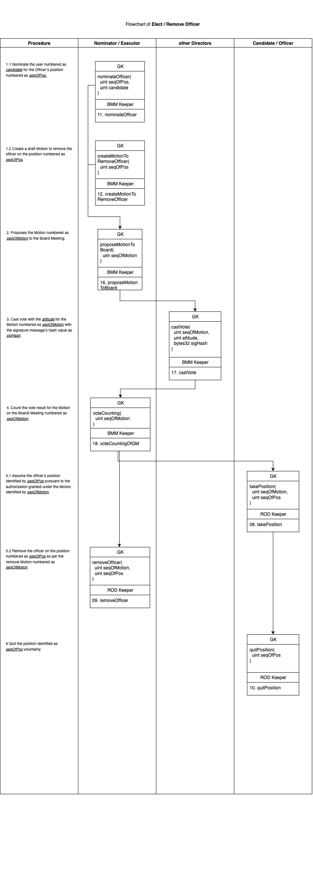

# ⏳ 7. Scenarios for Equity Transactions and Corporate Governance

In the course of a company’s daily operations and financing activities, all legal actions can generally be categorized into 【12】 representative scenarios. These scenarios broadly encompass the issuance of new shares, transfer of existing shares, amendment of the shareholders’ agreement, equity financing, election of directors and officers, approval of legal documents by resolution, external payments, and the execution of legal agreements, among others. This section presents these scenarios through logical flowcharts (swimlane diagrams), illustrating how the company’s stakeholders, acting in their respective capacities as rights holders, may utilize the external APIs provided by the ComBoox system to rigorously and systematically complete the aforementioned legal actions within the ComBoox platform. These scenarios include:

<strong>7.1. Apply for Qualified Investor Status</strong>

To invest in a company registered on the ComBoox platform, an individual must first apply for “Qualified Investor” status. This process entails a whitelist review and verification procedure. The “Listing Rules” under the company’s Shareholders’ Agreement explicitly define which user roles are vested with the authority to approve Qualified Investor applications. These approvers, referred to as “Verifiers,” may include the company’s shareholders, senior executives, affiliated equity trading venues, or even regulatory authorities.

Only users admitted to the whitelist are permitted to buy and sell the company’s shares. Once a user’s Qualified Investor status is revoked by a Verifier, all equity holdings of that user are effectively frozen and may not be transferred until the Qualified Investor status is reinstated.

The application and approval process for obtaining Qualified Investor status generally consists of the following steps:

1. Applicant calls the regUser() function of RegCenter to sign up with ComBoox Platform;
2. Applicant calls the setBackupKey() function of RegCenter to set _bKey_ as its backup key;
3. Applicant calls regInvestor() (the No.72 API) to register itself as an investor, by inputting its backup key as _bKey_, the user number of its concert group’s representative as _groupRep_, with the hash value of its identity information as _idHas_.
4. Verifier calls approveInvestor() (the No.73 API) to approve the investor’s application, pursuant to the Listing Rule numbered as _seqOfLR_, filed by the user numbered as _userNo_.

<figure><figcaption></figcaption></figure>

<strong>7.2. Update Shareholders’ Agreement</strong>

The Shareholders’ Agreement or the Articles of Association serve as the company’s constitutional documents. They set forth the Rules governing corporate governance (Governance Rules), voting procedures (Voting Rules), allocation of executive positions (Position Allocation Rules), pre-emptive rights (First Refusal Rules), listing requirements (Listing Rules), as well as special investor protection provisions (Terms) such as share Lock-Up, Anti-Dilution, Drag-Along and Tag-along rights, Call Options, and Put Options.

Within the ComBoox system, shareholders may, in accordance with prescribed voting rules, submit proposals, cast votes, and activate new versions of the Shareholders’ Agreement in order to establish or amend the foregoing Rules and Terms. Once activated, the Shareholders’ Agreement will automatically respond in real time to queries from other Sub Keeper contracts and Registry contracts, providing the relevant Rules and Terms. This ensures that all corporate legal actions are executed strictly in accordance with the conditions and procedures stipulated in the Shareholders’ Agreement.

The specific process for creating, proposing, voting on, and activating the Shareholders’ Agreement includes the following steps:

1. Shareholder calls createSHA() (the No.01 API) to create a new shareholders agreement by cloning the Template of the specific _version_.
2. Owner of the draft SHA calls circulateSHA() (the No.02 API) to circulate the finalized draft of SHA deployed at the address of _body_ to the contractual parties for signing, with the URL infomation of _docUrl_, and hash value of _docHash_.
3. Shareholders call signSHA() (the No.03 API) to sign the finalized draft of SHA deployed at the address of _sha_, with the hash value of signature as _sigHash_.
4. Owner of the draft call proposeDocOfGM() (the No.29 API) to create and propose a draft Motion for the General Meeting to approve the document deployed at the address of _doc_ as per the voting rule numbered as _seqOfVR_ with the user numbered as _executor_ to invoke it.
5. Shareholders call castVoteOfGM() (the No.35 API) to cast vote with the _attitude_ for the Motion numbered as _seqOfMotion_ with the signature message’s hash value as _sigHash_.
6. Any user call voteCountingOfGM() (the No.36 API) to count the vote result for the Motion on the General Meeting numbered as _seqOfMotion_.
7. Any Shareholder may call activateSHA() (the No.04 API) to activate the draft of shareholders agreement deployed at the address of _body_.
8. Investor may call acceptSHA() (the No.05 API) to accept the terms and conditons of the SHA in force, with the hash value as _sigHash_.

<figure><figcaption></figcaption></figure>

<strong>7.3. Trade Equity by Agreement</strong>

Equity subscription or transfer by agreement is the share trading mechanism designed by ComBoox for the vast majority of non-listed companies. Under this agreement-based approach, both new share issuances and secondary share transfers may be conducted. Settlements can be executed either through a hash time-lock using off-chain fiat currency as payment consideration, or via atomic delivery-versus-payment (DVP) transactions using USDC.

A General Meeting’s resolution is an essential step in agreement-based share transactions, ensuring that special investor rights, such as Lock-Up, First Refusal, Drag Along and Tag Along, can be duly exercised. Where the Shareholders’ Agreement specifies that the approval voting ratio for equity-trading-related voting rules (Voting Rules No. 1–7) is set to “0,” proposals may bypass the voting stage. In such cases, the relevant share transfer or subscription agreement may be deemed approved by the shareholders’ meeting directly upon triggering the calculateVoteResult() API, thereby proceeding immediately to settlement.

The process for conducting equity transactions by agreement includes the following steps:

1. Any Shareholder may call createIA() (the No.38 API) to create a draft Investment Agreement on the Register of Agreement, by cloning the Template of the version numbered as _version_.
2. Owner of the draft Investment Agreement calls circulateIA() (the No.39 API) to circulate the finalized draft deployed at the address of _body_ to the parties for signature, attaching with the URL information of _docUrl_ and the hash value of the draft as _docHash_.
3. Parties to the draft IA call signIA() (the No.40 API) to sign the Investment Agreement deployed at the address of _ia_, with the signature message’s hash value as _sigHash_.
4. Owner of the draft to call proposeDocOfGM() (the No.29 API) to create and propose a draft Motion for the General Meeting to approve the document deployed at the address of _doc_ as per the voting rule numbered as _seqOfVR_ with the user numbered as _executor_ to invoke it.
5. Shareholders call castVoteOfGM() (the No.35 API) to cast vote with the _attitude_ for the Motion numbered as _seqOfMotion_ with the signature message’s hash value as _sigHash_.
6. Any user may call voteCountingOfGM() (the No.36 API) to count the vote result for the Motion on the General Meeting numbered as _seqOfMotion_.
7. Seller may call pushToCoffer() (the No.41 API) to confirm all conditions precedent have been satisfied and ready for closing, for the specific deal numbered as _seqOfDeal_, under the Investment Agreement deployed at the address of _ia_, by inputting a hash lock value _hashLock_ and setting the closing deadline as _closingDeadline_.
8. Buyer calls closeDeal() (the No.42 API) to close the deal numbered as _seqOfDeal_, under the Investment Agreement deployed at the address of _ia_, after paying the consideration off-chain, by inputting the hash key string _hashKey_.
9. Controller of the company may call issueNewShare() (the No.43 API) to issue new share directly to the buyer, for the capital increasing Deal numbered as _seqOfDeal_ under the Investment Agreement deployed at the address of _ia_.
10. Seller may call transferTargetShare() (the No.44 API) to transfer the subject share directly to the buyer, for the specific share transfer Deal numbered as _seqOfDeal_ under the Investment Agreement deployed at the address of _ia_.
11. Buyer may call payOffApprovedDeal() (the No.46 API) to pay off the specific Deal numbered as _seqOfDeal_ in the Investment Agreement deployed as the address of _ia_, by paying to the seller/issuer address to certain amount of USDC as per the off-chain authorization signed as _auth_, to close the Deal.
12. After the expiration of the Deal, seller may call terminateDeal() (the No.45 API) to terminate the Deal numbered as _seqOfDeal_ under the Investment Agreement deployed at the address of _ia_.

<figure><figcaption></figcaption></figure>

<strong>7.4. Trade Equity by Listing (in USDC)</strong>

The listing-based trading mechanism is designed by ComBoox for companies that are publicly listed. Qualified Investors may subscribe for or transfer company shares through blockchain-based smart contracts using USDC as the settlement currency. This mechanism enables both subscriptions for newly issued shares and secondary trading of existing shares.

The smart contract system, centered on the LOO Keeper and LOO smart contracts, automatically matches and executes orders under a “time priority, price priority” principle, with settlement conducted on a delivery-versus-payment (DVP) model.

A company may stipulate the specific rules governing the listing and issuance of its shares through the “Listing Rules” under its Shareholders’ Agreement. Such rules may include, for example, the minimum and maximum issue prices for shares, the minimum interval between share transfers, or the lowest permissible trading price.

Most importantly, the Listing Rules define the role of the Verifier, either as a designated user group or specific individual, who is vested with the authority to approve or revoke “Qualified Investor” status. This whitelist mechanism ensures that all investors participating in the company’s share transactions comply with applicable KYC/AML requirements and other regulatory obligations.

A Verifier may be a company director or officer, a designated bookrunner or registrar, an exchange operator, a KYC/AML service provider, or even a competent regulatory authority within a particular jurisdiction.

The company’s General Meeting may amend the Listing Rules by updating the Shareholders’ Agreement, thereby ensuring that the issuance and trading of its shares remain in compliance with the requirements of specific jurisdictions or trading venues.


**The public offering or trading of company shares is subject to compliance with applicable laws and regulations governing securities registration, securities trading, KYC, AML, and related requirements. Accordingly, prior to engaging in share listing or trading activities, it is strongly recommended to seek professional advice from qualified legal counsel in the relevant jurisdiction.**


The specific procedures for trading company shares under the listing mechanism are as follows:

1. Controller or director may call placeInitialOffer() (the No.78 API) to place an initial offer for the class of _classOfShare_, at the price of paid as _price_, to the amount of paid as _paid_, with the available number of hours as _execHours_, pursuant to the Listing Rule numbered as _seqOfLR_.
2. A shareholder may call placeSellOrder() (the No.80 API) to place a sell order under the class numbered as _classOfShare_, as per the Listing Rule of _seqOfLR_, to the paid value amount to _paid_, at the selling price of _price_, with the available time within the number of hours as _execHours_.
3. A Qualified Investor may call placeBuyOrder() (the No.82 API) to place a buy order for the class of _classOfShare_, to the paid value amount to _paid_, at the buy price of _price_, within the available time as number of hours of _execHours_, paying certain amount of USDC as per the off-chain authorization signed as _auth_.
4. A Qualified Investor may call placeMarketBuyOrder() (the No.83 API) to place a buy order for the class of _classOfShare_, to the paid value amount to _paid_, at the market price, with the available time within the number of hours as _execHours_, paying certain amount of USDC as per the off-chain authorization signed as auth.
5. The Controller or director may call withdrawInitialOffer() (the No.79 API) to withdraw the initial offer numbered as _seqOfOrder_ under the class of _classOfShare_, pursuant to the Listing Rule numbered as _seqOfLR._
6. The seller may call withdrawSellOrder() (the No.81 API) to withdraw sell order numbered as _seqOfOrder_ for the class of _classOfShare_.
7. The buyer may call withdrawBuyOrder() (the No.84 API) to withdraw the buy order numbered as _seqOfOrder_ for the class of _classOfShare_.

<figure><figcaption></figcaption></figure>

<strong>7.5. Elect or Remove Directors</strong>

The power to appoint and remove directors or officers is a fundamental aspect of corporate governance. Within the ComBoox system, the Position Allocation Rules defined in the Shareholders’ Agreement may specify the manner in which company executives and officers are appointed, as well as the duration of their terms of office. For example, such rules may establish shareholders’ rights to nominate a certain number of board seats or specific positions such as the Chairperson, or the authority of certain directors or executives to nominate, appoint or remove other company officers.

Users vested with nomination or appointment/removal rights may exercise such powers by triggering designated APIs. The election of company officers may take place at a General Meeting or a Board Meeting. A user holding nomination rights may also initiate a motion to remove (impeach) a director or executive whom they have nominated.

Elected candidates must trigger the Appointment API in order to assume office; similarly, resignation requires activation of the Resignation API.

Shareholders may amend the Shareholders’ Agreement to revise the Position Allocation Rules, thereby altering the method of appointment or the term of office for specific positions.

The procedures for the election or appointment of directors are as follows:

1. The right holder calls nominateDirector() (the No.27 API) to nominate the user numbered as _candidate_ for the Director’s position numbered as _seqOfPos_.
2. The right holder calls createMotionToRemoveDirector() (the No.28 API) to create a draft Motion to remove the officer on the position numbered as _seqOfPos_.
3. The right holder calls proposeMotionToGeneralMeeting() (the No.34 API) to proposes the Motion numbered as _seqOfMotion_ to the General Meeting.
4. Members call castVoteOfGM() (the No.35 API) to cast vote with the _attitude_ for the Motion numbered as _seqOfMotion_ with the signature message’s hash value as _sigHash_.
5. Any user may call voteCountingOfGM() (the No.36 API) to count the vote result for the Motion on the General Meeting numbered as _seqOfMotion_.
6. The elected candidate calls takeSeat() (the No.06 API) to assume the director’s seat identified by _seqOfPos_ pursuant to the authorization granted under the Motion identified by _seqOfMotion_.
7. The executor calls removeDirector() (the No.07 API) to remove the director on the position numbered as _seqOfPos_ as per the removal Motion numbered as _seqOfMotion_.
8. The director calls quitPosition() (the No.10 API) to quit the position identified as _seqOfPos_ voluntarily.

<figure><figcaption></figcaption></figure>

<strong>7.6. Elect or Remove Officers</strong>

The procedures for the election or appointment of officers are as follows:

1. The right holder calls nominateOfficer() (the No.11 API) of General Keeper to nominate the user numbered as _candidate_ for the Officer’s position numbered as _seqOfPos_.
2. The right holder calls createMotionToRemoveOfficer() (the No.12 API) of General Keeper to create a draft Motion to remove the officer on the position numbered as _seqOfPos_.
3. The right holder calls proposeMotionToBoard() (the No.16 API) of General Keeper to proposes the Motion numbered as _seqOfMotion_ to the Board Meeting.
4. Directors call castVote () (the No.17 API) of General Keeper to cast vote with the _attitude_ for the Motion numbered as _seqOfMotion_ with the signature message’s hash value as _sigHash_.
5. Any user may call voteCounting() (the No.18 API) of General Keeper to count the vote result for the Motion on the Board Meeting numbered as _seqOfMotion_.
6. The elected candidate calls takePosition() (the No.08 API) of General Keeper to assume the director’s seat identified by _seqOfPos_ pursuant to the authorization granted under the Motion identified by _seqOfMotion_.
7. The executor calls removeOfficer() (the No.09 API) of General Keeper to remove the director on the position numbered as _seqOfPos_ as per the removal Motion numbered as _seqOfMotion_.
8. The director calls qutiPosition() (the No.10 API) of General Keeper to quit the position identified as _seqOfPos_ voluntarily.

<figure><figcaption></figcaption></figure>

<strong>7.7. Transfer Fund</strong>

External payments constitute one of the most important forms of asset disposition and corporate governance actions for a company. Within the ComBoox system, any external payment made by a company must be approved either at a General Meeting or a Board Meeting. The maximum payment amount that may be authorized by the Board can be expressly stipulated in the Governance Rule set forth in the Shareholders’ Agreement. Should any Board Motion on external payments exceed such threshold, the system will automatically return an error and prohibit the Motion from proceeding to a vote.

The ComBoox system permits companies to make external payments in three types of tokens: ETH, USDC, and CBP. The first two represent company assets, while the latter, in the case of the ComBoox DAO, represents a category of long-term liabilities classified as “deferred revenue.” For other companies, CBP functions as a special utility token that may be consumed when utilizing the ComBoox system.

The ComBoox system provides dedicated APIs for making payments in CBP or USDC. For ETH, however, payments must be executed by triggering the General Keeper to call the universal interface for external smart contracts, which in turn invokes the execActionOfGM() or execAction() function to complete the external payment.&#x20;

The process for effecting external payments involves the following steps:

1. Any Member or Director may call proposeToTransferFundWithBoard() (the No.14 API) to propose to the Board or call proposeToTransferFundWithGM() (the No.31 API) the General Meeting (_toBMM_ is false), to transfer certain amount of CBP (_isCBP_ is true) or USDC (_isCBP_ is false), to the account address _to_, amount to _amt_, before the timestamp of _expireDate_, as per the Voting Rule numbered as _seqOfVR_, with the user numbered as _executor_ to execute the Motion concerned; or
2. Any Member may call createAction() (the No.15 API) or createActionOfGM() (the No.32 API) to create a draft Motion for the Board Meeting or General Meeting to execute a series of calls, as per the voting rule numbered as _seqOfVR_, to the contracts deployed at the addresses of _targets_, with paying the respective ETH amount to _values_, and inputting parameters of _params_, attached a description message whose hash value is _desHash_, with the user numbered as executor to invoke it.
3. Directors call castVote() (the No.18 API) to cast vote in the Board Meeting with the _attitude_ for the Motion numbered as _seqOfMotion_ with the signature message’s hash value as _sigHash_; or
4. Members call castVoteOfGM() (the No.35 API) to cast vote in the General Meeting with the _attitude_ for the Motion numbered as _seqOfMotion_ with the signature message’s hash value as _sigHash_.
5. Any user calls voteCounting() (the No.19 API) to count the vote result for the Motion on the Board Meeting numbered as _seqOfMotion_; or
6. Any user may call voteCountingOfGM() (the No.36 API) to count the vote result for the Motion on the General Meeting numbered as _seqOfMotion_.
7. The designated executor calls transferFund() (the No.69 API) to transfer, CBP (_isCBP_ is true) or ETH (_isCBP_ is false), to the account address _to_, amount to _amt_, as per the Motion passed by, the Board (_toBMM_ is true) or the General Meeting (_toBMM_ is false), before the timestamp of _expireDate_, numbered as _seqOfMotion_; or
8. The designated executor calls execAction() (the No.20 API) or execActionOfGM() (the No.37 API) to execute the Motion numbered as _seqOfMotion_, categorized as _typeOfAction_, to trigger the series of calls to the contracts deployed at addresses of _targets_, with paying the respective ETH amount to _values_, inputting parameters as _params_, attached with hash value of the description message as _desHash_.

<figure><figcaption></figcaption></figure>

<strong>7.8. Distribute Profits or</strong> Income

ComBoox enables companies to distribute profits or income in USDC. Any distribution must be approved by Resolution at the company’s General Meeting. Distributions in USDC require triggering the Cashier contract’s distrProfits() or distrIncome() function to complete the process.

The procedure for distributing company profits includes the following steps:

1. Any Member may call proposeToDistributeUsd() (the No.30 API) to propose to distribute profits or income of the company in USDC, to the General Meeting, pursuant to the Voting Rule numbered as _seqOfVR_, and the Distribuiton Rule numbered as _seqOfDR_, amount to _amt_, before the expiration date of _expireDate_, with the user numbered as _executor_ to execute.
2. Members call castVoteOfGM() (the No.35 API) to cast vote with the _attitude_ for the Motion numbered as _seqOfMotion_ with the signature message’s hash value as _sigHash_.
3. Any user may call voteCountingOfGM() (the No.36 API) to count the vote result for the Motion on the General Meeting numbered as _seqOfMotion_.
4. The designated executor call distrProfits() (the No.67 API) or distrIncome (the No.68 API) to distribute the profits or income of the company in USDC amount to _amt_, as per the Motion numbered as _seqOfMotion_, and the distribution rule numbered as _seqOfDR_, before the expiration date of _expireDate_.

<figure><figcaption></figcaption></figure>

<strong>7.9. Call External Smart Contracts</strong>

As a Turing-complete programming language, Solidity enables the development of smart contracts to implement a wide range of legal actions depending on the application scenario. Within the ComBoox system, the General Keeper contract represents the on-chain legal entity of the company. Accordingly, when the General Keeper invokes an external smart contract, this action is deemed to constitute the company, in its capacity as an independent legal person, undertaking legal acts in external civil or commercial matters.

For this purpose, two universal interfaces—execAction() and execActionOfGM()—have been specifically developed. These functions allow the company to call external smart contracts flexibly, thereby adapting to future contracts designed for various commercial purposes. By invoking such contracts, the company can perform legally binding actions and achieve its intended business objectives. The former interface corresponds to legal actions requiring Board approval, while the latter corresponds to those requiring General Meeting approval.

When invoking external contract interfaces, the target contract addresses and corresponding instructions are structured in arrays. This design allows multiple smart contract functions to be called within a single instruction, enabling the execution of multiple legal actions and the realization of complex business objectives in a single operation.

The process for executing external smart contracts through the General Keeper includes the following steps:

1. Any Member may call createActionOfGM() (the No.32 API) to create a draft Motion for the General Meeting to execute a series of calls, as per the voting rule numbered as _seqOfVR_, to the contracts deployed at the addresses of _targets_, with paying the respective ETH amount to _values_, and inputting parameters of _params_, attached a description message whose hash value is _desHash_, with the user numbered as _executor_ to invoke it; or
2. Any director may call createAction() (the No.15 API) to create a draft Motion for the Board Meeting to execute a series of calls, as per the voting rule numbered as seqOfVR, to the contracts deployed at the addresses of targets, with paying the respective ETH amount to values, and inputting parameters of params, attached a description message whose hash value is desHash, with the user numbered as executor to invoke it.
3. Owner who created the Motion may call proposeMotionToGeneralMeeting() (the No.34 API) to proposes the Motion numbered as _seqOfMotion_ to the General Meeting; or
4. Owner who created the Motion may call proposeMotionToBoard() (the No.17 API) to proposes the Motion numbered as _seqOfMotion_ to the Board Meeting.
5. Members may call castVoteOfGM() (the No.35 API) to cast vote with the _attitude_ for the Motion numbered as _seqOfMotion_ with the signature message’s hash value as _sigHash_; or
6. Directors may call castVote() (the No.18 API) to cast vote with the _attitude_ for the Motion numbered as _seqOfMotion_ with the signature message’s hash value as _sigHash_.
7. Any user may call voteCountingOfGM() (the No.36 API) to count the vote result for the Motion on the General Meeting numbered as _seqOfMotion_; or
8. Any user may call voteCounting() (the No.19 API) to count the vote result for the Motion on the Boardl Meeting numbered as _seqOfMotion_.
9. The designated executor may call execActionOfGM() (the No.37 API) to  execute the Motion numbered as _seqOfMotion_, categorized as _typeOfAction_, to trigger the series of calls to the contracts deployed at addresses of _targets_, with paying the respective ETH amount to _values_, inputting parameters as _params_, attached with hash value of the description message as _desHash_; or
10. The designated executor may call execAction() (the No.20 API) to execute the Motion numbered as _seqOfMotion_, categorized as _typeOfAction_, to trigger the series of calls to the contracts deployed at addresses of _targets_, with paying the respective ETH amount to _values_, inputting parameters as _params_, attached with hash value of the description message as _desHash_.

<figure><figcaption></figcaption></figure>

<strong>7.10. Pledge Shares for Debts</strong>

The system maintains a dedicated Register of Pledges smart contract to record all equity pledge arrangements. Shareholders may pledge the equity they hold as collateral for a specified guaranteed amount of debt, subject to a defined guarantee period and up to a pledged value based on the paid value of the shares. The pledgee may transfer its pledge rights together with the underlying debt obligation. The pledgee may also confirm repayment of part of the principal, in which case the system will automatically reduce the pledged equity proportionally.

A pledgee may establish a hash lock mechanism whereby, once the pledgor repays the principal off-chain, the pledge may be released upon submission of the corresponding hash key. Upon maturity of the debt, the pledgee may exercise its rights by transferring the pledged equity to a designated buyer. Conversely, once the guarantee period expires, the pledgor may revoke the pledge to release the pledged shares.

It is important to emphasize that both the pledgee and any buyer designated upon enforcement of the pledge must obtain and maintain Qualified Investor status. Otherwise, the system will return an error message and block both the creation and enforcement of the pledge.

The specific steps for establishing and managing equity pledges are as follows:

1. A Shareholder may call createPledge() (the No.52 API) to create a Pledge with the codified serial number _snOfPld_ amount to paid value of _paid_ and par value of _par_ to guarantee the debt amount to _guarantedAmt_ with the guarantee period lasting for number of days of _execDays_.
2. Pledgee may call transferPledge() (the No.53 API) to transfer the Pledge numbered as _seqOfPld_ setting up on the pledged share numbered _seqOfShare_ to the user numbered as _buyer_ with the credit amount to _amt_.
3. Pledgee calls refundDebt() (the No.54 API) to confirm refunding of the debt, guaranteed by the Pledge numbered as _seqOfPld_ setting on the pledged share numbered as _seqOfShare_, by the amount of amt.
4. Pledger calls extendPledge() (the No.55 API) to extend the guarantee period of the Pledge numbered as _seqOfPld_ setting on the pledged share numbered as _seqOfShare_ for a such number of days as _extDays_.
5. Pledgee calls lockPledge() (the No.56 API) to set up a hash lock with the hash value as _hashLock_ on the Pledge numbered as _seqOfPld_ setting on the pledged share numbered _seqOfShare_.
6. After paying consideration off-chain and obtaining the hash key, Pledger calls releasePledge() (the No. 57 API) to release the Pledge numbered as _seqOfPld_ setting on the pledged share numbered _seqOfShare_ by inputting the hash key string _hashKey_.
7. After the debt’s maturity and before expiration of the guaranteed period, Pledgee calls execPledge() (the No.58 API) to execute the Pledge numbered as _seqOfPld_ setting on the pledged share numbered as _seqOfShare_ to transfer the target share to the user numbered as _buyer_ who belongs to the concert group represented by the user numbered as _groupOfBuyer_.
8. After the expiration of the guaranteed period, Pledger calls revokePledge() (the No.59 API) to revoke the Pledge numbered as _seqOfPld_ setting on the pledged share numbered as _seqOfShare_.

<figure><figcaption></figcaption></figure>

<strong>7.11. Execute Special Investor Rights of SHA</strong>

First Refusal rights, Drag Along rights, Tag Along rights, and Anti Dilution rights are common features in equity investment transactions. Although it is highly unlikely that all such rights would be exercised simultaneously, the system provides a clear sequence of priority for their exercise.

Once an Investment Agreement has been signed, holders of First Refusal rights may exercise their rights first. In such case, the system will terminate the original Deal contemplated under the Investment Agreement and record the First Refusal exercise claims. Upon expiry of the first-refusal exercise period, the seller may trigger the relevant interface to calculate the outcome of the first-refusal exercise. The system will then, in accordance with the First Refusal Rule set forth in the Shareholders’ Agreement, recalculate and generate new transactions reflecting the updated Deals to the agreement.

Subsequently, holders of Drag Along or Tag Along rights may exercise such rights. Upon the expiry of the applicable exercise period, the buyer under the Investment Agreement may trigger the interface to confirm acceptance of the additional transfer transactions arising from the exercise of Drag Along or Tag Along rights.

If the issue price in a capital increase Deal falls below the Anti-Dilution provisions set forth in the SHA, holders of Anti-Dilution rights may exercise their claims. In such case, the system will automatically generate transfer transactions whereby shares representing a specified paid-in value are reallocated, free of charge, from the holdings of the anti-dilution obligors to the rights holders. Upon closing of the underlying transaction, the rights holders may trigger the API concerned to receive the additional shares, thereby adjusting the subscription price of their holdings to align with the capital increase Deal’s price.

The exercise procedures for the foregoing special investor rights are as follows:

1. Right holder call execFirstRefusal() (the No.64 API) to execute its First Refusal right, as per the Rule numbered as _seqOfRule_, with the identified sequence number as _seqOfRightholder_, to request to buy the subject share of the Deal numbered as _seqOfDeal_ in the Investment Agreement deployed at the address of _ia_, with the signature hash value as _sigHash._
2. Any Member may call computeFirstRefusal() (the No.65 API) to compute the First Refusal claims result for the Deal numbered as _seqOfDeal_ of the Investment Agreement deployed at the address of _ia_, so as to obtain the automatically updated Investment Agreement.
3. Rightholder may call execAlongRight() (the No.60 API) to execute the Drag-Along right, for the Deal numbered as _seqOfDeal_ in the Investment Agreement deployed at the address of _ia_, to sell with the same condition of the obligor’s share numbered as _seqOfShare_ to the amount of paid value of _paid_ and par value of _par_, with the signature’s hash value as _sigHash_; or
4. Rightholder may call execAlongRight() (the No.60 API) to execute the Tag-Along right, for the Deal numbered as _seqOfDeal_ in the Investment Agreement deployed at the address of _ia_, to sell with the same condition of its share numbered as _seqOfShare_ to the amount of paid value of _paid_ and par value of _par_, with the signature’s hash value as _sigHash_.
5. Buyer may call acceptAlongDeal() (the No.61 API) to accept the Tag/Drag Along requests, for the Deal numbered as seqOfDeal of the Investment Agreement deployed at the address of ia, with the signature’s hash value as sigHash.
6. Rightholder may call execAntiDilution() (the No.62 API) to execute the Anti-Dilution right, towards the Deal numbered as _seqOfDeal_ in the Investment Agreement deployed at the address of _ia_, for its share numbered _seqOfShare_, with the signature hash value as _sigHash_.
7. Rightholder may call takeGiftShares() (the No.63 API) to take the gift shares, generating as per the Anti-Dilution Term of SHA, for the Deal numbered as _seqOfDeal_ in the Investment Agreement deployed at the address of _ia_.

<figure><figcaption></figcaption></figure>

<strong>7.12. Execute Options</strong>

Options are a common feature in equity financing arrangements and generally take the form of Put Option or Call Option. The triggering conditions may be based simply on the passage of time or the arrival of a specified date, or they may be contingent upon financial metrics such as the company’s revenue or net profit falling below or exceeding a specified threshold. For off-chain data such as company revenue, the triggering conditions should be updated either by an independent third-party auditor or through real-time data feeds provided by automated oracle service providers.

Under a Put Option, the option holder may designate shares held by the obligor as the Pledged Share and identify the shares they wish to dispose of as the Target Share, thereby creating a Swap. Conversely, under a Call Option, the option holder may designate the obligor’s shares they intend to acquire as the Target Share and select their own shares as the Pledged Share, likewise creating a Swap.

In such a structure:

&#x20;      •      The obligor under a Put Option, or the holder of a Call Option, acting as the buyer of the Target Share, may acquire the Target Share by paying USDC or ETH, thereby releasing the Pledged Share under the Swap.

&#x20;      •      The holder of a Put Option, or the obligor under a Call Option, acting as the seller of the Target Share, may trigger the interface to execute the Swap, transferring the Target Share while simultaneously releasing the pledge imposed on the Pledged Share.

The transfer price of the Target Share in a Swap is determined in accordance with the Put / Call Option Terms set forth in the SHA. The pledged paid amount of the Pledged Share is automatically calculated by the system as the total transaction value of the Target Share transfer divided by the acquisition price of the Pledged Share.

The procedures for exercising options are as follows:

1. Direct Keeper of General Keeper calls updateOracle() (the No.47 API) to update the key performance indicators of d1, d2, and d3, for the specific Option numbered as _seqOfOpt_.
2. Option holder calls execOption() (the No.48 API) to execute the Option numbered as _seqOfOpt_.
3. Option holder calls createSwap() (the No.49 API) to create a Swap on the target share numbered as _seqOfTarget_, for paid value amount to _paidOfTarget_, with the collateral set up on the pledged share numbered as _seqOfPledge_, for executing the Option numbered as _seqOfOpt_.
4. Buyer of the Target Share calls payOffSwap() (the No.50 API) to pay certain amount of ETH with the equivalent value, under the Swap numbered _seqOfSwap_, of the Option numbered as _seqOfOpt_, to close the Swap.
5. Shareholder of the Target Share calls terminateSwap() (the No.51 API) to execute the swap numbered as _seqOfSwap_ of the Option numbered as _seqOfOpt_, by transferring the _Target Share_ and releasing the _Pledged Share_.

<figure><figcaption></figcaption></figure>

