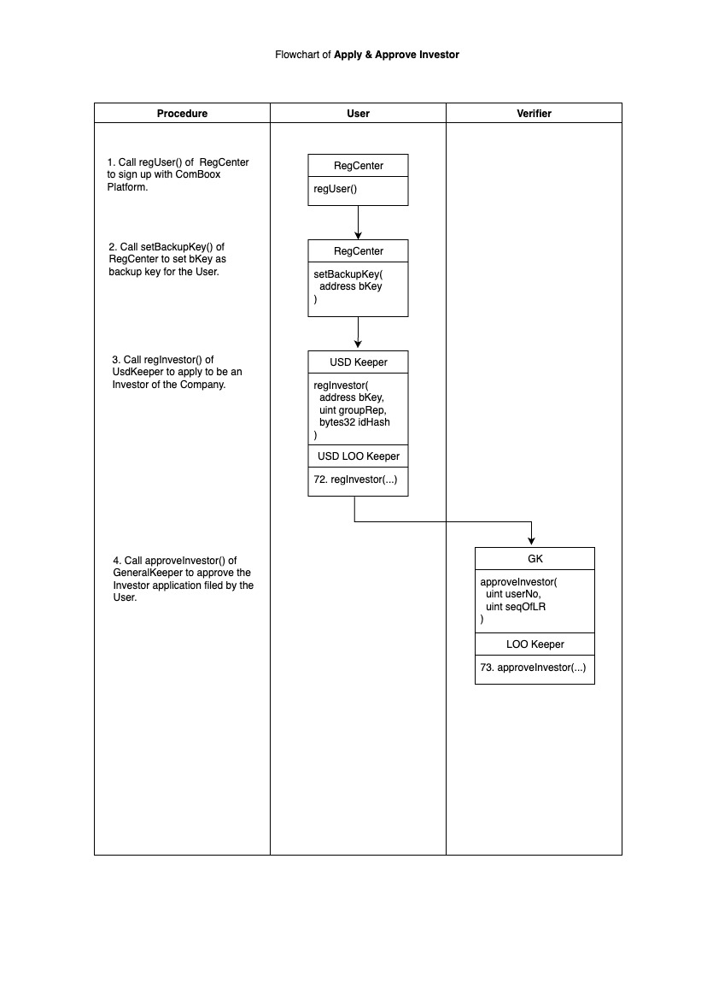
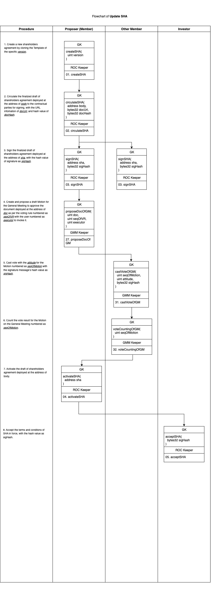

# ⏳ 7. Scenarios for Equity Transactions and Corporate Governance

In the course of a company’s daily operations and financing activities, all legal actions can generally be categorized into 【13】 representative scenarios. These scenarios broadly encompass the issuance of new shares, transfer of existing shares, amendment of the shareholders’ agreement, equity financing, election of directors and officers, approval of legal documents by resolution, external payments, and the execution of legal agreements, among others. This section presents these scenarios through logical flowcharts (swimlane diagrams), illustrating how the company’s stakeholders, acting in their respective capacities as rights holders, may utilize the external APIs provided by the ComBoox system to rigorously and systematically complete the aforementioned legal actions within the ComBoox platform. These scenarios include:

<strong>7.1. Apply for Qualified Investor Status</strong>

To invest in a company registered on the ComBoox platform, an individual must first apply for “Qualified Investor” status. This process entails a whitelist review and verification procedure. The “Listing Rules” under the company’s Shareholders’ Agreement explicitly define which user roles are vested with the authority to approve Qualified Investor applications. These approvers, referred to as “Verifiers,” may include the company’s shareholders, senior executives, affiliated equity trading venues, or even regulatory authorities.

Only users admitted to the whitelist are permitted to buy and sell the company’s shares. Once a user’s Qualified Investor status is revoked by a Verifier, all equity holdings of that user are effectively frozen and may not be transferred until the Qualified Investor status is reinstated.

The application and approval process for obtaining Qualified Investor status generally consists of the following steps:

1. Applicant calls the regUser() function of RegCenter to sign up with ComBoox Platform;
2. Applicant calls the setBackupKey() function of RegCenter to set _bKey_ as its backup key;
3. Applicant calls regInvestor() (the No.72 API) of USD Keeper to register itself as an investor, by inputting its backup key as _bKey_, the user number of its concert group’s representative as _groupRep_, with the hash value of its identity information as _idHas_.
4. Verifier calls approveInvestor() (the No.73 API) of General Keeper to approve the investor’s application, pursuant to the Listing Rule numbered as _seqOfLR_, filed by the user numbered as _userNo_.

<figure><figcaption></figcaption></figure>

<strong>7.2. Update Shareholders’ Agreement</strong>

The Shareholders’ Agreement or the Articles of Association serve as the company’s constitutional documents. They set forth the Rules governing corporate governance (Governance Rules), voting procedures (Voting Rules), allocation of executive positions (Position Allocation Rules), pre-emptive rights (First Refusal Rules), listing requirements (Listing Rules), as well as special investor protection provisions (Terms) such as share Lock-Up, Anti-Dilution, Drag-Along and Tag-along rights, Call Options, and Put Options.

Within the ComBoox system, shareholders may, in accordance with prescribed voting rules, submit proposals, cast votes, and activate new versions of the Shareholders’ Agreement in order to establish or amend the foregoing Rules and Terms. Once activated, the Shareholders’ Agreement will automatically respond in real time to queries from other Sub Keeper contracts and Registry contracts, providing the relevant Rules and Terms. This ensures that all corporate legal actions are executed strictly in accordance with the conditions and procedures stipulated in the Shareholders’ Agreement.

The specific process for creating, proposing, voting on, and activating the Shareholders’ Agreement includes the following steps:

1. Shareholder calls createSHA() (the No.01 API) of General Keeper to create a new shareholders agreement by cloning the Template of the specific _version_.
2. Owner of the draft SHA calls circulateSHA() (the No.02 API) of General Keeper to circulate the finalized draft of SHA deployed at the address of _body_ to the contractual parties for signing, with the URL infomation of _docUrl_, and hash value of _docHash_.
3. Shareholders call signSHA() (the No.03 API) of General Keeper to sign the finalized draft of SHA deployed at the address of _sha_, with the hash value of signature as _sigHash_.
4. Owner of the draft call proposeDocOfGM() (the No.27 API) of General Keeper to create and propose a draft Motion for the General Meeting to approve the document deployed at the address of _doc_ as per the voting rule numbered as _seqOfVR_ with the user numbered as _executor_ to invoke it.
5. Shareholders call castVoteOfGM() (the No.31 API) of General Keeper to cast vote with the _attitude_ for the Motion numbered as _seqOfMotion_ with the signature message’s hash value as _sigHash_.
6. Any user call voteCountingOfGM() (the No.32 API) of General Keeper to count the vote result for the Motion on the General Meeting numbered as _seqOfMotion_.
7. Any Shareholder may call activateSHA() (the No.04 API) of General Keeper to activate the draft of shareholders agreement deployed at the address of _body_.
8. Investor may call acceptSHA() (the No.05 API) of General Keeper to accept the terms and conditons of the SHA in force, with the hash value as _sigHash_.

<figure><figcaption></figcaption></figure>

