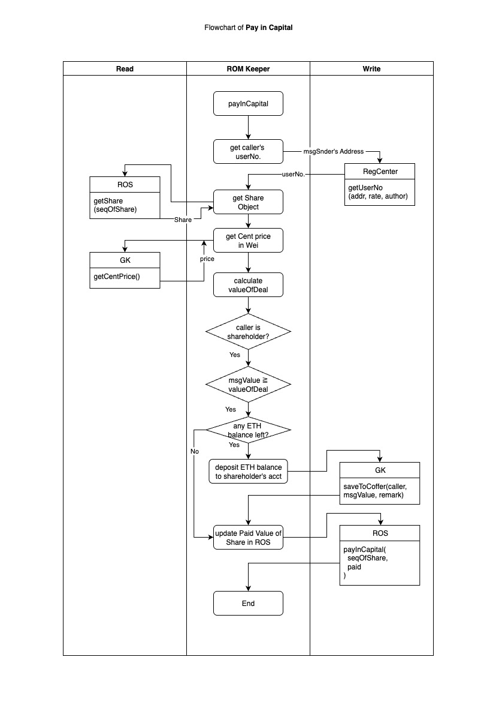
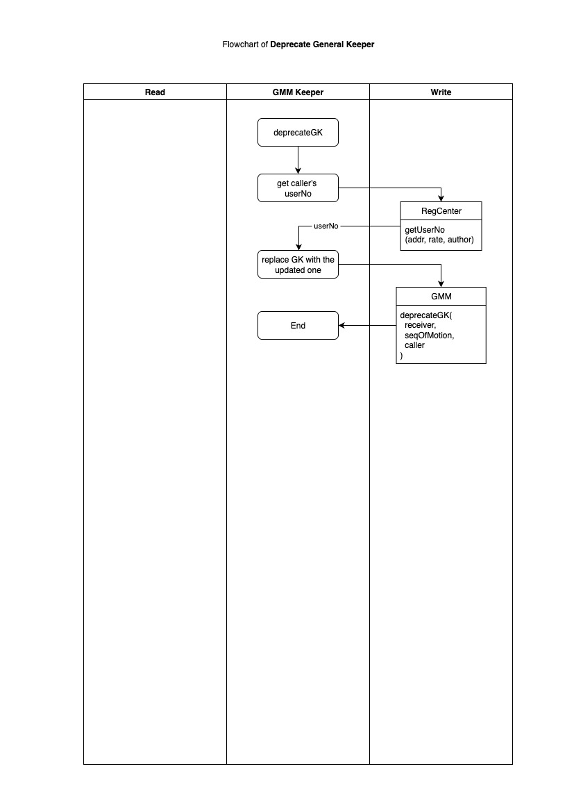
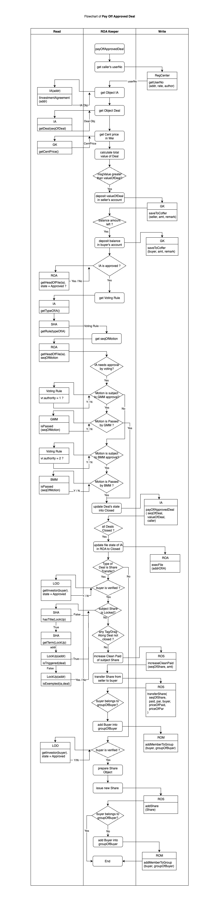

# 🧩 6. External Write APIs

There are totally 【91】 external write APIs exposed by the system, which collectively encompass nearly all legal acts relating to corporate governance, share transactions, and the payment and receipt of ETH and/or USDC. These APIs are routed to various Sub-Keepers for further processing and execution, thereby effectuating the corresponding legal consequences of each act.

<strong>6.1.  APIs routed to ROC Keeper</strong>

<table><thead><tr><th width="83.83203125">S.N.</th><th width="198.00390625">API</th><th>Description of Functions and Input Parameters</th></tr></thead><tbody><tr><td>01</td><td>function createSHA(   uint <em><mark style="color:blue;">version</mark></em> ) external</td><td>(Any Member) Create a new shareholders agreement by cloning the Template of the specific <em><mark style="color:blue;">version</mark></em>.</td></tr><tr><td>02</td><td>
Function circulateSHA(

  address <em><mark style="color:blue;">body</mark></em>,

  bytes32 <em><mark style="color:blue;">docUrl</mark></em>,

  bytes32 <em><mark style="color:blue;">docHash</mark></em>

) external
</td><td>(The Owner of the draft) Circulate the finalized draft of shareholders agreement deployed at the address of <em><mark style="color:blue;">body</mark></em> to the contractual parties for signing, with the URL infomation of <em><mark style="color:blue;">docUrl</mark></em>, and hash value of <em><mark style="color:blue;">docHash</mark></em>.</td></tr><tr><td>03</td><td>
function signSHA(

  address <em><mark style="color:blue;">sha</mark></em>,

  bytes32 <em><mark style="color:blue;">sigHash</mark></em>

) external
</td><td>(Parties to the draft) Sign the finalized draft of shareholders agreement deployed at the address of <em><mark style="color:blue;">sha</mark></em>, with the hash value of signature as <em><mark style="color:blue;">sigHash</mark></em>.</td></tr><tr><td>04</td><td>
function activateSHA(

  address <em><mark style="color:blue;">body</mark></em>

) external
</td><td>(Any user) Activate the draft of shareholders agreement deployed at the address of <em><mark style="color:blue;">body</mark></em>.</td></tr><tr><td>05</td><td>
function acceptSHA(

  bytes32 <em><mark style="color:blue;">sigHash</mark></em>

) external
</td><td>(Any user) Accept the terms and conditons of SHA in force, with the hash value as <em><mark style="color:blue;">sigHash</mark></em>.</td></tr></tbody></table>

<figure><figcaption></figcaption></figure>

<figure><figcaption></figcaption></figure>

<figure><figcaption></figcaption></figure>

<figure><figcaption></figcaption></figure>

<figure><figcaption></figcaption></figure>

<strong>6.2. APIs Routed to ROD Keeper</strong>

<table><thead><tr><th width="78.9296875">S.N.</th><th width="229.31640625">API</th><th>Description of Functions and Input Parameters</th><th></th></tr></thead><tbody><tr><td>06</td><td>
function takeSeat(

  uint256 <em><mark style="color:blue;">seqOfMotion</mark></em>,

  uint256 <em><mark style="color:blue;">seqOfPos</mark></em>

) external
</td><td>(The elected Director) Assume the director’s seat identified by <em><mark style="color:blue;">seqOfPos</mark></em> pursuant to the authorization granted under the Motion identified by <em><mark style="color:blue;">seqOfMotion</mark></em>.</td><td></td></tr><tr><td>07</td><td>
function removeDirector (

  uint256 <em><mark style="color:blue;">seqOfMotion</mark></em>,

  uint256 <em><mark style="color:blue;">seqOfPos</mark></em>

) external
</td><td>(The Member having the nomination right) Remove the director on the position numbered as <em><mark style="color:blue;">seqOfPos</mark></em> as per the removal Motion numbered as <em><mark style="color:blue;">seqOfMotion</mark></em>.</td><td></td></tr><tr><td>08</td><td>
function takePosition(

  uint256 <em><mark style="color:blue;">seqOfMotion</mark></em>,

  uint256 <em><mark style="color:blue;">seqOfPos</mark></em>

) external
</td><td>(The elected officer) Take the officer position identified as <em><mark style="color:blue;">seqOfPos</mark></em> pursuant to the authorization granted under the Motion identified as <em><mark style="color:blue;">seqOfMotion</mark></em>.</td><td></td></tr><tr><td>09</td><td>
function removeOfficer (

  uint256 <em><mark style="color:blue;">seqOfMotion</mark></em>,

  uint256 <em><mark style="color:blue;">seqOfPos</mark></em>

) external
</td><td>(The executor) Remove the executive officer on the position numbered as <em><mark style="color:blue;">seqOfPos</mark></em> as per the removal Motion numbered as <em><mark style="color:blue;">seqOfMotion</mark></em>.</td><td></td></tr><tr><td>10</td><td>
function quitPosition(

  uint256 <em><mark style="color:blue;">seqOfPos</mark></em>

) external
</td><td>(The Director or officer) Quit the position identified as <em><mark style="color:blue;">seqOfPos</mark></em> voluntarily.</td><td></td></tr></tbody></table>

<figure><figcaption></figcaption></figure>

<figure><figcaption></figcaption></figure>

<figure><figcaption></figcaption></figure>

<figure><figcaption></figcaption></figure>

<figure><figcaption></figcaption></figure>

<strong>6.3. APIs Routed to BMM Keeper</strong>

<table><thead><tr><th width="79.625">S.N.</th><th width="299.6953125">API</th><th>Description of Functions and Input Parameters</th></tr></thead><tbody><tr><td>11</td><td>
function nominateOfficer(

  uint256 <em><mark style="color:blue;">seqOfPos</mark></em>,

  uint256 <em><mark style="color:blue;">candidate</mark></em>

) external
</td><td>(The Director having the nomination right) Nominate the user identified by its user number as <em><mark style="color:blue;">candidate</mark></em> for the officer’s position numbered as <em><mark style="color:blue;">seqOfPos</mark></em>.</td></tr><tr><td>12</td><td>
function createMotionToRemoveOfficer(

uint256 <em><mark style="color:blue;">seqOfPos</mark></em>

) external
</td><td>(The Director having the nomination right) Create a draft Motion to remove the officer on the position numbered as <em><mark style="color:blue;">seqOfPos</mark></em>.</td></tr><tr><td>13</td><td>
function createMotionToApproveDoc(

  uint256 <em><mark style="color:blue;">doc</mark></em>,

  uint256 <em><mark style="color:blue;">seqOfVR</mark></em>,

  uint256 <em><mark style="color:blue;">executor</mark></em>

) external
</td><td>(Any Director) Creates a draft Motion for the Board to approve the document deployed at the address of <em><mark style="color:blue;">doc</mark></em>  as per the voting rule numbered as <em><mark style="color:blue;">seqOfVR</mark></em> with the user numbered as <em><mark style="color:blue;">executor</mark></em> to invoke it.</td></tr><tr><td>14</td><td>
function createAction(

    uint256 <em><mark style="color:blue;">seqOfVR</mark></em>,

    address[] memory <em><mark style="color:blue;">targets</mark></em>,

    uint256[] memory <em><mark style="color:blue;">values</mark></em>,

    bytes[] memory <em><mark style="color:blue;">params</mark></em>,

    bytes32 <em><mark style="color:blue;">desHash</mark></em>,

    uint256 <em><mark style="color:blue;">executor</mark></em>

) external
</td><td>Create a draft Motion for the Board to invoke a series of calls, as per the voting rule numbered as <em><mark style="color:blue;">seqOfVR</mark></em>, to the contracts deployed at their respective addresses of <em><mark style="color:blue;">targets</mark></em>, with paying ETH amount to <em><mark style="color:blue;">values</mark></em>, and inputting parameters of <em><mark style="color:blue;">params</mark></em>, attached with the hash value of the description message as <em><mark style="color:blue;">desHash</mark></em>, with the user numbered as <em><mark style="color:blue;">executor</mark></em> to invoke it.</td></tr><tr><td>15</td><td>
function entrustDelegaterForBoardMeeting(

  uint256 <em><mark style="color:blue;">seqOfMotion</mark></em>,

  uint256 <em><mark style="color:blue;">delegate</mark></em>

) external
</td><td>(Any Directors) Entrust the user numbered as <em><mark style="color:blue;">delegate</mark></em> to cast vote in Board meeting for the Motion identified as <em><mark style="color:blue;">seqOfMotion</mark></em>.</td></tr><tr><td>16</td><td>
function proposeMotionToBoard (

  uint256 <em><mark style="color:blue;">seqOfMotion</mark></em>

) external
</td><td>(Any Director) Propose the draft Motion numbered as <em><mark style="color:blue;">seqOfMotion</mark></em> to the Board meeting.</td></tr><tr><td>17</td><td>
function castVote(

  uint256 <em><mark style="color:blue;">seqOfMotion</mark></em>,

  uint256 <em><mark style="color:blue;">attitude</mark></em>,

  bytes32 <em><mark style="color:blue;">sigHash</mark></em>

) external
</td><td>(Any Director) Casts vote with the <em><mark style="color:blue;">attitude</mark></em> for the Motion numbered as <em><mark style="color:blue;">seqOfMotion</mark></em> with the signature message’s hash value as <em><mark style="color:blue;">sigHash</mark></em>.</td></tr><tr><td>18</td><td>
function voteCounting(

  uint256 <em><mark style="color:blue;">seqOfMotion</mark></em>

) external
</td><td>(Any user) Count the vote result for the Motion numbered as <em><mark style="color:blue;">seqOfMotion</mark></em>.</td></tr><tr><td>19</td><td>
function execAction(

    uint <em><mark style="color:blue;">typeOfAction</mark></em>,

    address[] memory <em><mark style="color:blue;">targets</mark></em>,

    uint256[] memory <em><mark style="color:blue;">values</mark></em>,

    bytes[] memory <em><mark style="color:blue;">params</mark></em>,

    bytes32 <em><mark style="color:blue;">desHash</mark></em>,

    uint256 <em><mark style="color:blue;">seqOfMotion</mark></em>

) external
</td><td>(The designated executor) Executes the Motion numbered as <em><mark style="color:blue;">seqOfMotion</mark></em>, categorized as <em><mark style="color:blue;">typeOfAction</mark></em>, to invoke the series of calls to the contracts deployed at addresses of <em><mark style="color:blue;">targets</mark></em>, with paying the respective ETH amount to <em><mark style="color:blue;">values</mark></em>, inputting parameters as <em><mark style="color:blue;">params</mark></em>, attached with description message’s hash value as <em><mark style="color:blue;">desHash</mark></em>.</td></tr></tbody></table>

<figure><figcaption></figcaption></figure>

<figure><figcaption></figcaption></figure>

<figure><figcaption></figcaption></figure>

<figure><figcaption></figcaption></figure>

<figure><figcaption></figcaption></figure>

<figure><figcaption></figcaption></figure>

<figure><figcaption></figcaption></figure>

<figure><figcaption></figcaption></figure>

<figure><figcaption></figcaption></figure>

<strong>6.4. APIs Routed to ROM Keeper</strong>

<table><thead><tr><th width="49.73046875" align="center">S.N.</th><th width="261.87890625">API</th><th>Description of Functions and Input Parameters</th></tr></thead><tbody><tr><td align="center">20</td><td>
function setMaxQtyOfMembers(

  uint256 <em><mark style="color:blue;">max</mark></em>

) external
</td><td>(The sectary of company, i.e. the Direct Keeper of General Keeper) Set the max quantity of Members as <em><mark style="color:blue;">max</mark></em>.</td></tr><tr><td align="center">21</td><td>
function setPayInAmt(

  uint256 <em><mark style="color:blue;">seqOfShare</mark></em>,

  uint256 <em><mark style="color:blue;">amt</mark></em>,

  uint256 <em><mark style="color:blue;">expireDate</mark></em>,

  bytes32 <em><mark style="color:blue;">hashLock</mark></em>

) external
</td><td>(The sectary of company, i.e. the Direct Keeper of General Keeper) Set the intended pay in amount of <em><mark style="color:blue;">amt</mark></em> for the share numbered as <em><mark style="color:blue;">seqOfShare</mark></em>, before the date of <em><mark style="color:blue;">expireDate</mark></em>, with the hash lock whose hash value is <em><mark style="color:blue;">hashLock</mark></em>.</td></tr><tr><td align="center">22</td><td>
function requestPaidInCapital(

bytes32 <em><mark style="color:blue;">hashLock</mark></em>,

string memory <em><mark style="color:blue;">hashKey</mark></em>

) external
</td><td>(The Member, after paying the paid in the relevant price off-chain) Request the specific paid in amount for the target share by inputting the hash key string <em><mark style="color:blue;">hashKey</mark></em> to unlock the hash lock whose hash value is <em><mark style="color:blue;">hashLock</mark></em>.</td></tr><tr><td align="center">23</td><td>
function withdrawPayInAmt(

  bytes32 <em><mark style="color:blue;">hashLock</mark></em>,

  uint256 <em><mark style="color:blue;">seqOfShare</mark></em>

) external
</td><td>(The secrtary of the company, i.e. the Direct Keeper of General Keeper, after the expiration date of the relevant hash lock) Withdraw the setting for granting the pay in amount for the specific share numbered as <em><mark style="color:blue;">seqOfShare</mark></em>, by inputting the hash lock value <em><mark style="color:blue;">hashLock</mark></em>.</td></tr><tr><td align="center">24</td><td>
function payInCapital(

  uint256 <em><mark style="color:blue;">seqOfShare</mark></em>,

  uint256 <em><mark style="color:blue;">amt</mark></em>

) external payable
</td><td>(The shareholder) Pay in capital for the share numbered as <em><mark style="color:blue;">seqOfShare</mark></em> to gain the paid-in amount of <em><mark style="color:blue;">amt</mark></em>  by paying ETH with the equivalent value to the General Keeper.</td></tr></tbody></table>

<figure><figcaption></figcaption></figure>

<figure><figcaption></figcaption></figure>

<figure><figcaption></figcaption></figure>

<figure><figcaption></figcaption></figure>

<figure><figcaption></figcaption></figure>

<strong>6.5. APIs Routed to GMM Keeper</strong>

<table><thead><tr><th width="75.40625">S.N.</th><th width="308.08984375">API</th><th>Description of Functions and Input Parameters</th></tr></thead><tbody><tr><td>25</td><td>
function nominateDirector(

  uint256 <em><mark style="color:blue;">seqOfPos</mark></em>,

  uint256 <em><mark style="color:blue;">candidate</mark></em>

) external
</td><td>(The Member who has the nomination right) Nominate the user numbered as <em><mark style="color:blue;">candidate</mark></em> for the Director’s position numbered as <em><mark style="color:blue;">seqOfPos</mark></em>.</td></tr><tr><td>26</td><td>
function createMotionToRemoveDirector(

  uint256 <em><mark style="color:blue;">seqOfPos</mark></em>

) external
</td><td>(The Member who has the nomination right) Create a draft motion to remove the Director on the position numbered as <em><mark style="color:blue;">seqOfPos</mark></em>.</td></tr><tr><td>27</td><td>
function proposeDocOfGM(

  uint256 <em><mark style="color:blue;">doc</mark></em>,

  uint256 <em><mark style="color:blue;">seqOfVR</mark></em>,

  uint256 <em><mark style="color:blue;">executor</mark></em>

) external
</td><td>(A Member) Create and propose a draft Motion for the General Meeting to approve the document deployed at the address of <em><mark style="color:blue;">doc</mark></em> as per the voting rule numbered as <em><mark style="color:blue;">seqOfVR</mark></em> with the user numbered as <em><mark style="color:blue;">executor</mark></em> to invoke it.</td></tr><tr><td>28</td><td>
function createActionOfGM(

    uint <em><mark style="color:blue;">seqOfVR</mark></em>,

    address[] memory <em><mark style="color:blue;">targets</mark></em>,

    uint256[] memory <em><mark style="color:blue;">values</mark></em>,

    bytes[] memory <em><mark style="color:blue;">params</mark></em>,

    bytes32 <em><mark style="color:blue;">desHash</mark></em>,

    uint <em><mark style="color:blue;">executor</mark></em>

) external
</td><td>(A Member) Create a draft Motion for the General Meeting to execute a series of calls, as per the voting rule numbered as <em><mark style="color:blue;">seqOfVR</mark></em>, to the contracts deployed at the addresses of <em><mark style="color:blue;">targets</mark></em>, with paying the respective ETH amount to <em><mark style="color:blue;">values</mark></em>, and inputting parameters of <em><mark style="color:blue;">params</mark></em>, attached a description message whose hash value is <em><mark style="color:blue;">desHash</mark></em>, with the user numbered as <em><mark style="color:blue;">executor</mark></em> to invoke it.</td></tr><tr><td>29</td><td>
function entrustDelegaterForGeneralMeeting(

  uint256 <em><mark style="color:blue;">seqOfMotion</mark></em>,

  uint256 <em><mark style="color:blue;">delegate</mark></em>

) external
</td><td>(A Member) Entrust the user numbered as <em><mark style="color:blue;">delegate</mark></em> to cast vote in General Meeting for the Motion numbered as <em><mark style="color:blue;">seqOfMotion</mark></em>.</td></tr><tr><td>30</td><td>
function proposeMotionToGeneralMeeting(

  uint256 <em><mark style="color:blue;">seqOfMotion</mark></em>

) external
</td><td>(A Member) Proposes the Motion numbered as <em><mark style="color:blue;">seqOfMotion</mark></em> to the General Meeting.</td></tr><tr><td>31</td><td>
function castVoteOfGM(

  uint256 <em><mark style="color:blue;">seqOfMotion</mark></em>,

  uint256 <em><mark style="color:blue;">attitude</mark></em>,

  bytes32 <em><mark style="color:blue;">sigHash</mark></em>

) external
</td><td>(A Member) Cast vote with the <em><mark style="color:blue;">attitude</mark></em> for the Motion numbered as <em><mark style="color:blue;">seqOfMotion</mark></em> with the signature message’s hash value as <em><mark style="color:blue;">sigHash</mark></em>.</td></tr><tr><td>32</td><td>
function voteCountingOfGM(

  uint256 <em><mark style="color:blue;">seqOfMotion</mark></em>

) external
</td><td>(Any user) Count the vote result for the Motion on the General Meeting numbered as <em><mark style="color:blue;">seqOfMotion</mark></em>.</td></tr><tr><td>33</td><td>
function execActionOfGM(

    uint <em><mark style="color:blue;">typeOfAction</mark></em>,

    address[] memory <em><mark style="color:blue;">targets</mark></em>,

    uint256[] memory <em><mark style="color:blue;">values</mark></em>,

    bytes[] memory <em><mark style="color:blue;">params</mark></em>,

    bytes32 <em><mark style="color:blue;">desHash</mark></em>,

    uint256 <em><mark style="color:blue;">seqOfMotion</mark></em>

) external
</td><td>(The designated executor) Execute the Motion numbered as <em><mark style="color:blue;">seqOfMotion</mark></em>, categorized as <em><mark style="color:blue;">typeOfAction</mark></em>, to trigger the series of calls to the contracts deployed at addresses of <em><mark style="color:blue;">targets</mark></em>, with paying the respective ETH amount to <em><mark style="color:blue;">values</mark></em>, inputting parameters as <em><mark style="color:blue;">params</mark></em>, attached with hash value of the description message as <em><mark style="color:blue;">desHash</mark></em>.</td></tr><tr><td>34</td><td>
function deprecateGK(

  address payable <em><mark style="color:blue;">receiver</mark></em>,

  uint256 <em><mark style="color:blue;">seqOfMotion</mark></em>

) external
</td><td>(The designated executor) deprecate the current General Keeper, as per the Motion numbered as <em><mark style="color:blue;">seqOfMotion</mark></em>, so as to move all archives and the balance amount of ETH and CBP to the new General Keeper deployed at the address of <em><mark style="color:blue;">receiver</mark></em>.</td></tr></tbody></table>

<figure><figcaption></figcaption></figure>

<figure><figcaption></figcaption></figure>

<figure><figcaption></figcaption></figure>

<figure><figcaption></figcaption></figure>

<figure><figcaption></figcaption></figure>

<figure><figcaption></figcaption></figure>

<figure><figcaption></figcaption></figure>

<figure><figcaption></figcaption></figure>

<figure><figcaption></figcaption></figure>

<figure><figcaption></figcaption></figure>

<strong>6.6. APIs Routed to ROA Keeper</strong>

<table><thead><tr><th width="78.23046875">S.N.</th><th width="239.078125">API</th><th>Description of Functions and Input Parameters</th></tr></thead><tbody><tr><td>35</td><td>
function createIA(

  uint256 <em><mark style="color:blue;">version</mark></em>

) external
</td><td>(Any Member) Create a draft Investment Agreement on the Register of Agreement, by cloning the Template of the version numbered as <em><mark style="color:blue;">version</mark></em>.</td></tr><tr><td>36</td><td>
function circulateIA(

  address <em><mark style="color:blue;">body</mark></em>,

  bytes32 <em><mark style="color:blue;">docUrl</mark></em>,

  bytes32 <em><mark style="color:blue;">docHash</mark></em>

) external
</td><td>(The Member who is the Owner of the draft Investment Agreement) Circulate the finalized draft deployed at the address of <em><mark style="color:blue;">body</mark></em> to the parties for signature, attaching with the URL information of <em><mark style="color:blue;">docUrl</mark></em> and the hash value of the draft as <em><mark style="color:blue;">docHash</mark></em>.</td></tr><tr><td>37</td><td>
function signIA(

  address <em><mark style="color:blue;">ia</mark></em>,

  bytes32 <em><mark style="color:blue;">sigHash</mark></em>

) external
</td><td>(The parties to the Investment Agreement) Sign the Investment Agreement deployed at the address of <em><mark style="color:blue;">ia</mark></em>, with the signature message’s hash value as <em><mark style="color:blue;">sigHash</mark></em>.</td></tr><tr><td>38</td><td>
function pushToCoffer(

  address <em><mark style="color:blue;">ia</mark></em>,

  uint256 <em><mark style="color:blue;">seqOfDeal</mark></em>,

  bytes32 <em><mark style="color:blue;">hashLock</mark></em>,

  uint256 <em><mark style="color:blue;">closingDeadline</mark></em>

) external
</td><td>(The seller) Confirm all conditions precedent have been satisfied and ready for closing, for the specific deal numbered as <em><mark style="color:blue;">seqOfDeal</mark></em>, under the Investment Agreement deployed at the address of <em><mark style="color:blue;">ia</mark></em>, by inputting a hash lock value <em><mark style="color:blue;">hashLock</mark></em>  and setting the closing deadline as <em><mark style="color:blue;">closingDeadline</mark></em>.</td></tr><tr><td>39</td><td>
function closeDeal(

  address <em><mark style="color:blue;">ia</mark></em>,

  uint256 <em><mark style="color:blue;">seqOfDeal</mark></em>,

  string memory <em><mark style="color:blue;">hashKey</mark></em>

) external
</td><td>(The buyer) Close the deal numbered as <em><mark style="color:blue;">seqOfDeal</mark></em>, under the Investment Agreement deployed at the address of <em><mark style="color:blue;">ia</mark></em>, after paying the consideration off-chain, by inputting the hash key string <em><mark style="color:blue;">hashKey</mark></em>.</td></tr><tr><td>40</td><td>
function issueNewShare(

  address <em><mark style="color:blue;">ia</mark></em>,

  uint256 <em><mark style="color:blue;">seqOfDeal</mark></em>

) external
</td><td>(The issuer) Issue new share directly to the buyer, for the capital increasing Deal numbered as <em><mark style="color:blue;">seqOfDeal</mark></em> under the Investment Agreement deployed at the address of <em><mark style="color:blue;">ia</mark></em>.</td></tr><tr><td>41</td><td>
function transferTargetShare(

address <em><mark style="color:blue;">ia</mark></em>,

uint256 <em><mark style="color:blue;">seqOfDeal</mark></em>

) external
</td><td>(The seller) Transfer the subject share directly to the buyer, for the specific share transfer Deal numbered as <em><mark style="color:blue;">seqOfDeal</mark></em> under the Investment Agreement deployed at the address of <em><mark style="color:blue;">ia</mark></em>.</td></tr><tr><td>42</td><td>
function terminateDeal(

  address <em><mark style="color:blue;">ia</mark></em>,

  uint256 <em><mark style="color:blue;">seqOfDeal</mark></em>

) external
</td><td>(The seller, after the expiration date concerned) Terminate the Deal numbered as <em><mark style="color:blue;">seqOfDeal</mark></em> under the Investment Agreement deployed at the address of <em><mark style="color:blue;">ia</mark></em>.</td></tr><tr><td>43</td><td>
function payOffApprovedDeal(

    address <em><mark style="color:blue;">ia</mark></em>,

    uint256 <em><mark style="color:blue;">seqOfDeal</mark></em>

) external payable
</td><td>(The buyer) Close the Deal numbered as <em><mark style="color:blue;">seqOfDeal</mark></em>, under the Investment Agreement deployed at the address of <em><mark style="color:blue;">ia</mark>,</em> by paying ETH having the equivalent value to the total consideration.</td></tr></tbody></table>

<figure><figcaption></figcaption></figure>

<figure><figcaption></figcaption></figure>

<figure><figcaption></figcaption></figure>

<figure><figcaption></figcaption></figure>

<figure><figcaption></figcaption></figure>

<figure><figcaption></figcaption></figure>

<figure><figcaption></figcaption></figure>

<figure><figcaption></figcaption></figure>

<figure><figcaption></figcaption></figure>

