# 🧩 6. External Write APIs

There are totally 【84】 external write APIs exposed by the system, which collectively encompass nearly all legal acts relating to corporate governance, share transactions, and the payment and receipt of USDC. These APIs are routed to various Sub-Keepers for further processing and execution, thereby effectuating the corresponding legal consequences of each act.

<strong>6.1.  APIs routed to ROC Keeper</strong>

<table><thead><tr><th width="83.83203125">S.N.</th><th width="198.00390625">API</th><th>Description of Functions and Input Parameters</th></tr></thead><tbody><tr><td>01</td><td>function createSHA(   uint <em><mark style="color:blue;">version</mark></em> ) external</td><td>(Any Member) Create a new shareholders agreement by cloning the Template of the specific <em><mark style="color:blue;">version</mark></em>.</td></tr><tr><td>02</td><td>
Function circulateSHA(

  address <em><mark style="color:blue;">body</mark></em>,

  bytes32 <em><mark style="color:blue;">docUrl</mark></em>,

  bytes32 <em><mark style="color:blue;">docHash</mark></em>

) external
</td><td>(The Owner of the draft) Circulate the finalized draft of shareholders agreement deployed at the address of <em><mark style="color:blue;">body</mark></em> to the contractual parties for signing, with the URL infomation of <em><mark style="color:blue;">docUrl</mark></em>, and hash value of <em><mark style="color:blue;">docHash</mark></em>.</td></tr><tr><td>03</td><td>
function signSHA(

  address <em><mark style="color:blue;">sha</mark></em>,

  bytes32 <em><mark style="color:blue;">sigHash</mark></em>

) external
</td><td>(Parties to the draft) Sign the finalized draft of shareholders agreement deployed at the address of <em><mark style="color:blue;">sha</mark></em>, with the hash value of signature as <em><mark style="color:blue;">sigHash</mark></em>.</td></tr><tr><td>04</td><td>
function activateSHA(

  address <em><mark style="color:blue;">body</mark></em>

) external
</td><td>(Any user) Activate the draft of shareholders agreement deployed at the address of <em><mark style="color:blue;">body</mark></em>.</td></tr><tr><td>05</td><td>
function acceptSHA(

  bytes32 <em><mark style="color:blue;">sigHash</mark></em>

) external
</td><td>(Any user) Accept the terms and conditons of SHA in force, with the hash value as <em><mark style="color:blue;">sigHash</mark></em>.</td></tr></tbody></table>

<figure>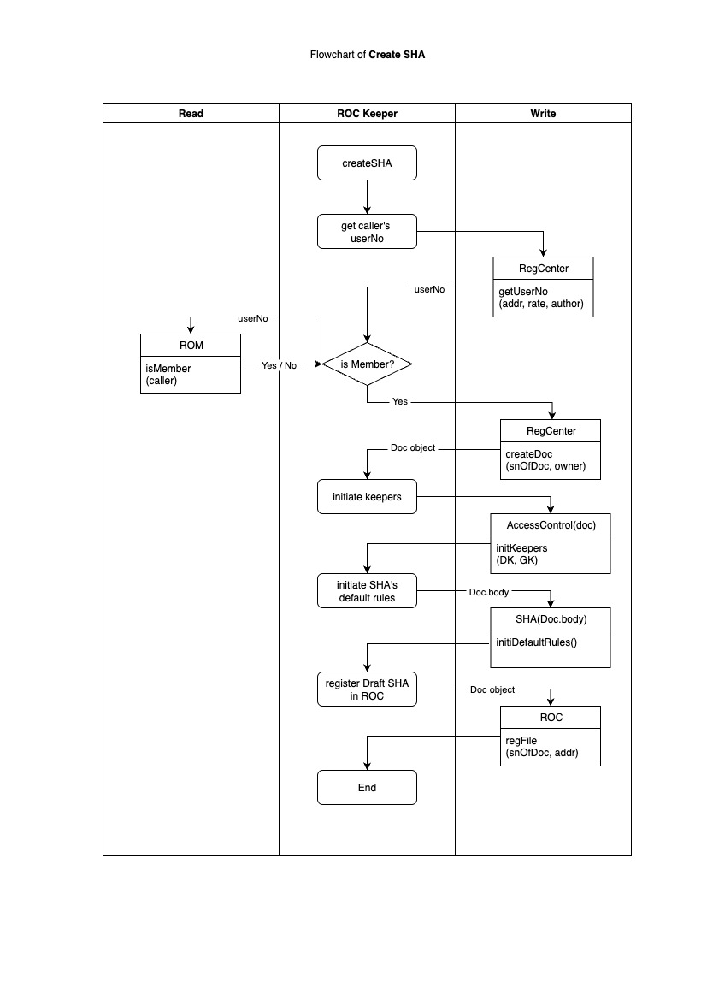<figcaption></figcaption></figure>

<figure>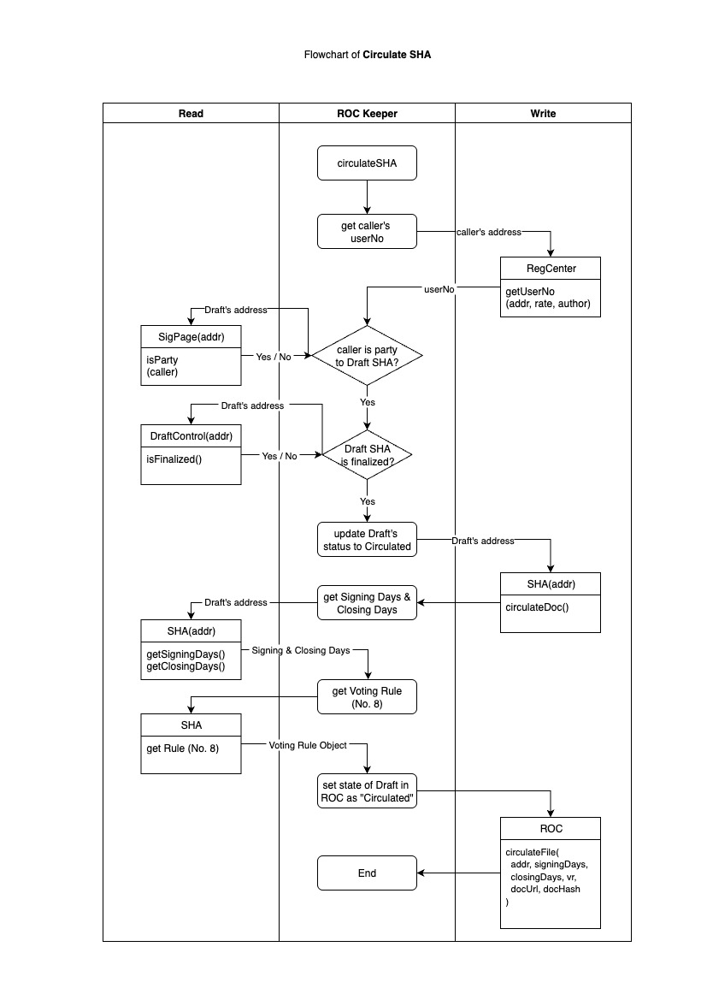<figcaption></figcaption></figure>

<figure><figcaption></figcaption></figure>

<figure>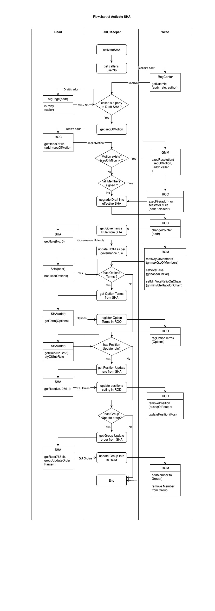<figcaption></figcaption></figure>

<figure><figcaption></figcaption></figure>

<strong>6.2. APIs Routed to ROD Keeper</strong>

<table><thead><tr><th width="78.9296875">S.N.</th><th width="229.31640625">API</th><th>Description of Functions and Input Parameters</th><th></th></tr></thead><tbody><tr><td>06</td><td>
function takeSeat(

  uint256 <em><mark style="color:blue;">seqOfMotion</mark></em>,

  uint256 <em><mark style="color:blue;">seqOfPos</mark></em>

) external
</td><td>(The elected Director) Assume the director’s seat identified by <em><mark style="color:blue;">seqOfPos</mark></em> pursuant to the authorization granted under the Motion identified by <em><mark style="color:blue;">seqOfMotion</mark></em>.</td><td></td></tr><tr><td>07</td><td>
function removeDirector (

  uint256 <em><mark style="color:blue;">seqOfMotion</mark></em>,

  uint256 <em><mark style="color:blue;">seqOfPos</mark></em>

) external
</td><td>(The Member having the nomination right) Remove the director on the position numbered as <em><mark style="color:blue;">seqOfPos</mark></em> as per the removal Motion numbered as <em><mark style="color:blue;">seqOfMotion</mark></em>.</td><td></td></tr><tr><td>08</td><td>
function takePosition(

  uint256 <em><mark style="color:blue;">seqOfMotion</mark></em>,

  uint256 <em><mark style="color:blue;">seqOfPos</mark></em>

) external
</td><td>(The elected officer) Take the officer position identified as <em><mark style="color:blue;">seqOfPos</mark></em> pursuant to the authorization granted under the Motion identified as <em><mark style="color:blue;">seqOfMotion</mark></em>.</td><td></td></tr><tr><td>09</td><td>
function removeOfficer (

  uint256 <em><mark style="color:blue;">seqOfMotion</mark></em>,

  uint256 <em><mark style="color:blue;">seqOfPos</mark></em>

) external
</td><td>(The executor) Remove the executive officer on the position numbered as <em><mark style="color:blue;">seqOfPos</mark></em> as per the removal Motion numbered as <em><mark style="color:blue;">seqOfMotion</mark></em>.</td><td></td></tr><tr><td>10</td><td>
function quitPosition(

  uint256 <em><mark style="color:blue;">seqOfPos</mark></em>

) external
</td><td>(The Director or officer) Quit the position identified as <em><mark style="color:blue;">seqOfPos</mark></em> voluntarily.</td><td></td></tr></tbody></table>

<figure><figcaption></figcaption></figure>

<figure>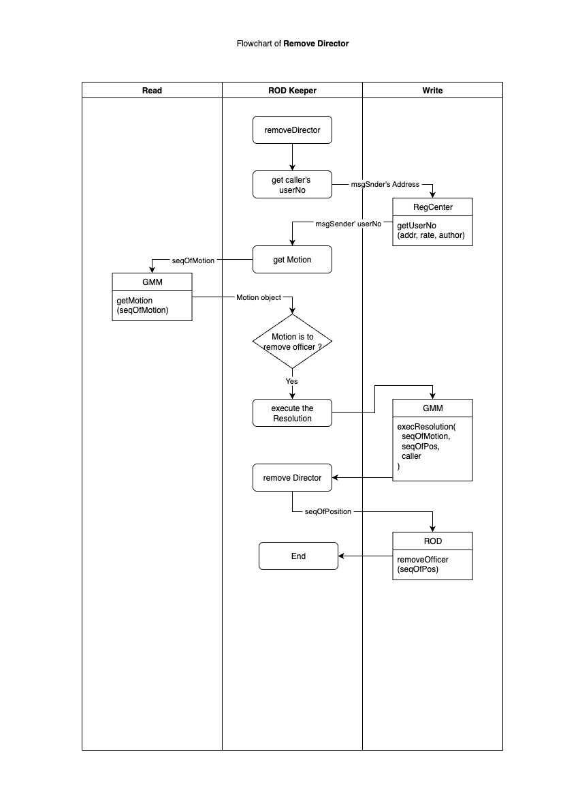<figcaption></figcaption></figure>

<figure>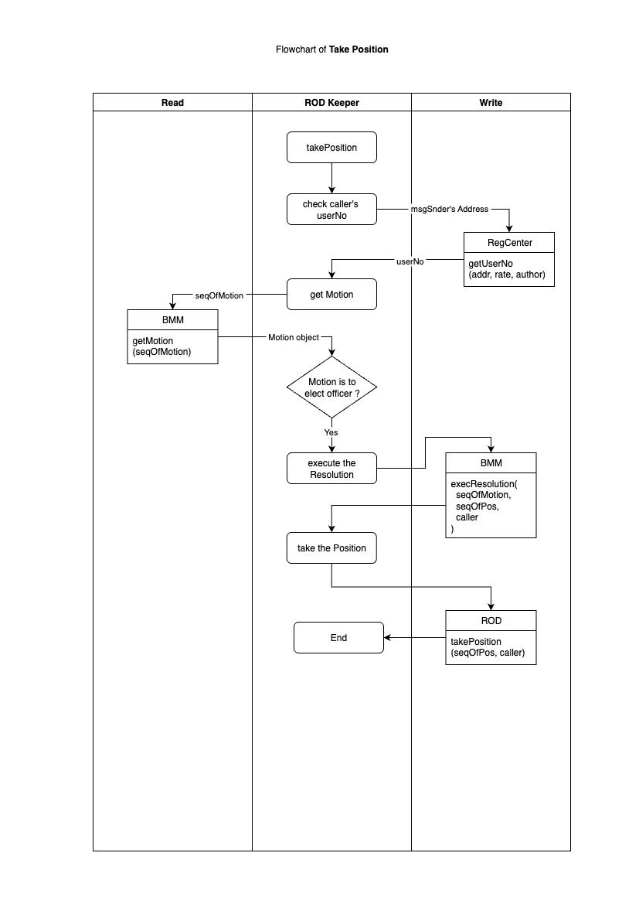<figcaption></figcaption></figure>

<figure>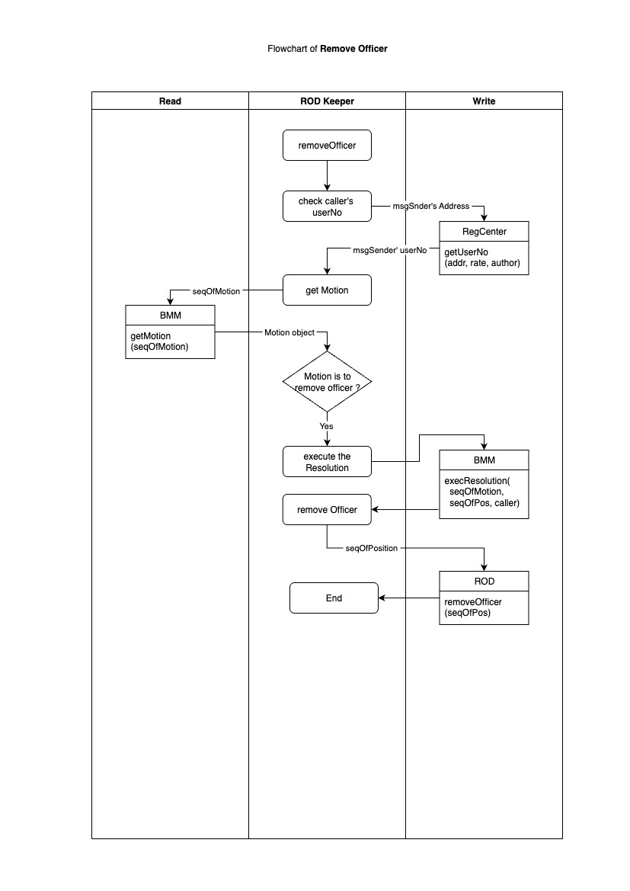<figcaption></figcaption></figure>

<figure><figcaption></figcaption></figure>

<strong>6.3. APIs Routed to BMM Keeper</strong>

<table><thead><tr><th width="53.37109375">S.N.</th><th width="299.6953125">API</th><th>Description of Functions and Input Parameters</th></tr></thead><tbody><tr><td>11</td><td>
function nominateOfficer(

  uint256 <em><mark style="color:blue;">seqOfPos</mark></em>,

  uint256 <em><mark style="color:blue;">candidate</mark></em>

) external
</td><td>(The Director having the nomination right) Nominate the user identified by its user number as <em><mark style="color:blue;">candidate</mark></em> for the officer’s position numbered as <em><mark style="color:blue;">seqOfPos</mark></em>.</td></tr><tr><td>12</td><td>
function createMotionToRemoveOfficer(

uint256 <em><mark style="color:blue;">seqOfPos</mark></em>

) external
</td><td>(The Director having the nomination right) Create a draft Motion to remove the officer on the position numbered as <em><mark style="color:blue;">seqOfPos</mark></em>.</td></tr><tr><td>13</td><td>
function createMotionToApproveDoc(

  uint256 <em><mark style="color:blue;">doc</mark></em>,

  uint256 <em><mark style="color:blue;">seqOfVR</mark></em>,

  uint256 <em><mark style="color:blue;">executor</mark></em>

) external
</td><td>(Any Director) Creates a draft Motion for the Board to approve the document deployed at the address of <em><mark style="color:blue;">doc</mark></em>  as per the voting rule numbered as <em><mark style="color:blue;">seqOfVR</mark></em> with the user numbered as <em><mark style="color:blue;">executor</mark></em> to invoke it.</td></tr><tr><td>14</td><td>
function <strong>proposeToTransferFundWithBoard</strong>(

    address <em><mark style="color:$primary;">to</mark></em>,

    bool <em><mark style="color:$primary;">isCBP</mark></em>,

    uint256 <em><mark style="color:$primary;">amt</mark></em>,

    uint256 <em><mark style="color:$primary;">expireDate</mark></em>,

    uint256 <em><mark style="color:$primary;">seqOfVR</mark></em>,

    uint256 <em><mark style="color:$primary;">executor</mark></em>

) external
</td><td>(Any Director) Propose, to the Board Meeting, to transfer certain amount of CBP (<em><mark style="color:$primary;">isCBP</mark></em> is true) or USDC (<em><mark style="color:$primary;">isCBP</mark></em> is false), to the account address <em><mark style="color:$primary;">to</mark></em>, amount to <em><mark style="color:$primary;">amt</mark></em>, before the timestamp of <em><mark style="color:$primary;">expireDate</mark></em>, as per the Voting Rule numbered as <em><mark style="color:$primary;">seqOfVR</mark></em>, with the user numbered as <em><mark style="color:$primary;">executor</mark></em> to execute the Motion concerned.</td></tr><tr><td>15</td><td>
function createAction(

    uint256 <em><mark style="color:blue;">seqOfVR</mark></em>,

    address[] memory <em><mark style="color:blue;">targets</mark></em>,

    uint256[] memory <em><mark style="color:blue;">values</mark></em>,

    bytes[] memory <em><mark style="color:blue;">params</mark></em>,

    bytes32 <em><mark style="color:blue;">desHash</mark></em>,

    uint256 <em><mark style="color:blue;">executor</mark></em>

) external
</td><td>Create a draft Motion for the Board to invoke a series of calls, as per the voting rule numbered as <em><mark style="color:blue;">seqOfVR</mark></em>, to the contracts deployed at their respective addresses of <em><mark style="color:blue;">targets</mark></em>, with paying ETH amount to <em><mark style="color:blue;">values</mark></em>, and inputting parameters of <em><mark style="color:blue;">params</mark></em>, attached with the hash value of the description message as <em><mark style="color:blue;">desHash</mark></em>, with the user numbered as <em><mark style="color:blue;">executor</mark></em> to invoke it.</td></tr><tr><td>16</td><td>
function entrustDelegaterForBoardMeeting(

  uint256 <em><mark style="color:blue;">seqOfMotion</mark></em>,

  uint256 <em><mark style="color:blue;">delegate</mark></em>

) external
</td><td>(Any Directors) Entrust the user numbered as <em><mark style="color:blue;">delegate</mark></em> to cast vote in Board meeting for the Motion identified as <em><mark style="color:blue;">seqOfMotion</mark></em>.</td></tr><tr><td>17</td><td>
function proposeMotionToBoard (

  uint256 <em><mark style="color:blue;">seqOfMotion</mark></em>

) external
</td><td>(Any Director) Propose the draft Motion numbered as <em><mark style="color:blue;">seqOfMotion</mark></em> to the Board meeting.</td></tr><tr><td>18</td><td>
function castVote(

  uint256 <em><mark style="color:blue;">seqOfMotion</mark></em>,

  uint256 <em><mark style="color:blue;">attitude</mark></em>,

  bytes32 <em><mark style="color:blue;">sigHash</mark></em>

) external
</td><td>(Any Director) Casts vote with the <em><mark style="color:blue;">attitude</mark></em> for the Motion numbered as <em><mark style="color:blue;">seqOfMotion</mark></em> with the signature message’s hash value as <em><mark style="color:blue;">sigHash</mark></em>.</td></tr><tr><td>19</td><td>
function voteCounting(

  uint256 <em><mark style="color:blue;">seqOfMotion</mark></em>

) external
</td><td>(Any user) Count the vote result for the Motion numbered as <em><mark style="color:blue;">seqOfMotion</mark></em>.</td></tr><tr><td>20</td><td>
function execAction(

    uint <em><mark style="color:blue;">typeOfAction</mark></em>,

    address[] memory <em><mark style="color:blue;">targets</mark></em>,

    uint256[] memory <em><mark style="color:blue;">values</mark></em>,

    bytes[] memory <em><mark style="color:blue;">params</mark></em>,

    bytes32 <em><mark style="color:blue;">desHash</mark></em>,

    uint256 <em><mark style="color:blue;">seqOfMotion</mark></em>

) external
</td><td>(The designated executor) Executes the Motion numbered as <em><mark style="color:blue;">seqOfMotion</mark></em>, categorized as <em><mark style="color:blue;">typeOfAction</mark></em>, to invoke the series of calls to the contracts deployed at addresses of <em><mark style="color:blue;">targets</mark></em>, with paying the respective ETH amount to <em><mark style="color:blue;">values</mark></em>, inputting parameters as <em><mark style="color:blue;">params</mark></em>, attached with description message’s hash value as <em><mark style="color:blue;">desHash</mark></em>.</td></tr></tbody></table>

<figure>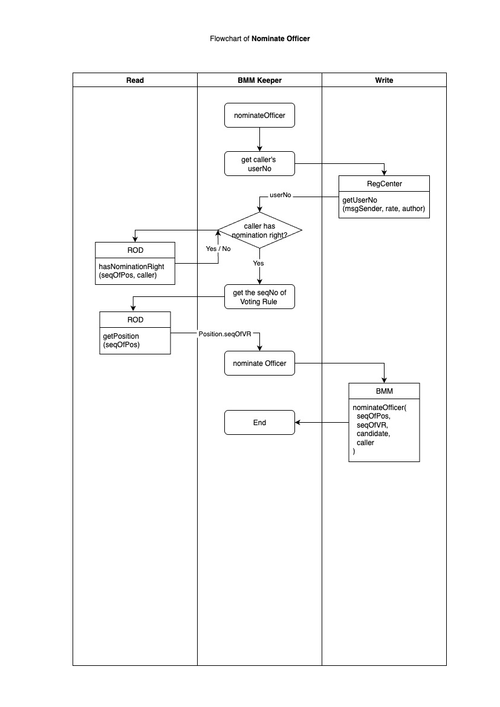<figcaption></figcaption></figure>

<figure>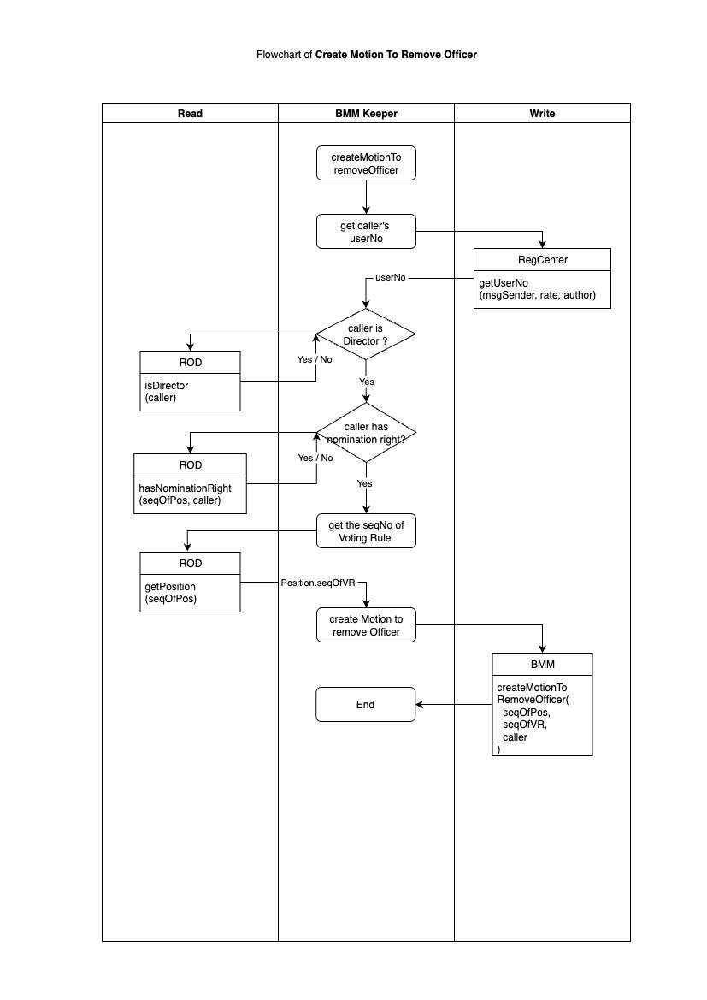<figcaption></figcaption></figure>

<figure>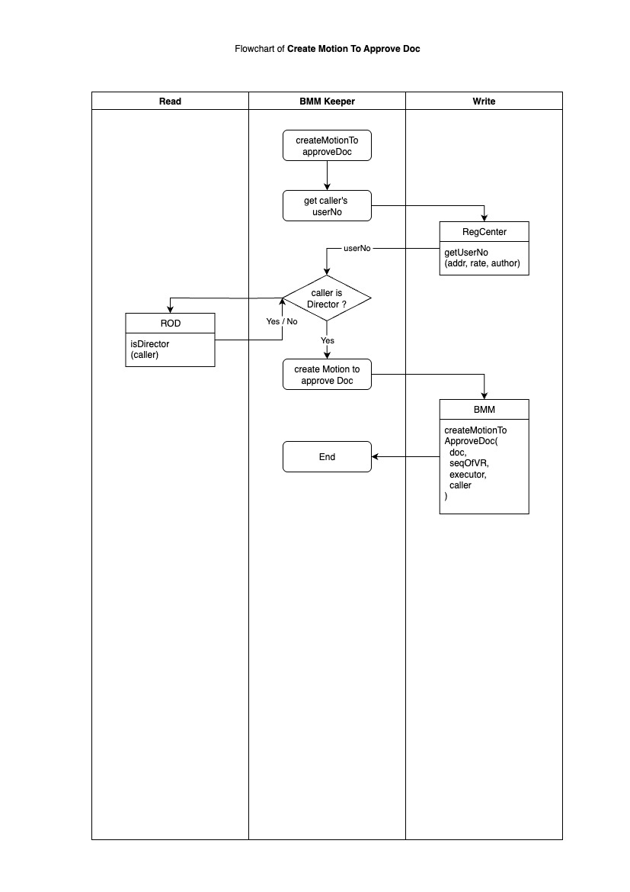<figcaption></figcaption></figure>

<figure><figcaption></figcaption></figure>

<figure>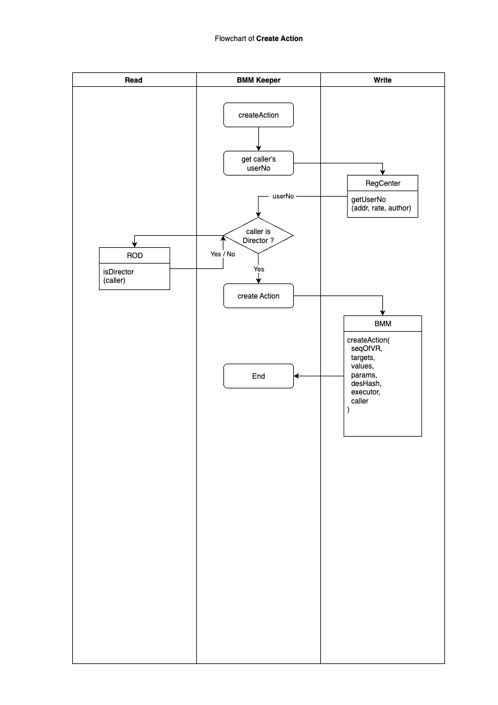<figcaption></figcaption></figure>

<figure>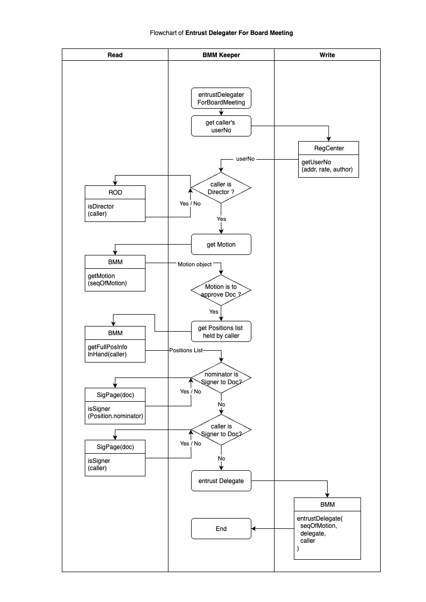<figcaption></figcaption></figure>

<figure>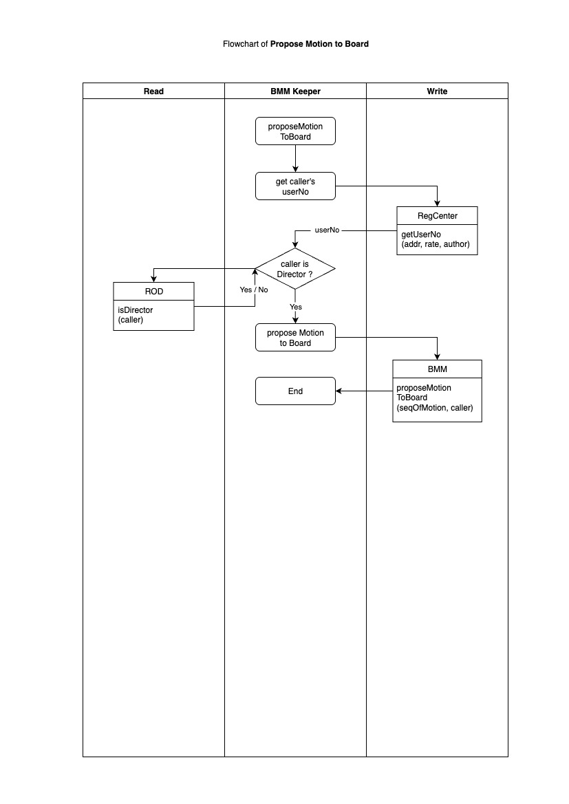<figcaption></figcaption></figure>

<figure>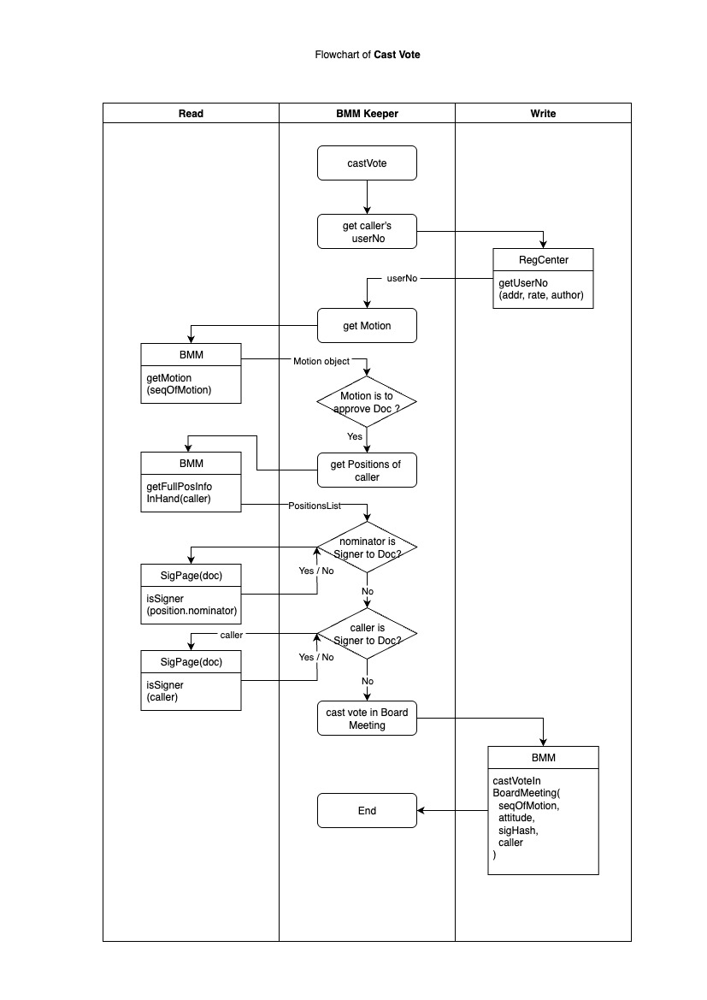<figcaption></figcaption></figure>

<figure><figcaption></figcaption></figure>

<figure>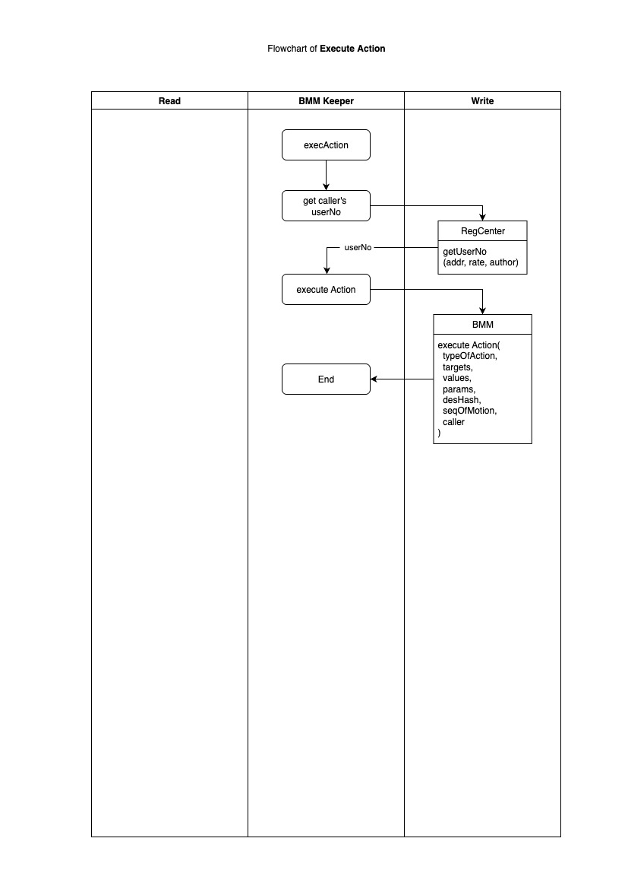<figcaption></figcaption></figure>

<strong>6.4. APIs Routed to ROM Keeper</strong>

<table><thead><tr><th width="49.73046875" align="center">S.N.</th><th width="317.13671875">API</th><th>Description of Functions and Input Parameters</th></tr></thead><tbody><tr><td align="center">21</td><td>
function setMaxQtyOfMembers(

  uint256 <em><mark style="color:blue;">max</mark></em>

) external
</td><td>(The sectary of company, i.e. the Direct Keeper of General Keeper) Set the max quantity of Members as <em><mark style="color:blue;">max</mark></em>.</td></tr><tr><td align="center">22</td><td>
function setPayInAmt(

  uint256 <em><mark style="color:blue;">seqOfShare</mark></em>,

  uint256 <em><mark style="color:blue;">amt</mark></em>,

  uint256 <em><mark style="color:blue;">expireDate</mark></em>,

  bytes32 <em><mark style="color:blue;">hashLock</mark></em>

) external
</td><td>(The sectary of company, i.e. the Direct Keeper of General Keeper) Set the intended pay in amount of <em><mark style="color:blue;">amt</mark></em> for the share numbered as <em><mark style="color:blue;">seqOfShare</mark></em>, before the date of <em><mark style="color:blue;">expireDate</mark></em>, with the hash lock whose hash value is <em><mark style="color:blue;">hashLock</mark></em>.</td></tr><tr><td align="center">23</td><td>
function requestPaidInCapital(

bytes32 <em><mark style="color:blue;">hashLock</mark></em>,

string memory <em><mark style="color:blue;">hashKey</mark></em>

) external
</td><td>(The Member, after paying the paid in the relevant price off-chain) Request the specific paid in amount for the target share by inputting the hash key string <em><mark style="color:blue;">hashKey</mark></em> to unlock the hash lock whose hash value is <em><mark style="color:blue;">hashLock</mark></em>.</td></tr><tr><td align="center">24</td><td>
function withdrawPayInAmt(

  bytes32 <em><mark style="color:blue;">hashLock</mark></em>,

  uint256 <em><mark style="color:blue;">seqOfShare</mark></em>

) external
</td><td>(The secrtary of the company, i.e. the Direct Keeper of General Keeper, after the expiration date of the relevant hash lock) Withdraw the setting for granting the pay in amount for the specific share numbered as <em><mark style="color:blue;">seqOfShare</mark></em>, by inputting the hash lock value <em><mark style="color:blue;">hashLock</mark></em>.</td></tr><tr><td align="center">25</td><td>
function <strong>payInCapital</strong>(

    ICashier.TransferAuth memory <em><mark style="color:$primary;">auth</mark></em>,

    uint256 <em><mark style="color:$primary;">seqOfShare</mark></em>,   

    uint256 <em><mark style="color:$primary;">paid</mark></em>

) external;
</td><td>(The shareholder) Pay in capital, for its specific share numbered as <em><mark style="color:$primary;">seqOfShare</mark></em>, to the amount of paid as <em><mark style="color:$primary;">paid</mark></em>, by paying certain amount of USDC through off-chain authorization signed as <em><mark style="color:$primary;">auth</mark>.</em></td></tr><tr><td align="center">26</td><td>
function <strong>decreaseCapital</strong>(

    uint <em><mark style="color:$primary;">seqOfVR</mark></em>,

    uint256 <em><mark style="color:$primary;">seqOfShare</mark></em>,

    uint <em><mark style="color:$primary;">paid</mark></em>,

    uint <em><mark style="color:$primary;">par</mark></em>,

    uint <em><mark style="color:$primary;">amt</mark></em>,

    uint <em><mark style="color:$primary;">seqOfMotion</mark></em>

) external;
</td><td>(The authorized executor) Decrease the registered capital of the share numbered as <em><mark style="color:$primary;">seqOfShare</mark></em>, as per the voting rule numbered as <em><mark style="color:$primary;">seqOfVR</mark></em>, with the paid value amount to <em><mark style="color:$primary;">paid</mark></em>, par value amount to <em><mark style="color:$primary;">par</mark></em>, and USDC value amount to <em><mark style="color:$primary;">amt</mark></em>, according to the passed resolution numbered as <em><mark style="color:$primary;">seqOfMotion</mark></em>.</td></tr></tbody></table>

<figure><figcaption></figcaption></figure>

<figure>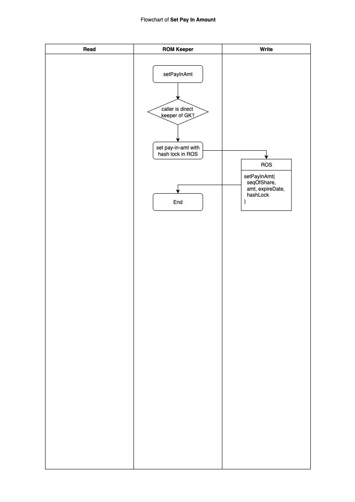<figcaption></figcaption></figure>

<figure>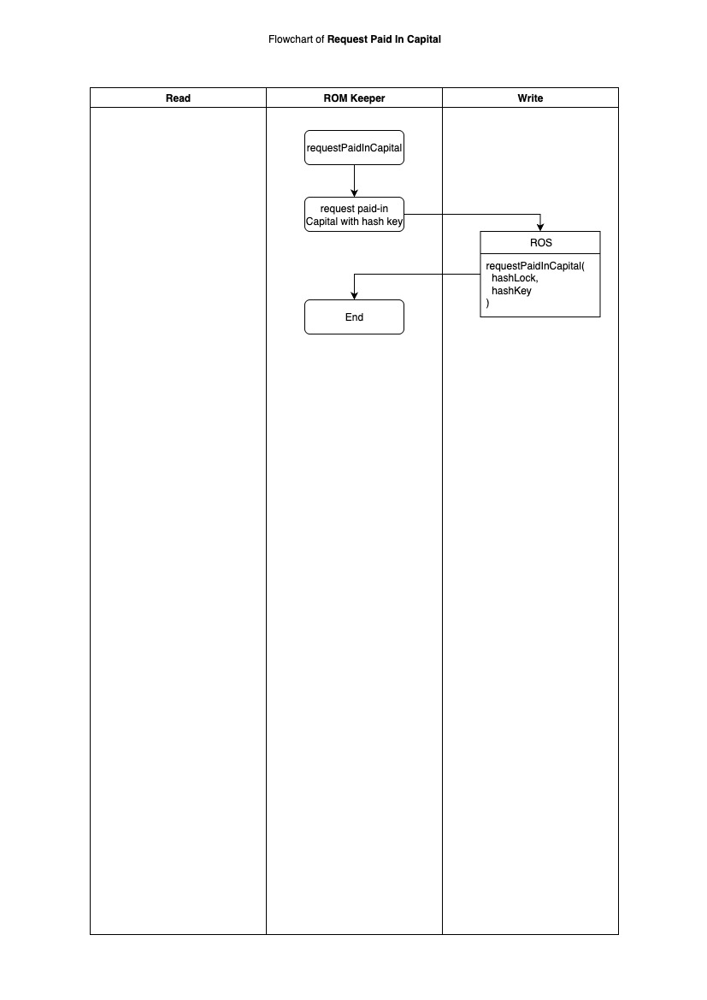<figcaption></figcaption></figure>

<figure>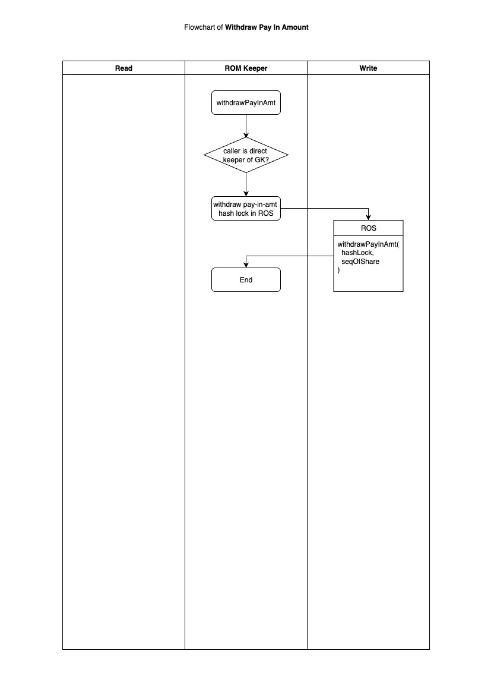<figcaption></figcaption></figure>

<figure><figcaption></figcaption></figure>

<figure><figcaption></figcaption></figure>

<strong>6.5. APIs Routed to GMM Keeper</strong>

<table><thead><tr><th width="75.40625">SN</th><th width="308.08984375">API</th><th>Description of Functions and Input Parameters</th></tr></thead><tbody><tr><td>27</td><td>
function nominateDirector(

  uint256 <em><mark style="color:blue;">seqOfPos</mark></em>,

  uint256 <em><mark style="color:blue;">candidate</mark></em>

) external
</td><td>(The Member who has the nomination right) Nominate the user numbered as <em><mark style="color:blue;">candidate</mark></em> for the Director’s position numbered as <em><mark style="color:blue;">seqOfPos</mark></em>.</td></tr><tr><td>28</td><td>
function createMotionToRemoveDirector(

  uint256 <em><mark style="color:blue;">seqOfPos</mark></em>

) external
</td><td>(The Member who has the nomination right) Create a draft motion to remove the Director on the position numbered as <em><mark style="color:blue;">seqOfPos</mark></em>.</td></tr><tr><td>29</td><td>
function proposeDocOfGM(

  uint256 <em><mark style="color:blue;">doc</mark></em>,

  uint256 <em><mark style="color:blue;">seqOfVR</mark></em>,

  uint256 <em><mark style="color:blue;">executor</mark></em>

) external
</td><td>(A Member) Create and propose a draft Motion for the General Meeting to approve the document deployed at the address of <em><mark style="color:blue;">doc</mark></em> as per the voting rule numbered as <em><mark style="color:blue;">seqOfVR</mark></em> with the user numbered as <em><mark style="color:blue;">executor</mark></em> to invoke it.</td></tr><tr><td>30</td><td>
function <strong>proposeToDistributeUsd</strong>(

    uint <em><mark style="color:$primary;">amt</mark></em>,

    uint <em><mark style="color:$primary;">expireDate</mark></em>,

    uint <em><mark style="color:$primary;">seqOfVR</mark></em>,

    uint <em><mark style="color:$primary;">seqOfDR</mark></em>,

    uint <em><mark style="color:$primary;">para</mark></em>,

    uint <em><mark style="color:$primary;">executor</mark></em>

) external;
</td><td>(A Member) Create and propose a draft Motion for the General Meeting to approve distribution a sum of USDC amount to <em><mark style="color:$primary;">amt</mark></em> before the expiration date <em><mark style="color:$primary;">expireDate</mark></em>, as per the voting rule numbered as <em><mark style="color:$primary;">seqOfVR</mark></em> and the distribution rule numbered as <em><mark style="color:$primary;">seqOfDR</mark></em>, with the parameter of <em><mark style="color:$primary;">para</mark></em> and with the user numbered as <em><mark style="color:$primary;">executor</mark></em> to invoke it.</td></tr><tr><td>31</td><td>
function <strong>proposeToTransferFundWithGM</strong>(

    address <em><mark style="color:$primary;">to</mark></em>,

    bool <em><mark style="color:$primary;">isCBP</mark></em>,

    uint256 <em><mark style="color:$primary;">amt</mark></em>,

    uint256 <em><mark style="color:$primary;">expireDate</mark></em>,

    uint256 <em><mark style="color:$primary;">seqOfVR</mark></em>,

    uint256 <em><mark style="color:$primary;">executor</mark></em>

) external
</td><td>(A Member or Director) Propose, to the General Meeting, to transfer certain amount of CBP (<em><mark style="color:$primary;">isCBP</mark></em> is true) or USDC (<em><mark style="color:$primary;">isCBP</mark></em> is false), to the account address <em><mark style="color:$primary;">to</mark></em>, amount to <em><mark style="color:$primary;">amt</mark></em>, before the timestamp of <em><mark style="color:$primary;">expireDate</mark></em>, as per the Voting Rule numbered as <em><mark style="color:$primary;">seqOfVR</mark></em>, with the user numbered as <em><mark style="color:$primary;">executor</mark></em> to execute the Motion concerned.</td></tr><tr><td>32</td><td>
function createActionOfGM(

    uint <em><mark style="color:blue;">seqOfVR</mark></em>,

    address[] memory <em><mark style="color:blue;">targets</mark></em>,

    uint256[] memory <em><mark style="color:blue;">values</mark></em>,

    bytes[] memory <em><mark style="color:blue;">params</mark></em>,

    bytes32 <em><mark style="color:blue;">desHash</mark></em>,

    uint <em><mark style="color:blue;">executor</mark></em>

) external
</td><td>(A Member) Create a draft Motion for the General Meeting to execute a series of calls, as per the voting rule numbered as <em><mark style="color:blue;">seqOfVR</mark></em>, to the contracts deployed at the addresses of <em><mark style="color:blue;">targets</mark></em>, with paying the respective ETH amount to <em><mark style="color:blue;">values</mark></em>, and inputting parameters of <em><mark style="color:blue;">params</mark></em>, attached a description message whose hash value is <em><mark style="color:blue;">desHash</mark></em>, with the user numbered as <em><mark style="color:blue;">executor</mark></em> to invoke it.</td></tr><tr><td>33</td><td>
function entrustDelegaterForGeneralMeeting(

  uint256 <em><mark style="color:blue;">seqOfMotion</mark></em>,

  uint256 <em><mark style="color:blue;">delegate</mark></em>

) external
</td><td>(A Member) Entrust the user numbered as <em><mark style="color:blue;">delegate</mark></em> to cast vote in General Meeting for the Motion numbered as <em><mark style="color:blue;">seqOfMotion</mark></em>.</td></tr><tr><td>34</td><td>
function proposeMotionToGeneralMeeting(

  uint256 <em><mark style="color:blue;">seqOfMotion</mark></em>

) external
</td><td>(A Member) Proposes the Motion numbered as <em><mark style="color:blue;">seqOfMotion</mark></em> to the General Meeting.</td></tr><tr><td>35</td><td>
function castVoteOfGM(

  uint256 <em><mark style="color:blue;">seqOfMotion</mark></em>,

  uint256 <em><mark style="color:blue;">attitude</mark></em>,

  bytes32 <em><mark style="color:blue;">sigHash</mark></em>

) external
</td><td>(A Member) Cast vote with the <em><mark style="color:blue;">attitude</mark></em> for the Motion numbered as <em><mark style="color:blue;">seqOfMotion</mark></em> with the signature message’s hash value as <em><mark style="color:blue;">sigHash</mark></em>.</td></tr><tr><td>36</td><td>
function voteCountingOfGM(

  uint256 <em><mark style="color:blue;">seqOfMotion</mark></em>

) external
</td><td>(Any user) Count the vote result for the Motion on the General Meeting numbered as <em><mark style="color:blue;">seqOfMotion</mark></em>.</td></tr><tr><td>37</td><td>
function execActionOfGM(

    uint <em><mark style="color:blue;">typeOfAction</mark></em>,

    address[] memory <em><mark style="color:blue;">targets</mark></em>,

    uint256[] memory <em><mark style="color:blue;">values</mark></em>,

    bytes[] memory <em><mark style="color:blue;">params</mark></em>,

    bytes32 <em><mark style="color:blue;">desHash</mark></em>,

    uint256 <em><mark style="color:blue;">seqOfMotion</mark></em>

) external
</td><td>(The designated executor) Execute the Motion numbered as <em><mark style="color:blue;">seqOfMotion</mark></em>, categorized as <em><mark style="color:blue;">typeOfAction</mark></em>, to trigger the series of calls to the contracts deployed at addresses of <em><mark style="color:blue;">targets</mark></em>, with paying the respective ETH amount to <em><mark style="color:blue;">values</mark></em>, inputting parameters as <em><mark style="color:blue;">params</mark></em>, attached with hash value of the description message as <em><mark style="color:blue;">desHash</mark></em>.</td></tr></tbody></table>

<figure>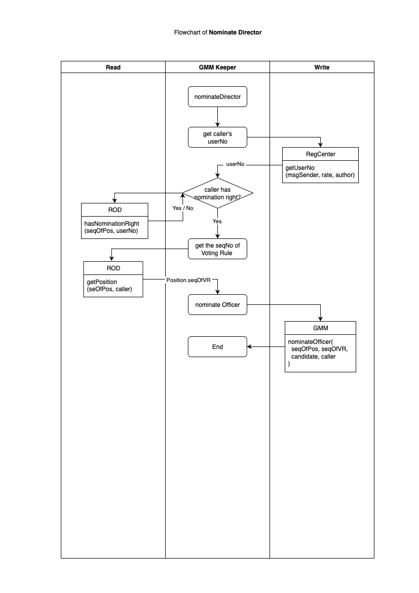<figcaption></figcaption></figure>

<figure>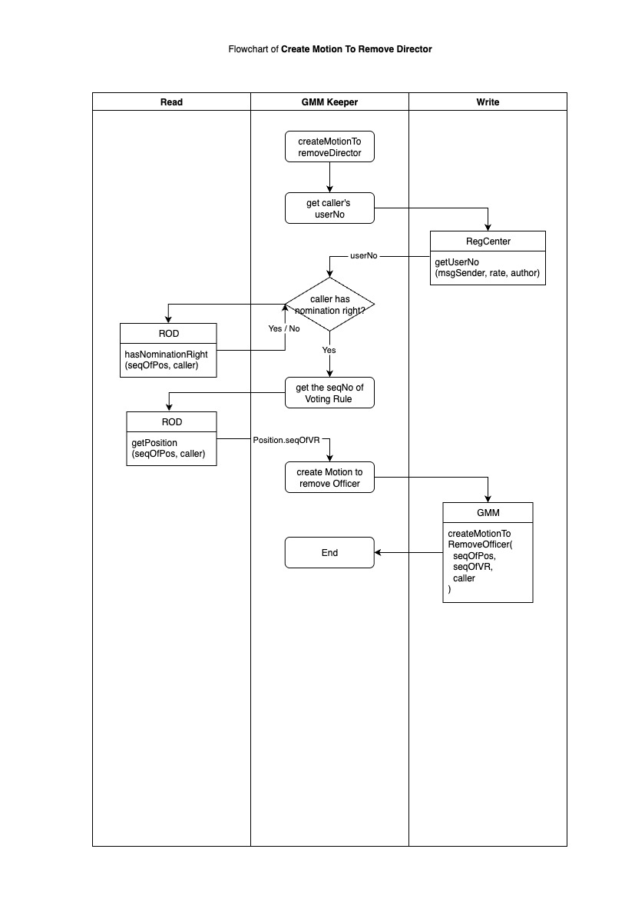<figcaption></figcaption></figure>

<figure>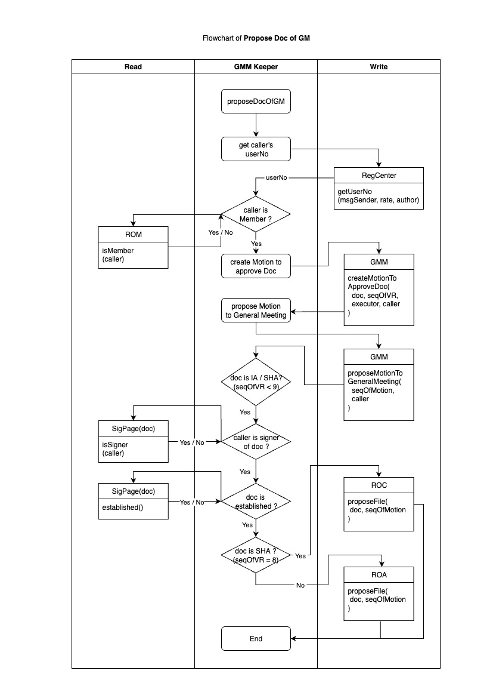<figcaption></figcaption></figure>

<figure><figcaption></figcaption></figure>

<figure><figcaption></figcaption></figure>

<figure>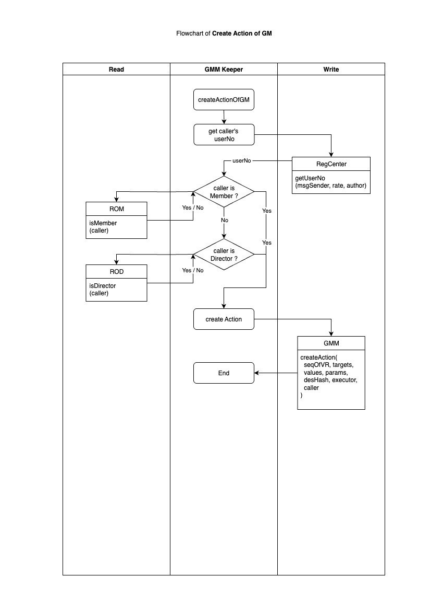<figcaption></figcaption></figure>

<figure>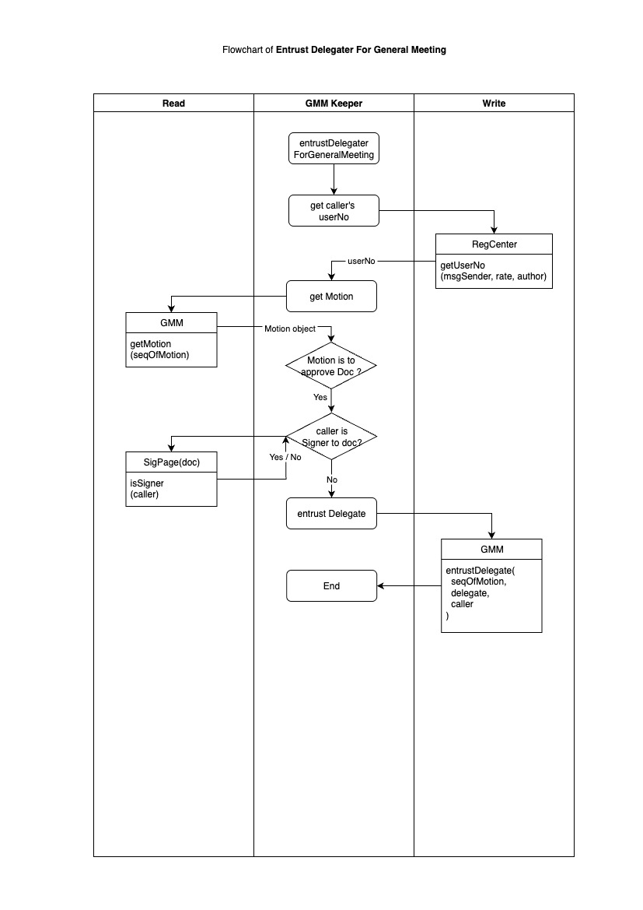<figcaption></figcaption></figure>

<figure>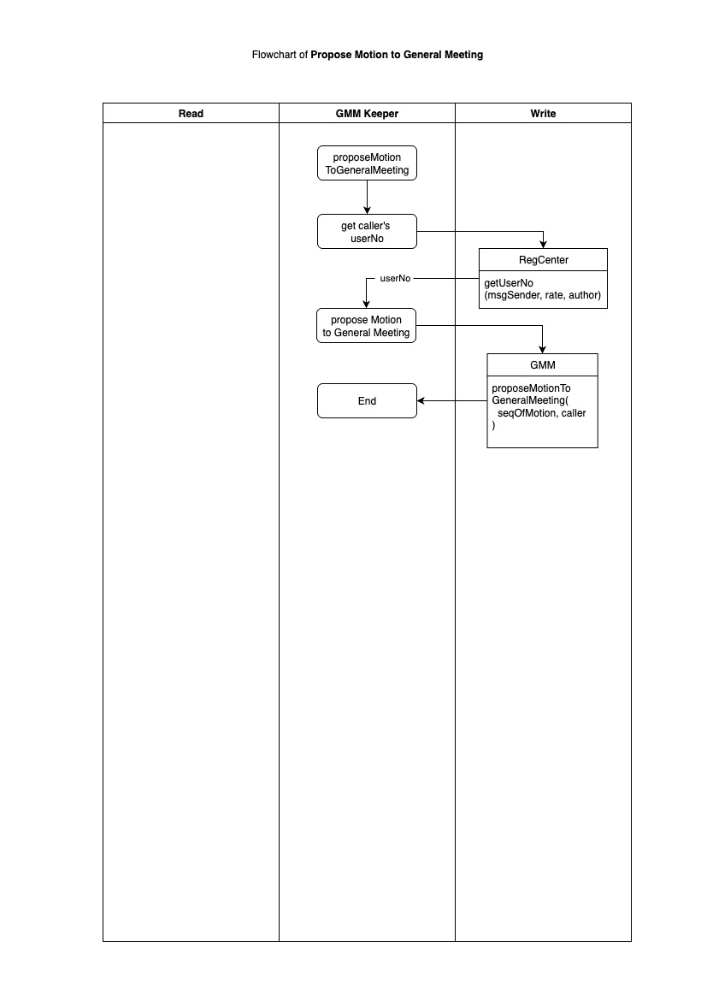<figcaption></figcaption></figure>

<figure>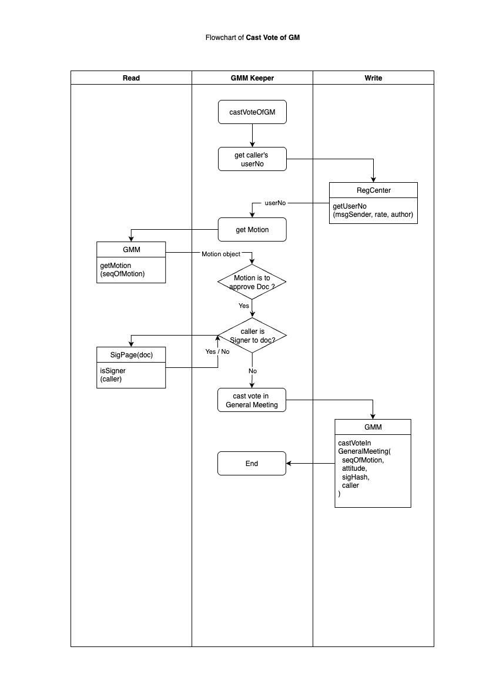<figcaption></figcaption></figure>

<figure>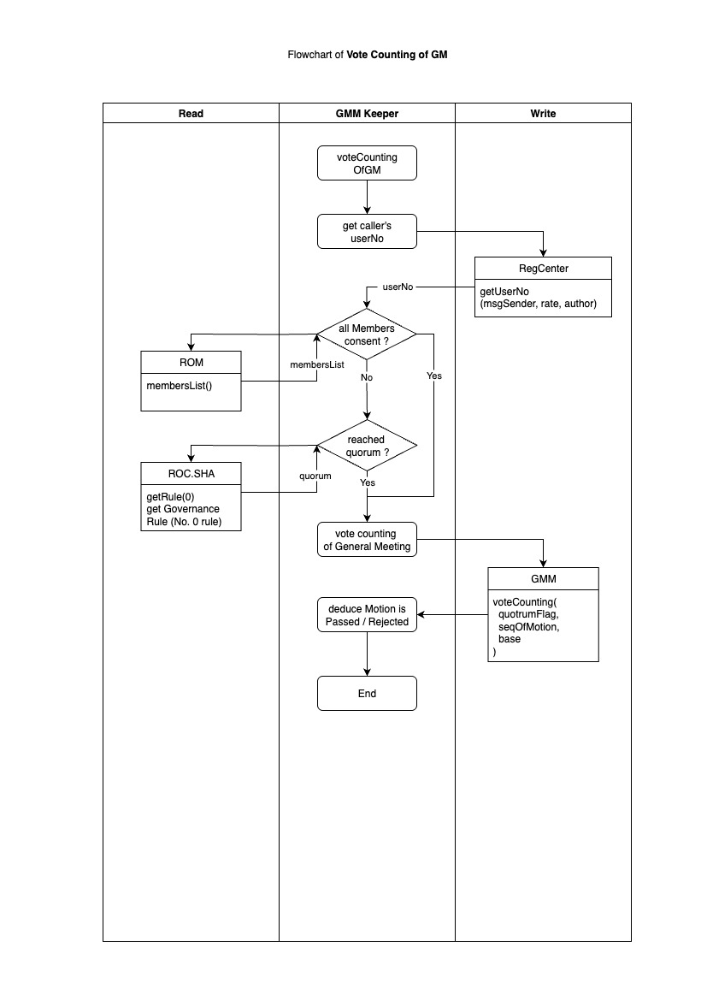<figcaption></figcaption></figure>

<figure>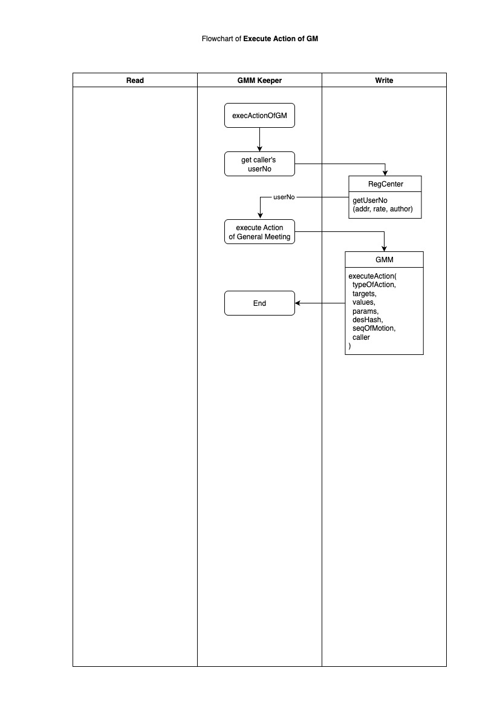<figcaption></figcaption></figure>

<strong>6.6. APIs Routed to ROA Keeper</strong>

<table><thead><tr><th width="52.37109375">SN</th><th width="267.32421875">API</th><th>Description of Functions and Input Parameters</th></tr></thead><tbody><tr><td>38</td><td>
function createIA(

  uint256 <em><mark style="color:blue;">version</mark></em>

) external
</td><td>(Any Member) Create a draft Investment Agreement on the Register of Agreement, by cloning the Template of the version numbered as <em><mark style="color:blue;">version</mark></em>.</td></tr><tr><td>39</td><td>
function circulateIA(

  address <em><mark style="color:blue;">body</mark></em>,

  bytes32 <em><mark style="color:blue;">docUrl</mark></em>,

  bytes32 <em><mark style="color:blue;">docHash</mark></em>

) external
</td><td>(The Member who is the Owner of the draft Investment Agreement) Circulate the finalized draft deployed at the address of <em><mark style="color:blue;">body</mark></em> to the parties for signature, attaching with the URL information of <em><mark style="color:blue;">docUrl</mark></em> and the hash value of the draft as <em><mark style="color:blue;">docHash</mark></em>.</td></tr><tr><td>40</td><td>
function signIA(

  address <em><mark style="color:blue;">ia</mark></em>,

  bytes32 <em><mark style="color:blue;">sigHash</mark></em>

) external
</td><td>(The parties to the Investment Agreement) Sign the Investment Agreement deployed at the address of <em><mark style="color:blue;">ia</mark></em>, with the signature message’s hash value as <em><mark style="color:blue;">sigHash</mark></em>.</td></tr><tr><td>41</td><td>
function pushToCoffer(

  address <em><mark style="color:blue;">ia</mark></em>,

  uint256 <em><mark style="color:blue;">seqOfDeal</mark></em>,

  bytes32 <em><mark style="color:blue;">hashLock</mark></em>,

  uint256 <em><mark style="color:blue;">closingDeadline</mark></em>

) external
</td><td>(The seller) Confirm all conditions precedent have been satisfied and ready for closing, for the specific deal numbered as <em><mark style="color:blue;">seqOfDeal</mark></em>, under the Investment Agreement deployed at the address of <em><mark style="color:blue;">ia</mark></em>, by inputting a hash lock value <em><mark style="color:blue;">hashLock</mark></em>  and setting the closing deadline as <em><mark style="color:blue;">closingDeadline</mark></em>.</td></tr><tr><td>42</td><td>
function closeDeal(

  address <em><mark style="color:blue;">ia</mark></em>,

  uint256 <em><mark style="color:blue;">seqOfDeal</mark></em>,

  string memory <em><mark style="color:blue;">hashKey</mark></em>

) external
</td><td>(The buyer) Close the deal numbered as <em><mark style="color:blue;">seqOfDeal</mark></em>, under the Investment Agreement deployed at the address of <em><mark style="color:blue;">ia</mark></em>, after paying the consideration off-chain, by inputting the hash key string <em><mark style="color:blue;">hashKey</mark></em>.</td></tr><tr><td>43</td><td>
function issueNewShare(

  address <em><mark style="color:blue;">ia</mark></em>,

  uint256 <em><mark style="color:blue;">seqOfDeal</mark></em>

) external
</td><td>(The issuer) Issue new share directly to the buyer, for the capital increasing Deal numbered as <em><mark style="color:blue;">seqOfDeal</mark></em> under the Investment Agreement deployed at the address of <em><mark style="color:blue;">ia</mark></em>.</td></tr><tr><td>44</td><td>
function transferTargetShare(

  address <em><mark style="color:blue;">ia</mark></em>,

  uint256 <em><mark style="color:blue;">seqOfDeal</mark></em>

) external
</td><td>(The seller) Transfer the subject share directly to the buyer, for the specific share transfer Deal numbered as <em><mark style="color:blue;">seqOfDeal</mark></em> under the Investment Agreement deployed at the address of <em><mark style="color:blue;">ia</mark></em>.</td></tr><tr><td>45</td><td>
function terminateDeal(

  address <em><mark style="color:blue;">ia</mark></em>,

  uint256 <em><mark style="color:blue;">seqOfDeal</mark></em>

) external
</td><td>(The seller, after the expiration date concerned) Terminate the Deal numbered as <em><mark style="color:blue;">seqOfDeal</mark></em> under the Investment Agreement deployed at the address of <em><mark style="color:blue;">ia</mark></em>.</td></tr><tr><td>46</td><td>
function <strong>payOffApprovedDeal</strong>(

    ICashier.TransferAuth memory <em><mark style="color:$primary;">auth</mark></em>,

    address <em><mark style="color:$primary;">ia</mark></em>,

    uint256 <em><mark style="color:$primary;">seqOfDeal</mark></em>,

    address <em><mark style="color:$primary;">to</mark></em>

) external;
</td><td>(The buyer) Pay off the specific Deal numbered as <em><mark style="color:$primary;">seqOfDeal</mark></em> in the Investment Agreement deployed as the address of <em><mark style="color:$primary;">ia</mark></em>, by paying to the seller/issuer address <em><mark style="color:$primary;">to</mark></em> certain amount of USDC as per the off-chain authorization signed as <em><mark style="color:$primary;">auth</mark></em>, to close the Deal.</td></tr></tbody></table>

<figure>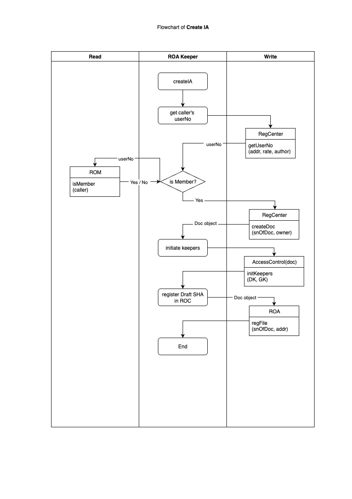<figcaption></figcaption></figure>

<figure>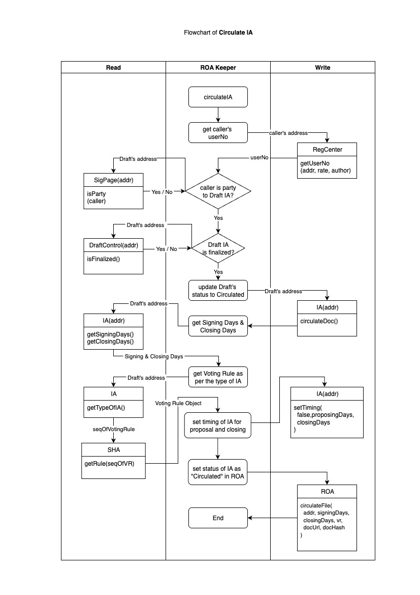<figcaption></figcaption></figure>

<figure>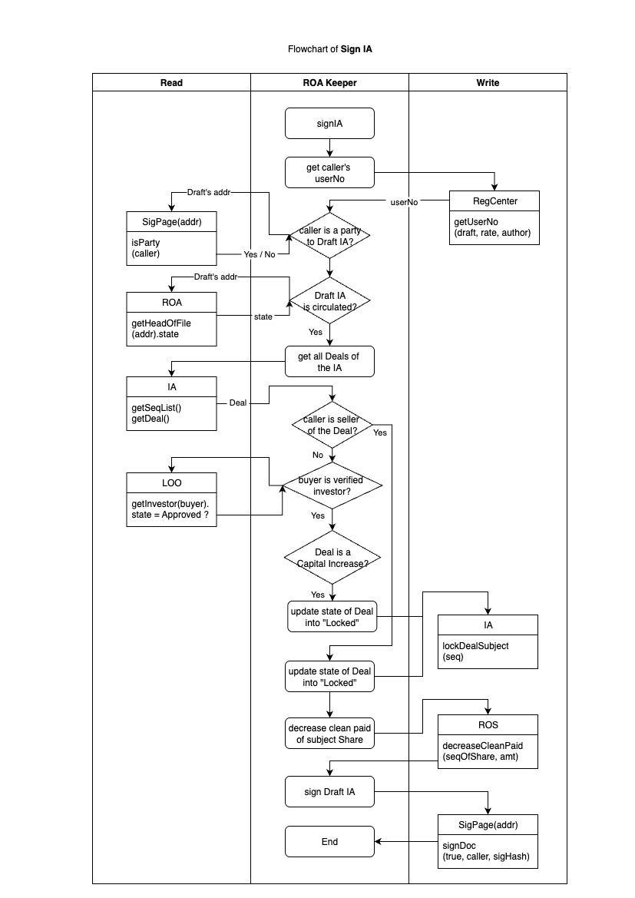<figcaption></figcaption></figure>

<figure>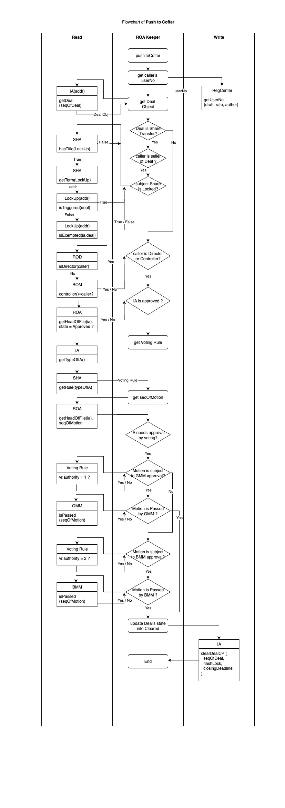<figcaption></figcaption></figure>

<figure>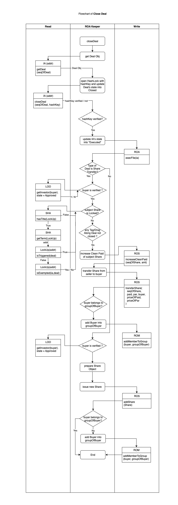<figcaption></figcaption></figure>

<figure>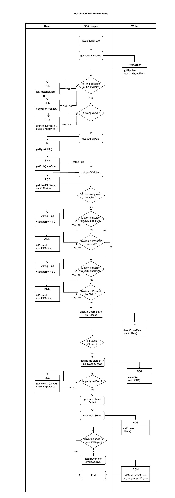<figcaption></figcaption></figure>

<figure>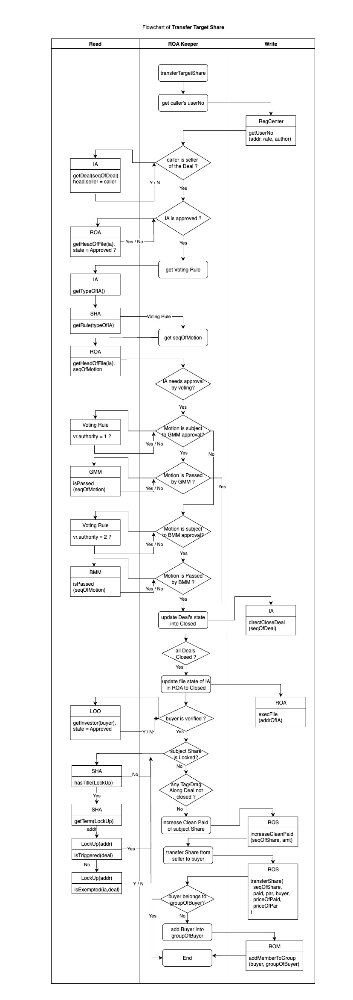<figcaption></figcaption></figure>

<figure>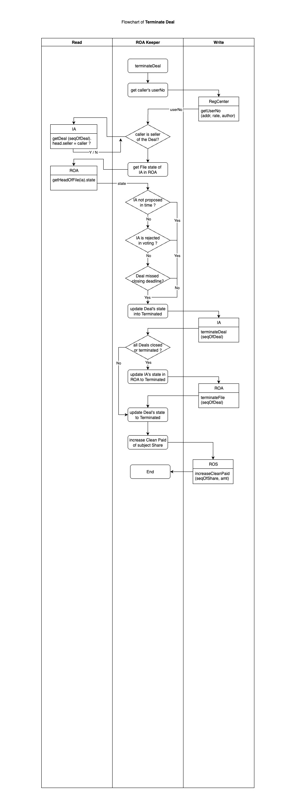<figcaption></figcaption></figure>

<figure><figcaption></figcaption></figure>

<strong>6.7. APIs Routed to ROO Keeper</strong>

<table><thead><tr><th width="49.76953125">SN</th><th width="228.01171875">API</th><th>Description of Functions and Input Parameters</th></tr></thead><tbody><tr><td>47</td><td>
function updateOracle(

    uint256 <em><mark style="color:blue;">seqOfOpt</mark></em>,

    uint256 <em><mark style="color:blue;">d1</mark></em>,

    uint256 <em><mark style="color:blue;">d2</mark></em>,

    uint256 <em><mark style="color:blue;">d3</mark></em>

) external
</td><td>(The sectary of the company, i.e. the Direct Keeper of General Keeper) Update the key performance indicators of <em><mark style="color:blue;">d1</mark></em>, <em><mark style="color:blue;">d2</mark></em>, and <em><mark style="color:blue;">d3</mark></em>, for the specific Option numbered as <em><mark style="color:blue;">seqOfOpt</mark></em>.</td></tr><tr><td>48</td><td>
function execOption(

  uint256 <em><mark style="color:blue;">seqOfOpt</mark></em>

) external
</td><td>(The right holder) Execute the Option numbered as <em><mark style="color:blue;">seqOfOpt</mark></em>.</td></tr><tr><td>49</td><td>
function createSwap(

    uint256 <em><mark style="color:blue;">seqOfOpt</mark></em>,

    uint256 <em><mark style="color:blue;">seqOfTarget</mark></em>,

    uint256 <em><mark style="color:blue;">paidOfTarget</mark></em>,

    uint256 <em><mark style="color:blue;">seqOfPledge</mark></em>

) external
</td><td>(The right holder) Create a Swap on the target share numbered as <em><mark style="color:blue;">seqOfTarget</mark></em>, for paid value amount to <em><mark style="color:blue;">paidOfTarget</mark></em>, with the collateral set up on the pledged share numbered as <em><mark style="color:blue;">seqOfPledge</mark></em>, for executing the Option numbered as <em><mark style="color:blue;">seqOfOpt</mark></em>.</td></tr><tr><td>50</td><td>
function <strong>payOffSwap</strong>(

    ICashier.TransferAuth memory <em><mark style="color:$primary;">auth</mark></em>,

    uint256 <em><mark style="color:$primary;">seqOfOpt</mark></em>,

    uint256 <em><mark style="color:$primary;">seqOfSwap</mark></em>,

    address <em><mark style="color:$primary;">to</mark></em>

) external;
</td><td>(The pledger) Pay certain amount of USDC as per the off-chain authorization signed as <em><mark style="color:$primary;">auth</mark></em>, to release the pledged share under the Swap numbered <em><mark style="color:$primary;">seqOfSwap</mark></em> of the Option numbered as <em><mark style="color:$primary;">seqOfOpt</mark></em>, to close the Swap.</td></tr><tr><td>51</td><td>
function terminateSwap(

    uint256 <em><mark style="color:blue;">seqOfOpt</mark></em>,

    uint256 <em><mark style="color:blue;">seqOfSwap</mark></em>

) external
</td><td>(The target share holder) Execute the swap numbered as <em><mark style="color:blue;">seqOfSwap</mark></em> of the Option numbered as <em><mark style="color:blue;">seqOfOpt</mark></em>, by transferring the target share and releasing the pledged share.</td></tr></tbody></table>

<figure>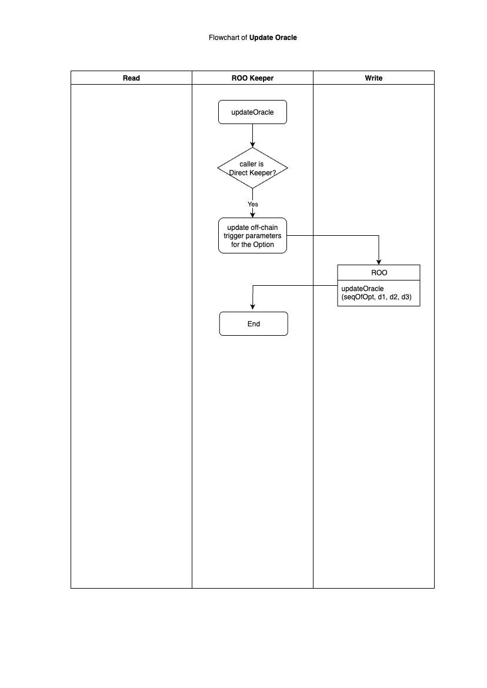<figcaption></figcaption></figure>

<figure>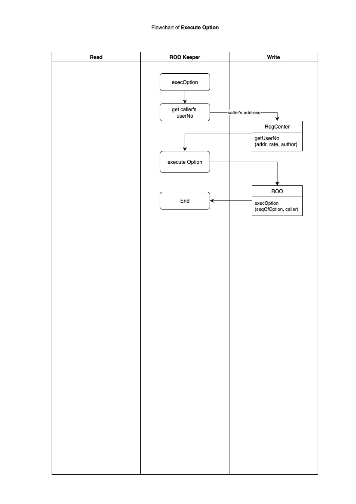<figcaption></figcaption></figure>

<figure>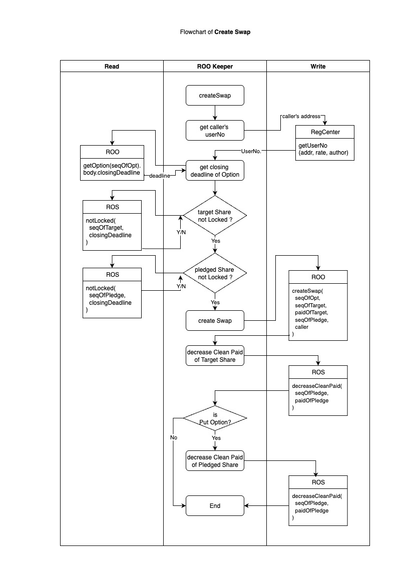<figcaption></figcaption></figure>

<figure><figcaption></figcaption></figure>

<figure>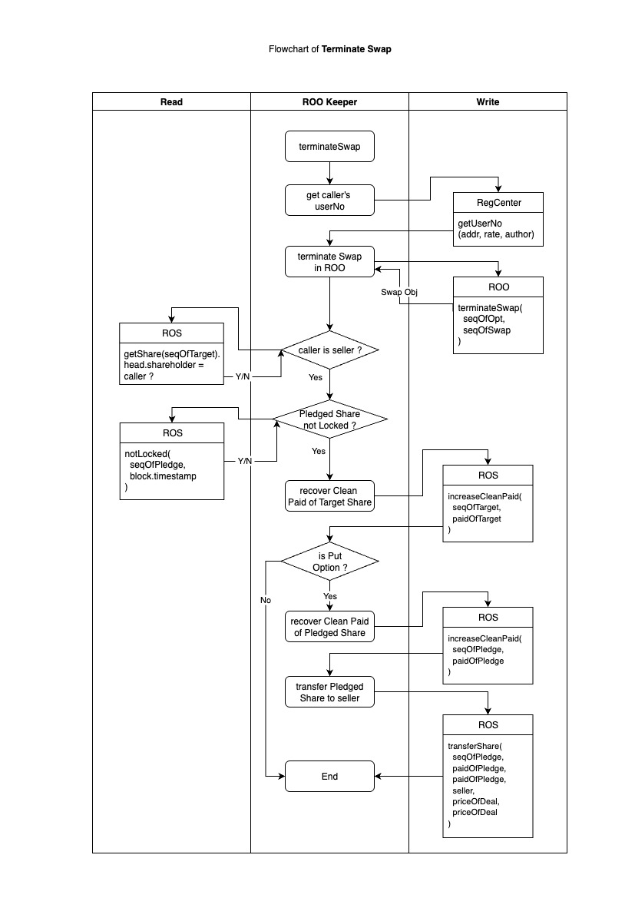<figcaption></figcaption></figure>

<strong>6.8. APIs Routed to ROP Keeper</strong>

<table><thead><tr><th width="61.8203125">SN</th><th width="243.5859375">API</th><th>Description of Functions and Input Parameters</th></tr></thead><tbody><tr><td>52</td><td>
function createPledge(

  bytes32 <em><mark style="color:blue;">snOfPld</mark></em>,

  uint256 <em><mark style="color:blue;">paid</mark></em>,

  uint256 <em><mark style="color:blue;">par</mark></em>,

  uint256 <em><mark style="color:blue;">guaranteedAmt</mark></em>,

  uint256 <em><mark style="color:blue;">execDays</mark></em>

) external
</td><td>(Any shareholder) Create a Pledge with the codified serial number <em><mark style="color:blue;">snOfPld</mark></em> amount to paid value of <em><mark style="color:blue;">paid</mark></em> and par value of <em><mark style="color:blue;">par</mark></em> to guarantee the debt amount to <em><mark style="color:blue;">guarantedAmt</mark></em> with the guarantee period lasting for number of days of <em><mark style="color:blue;">execDays</mark></em>.</td></tr><tr><td>53</td><td>
function transferPledge(

  uint256 <em><mark style="color:blue;">seqOfShare</mark></em>,

  uint256 <em><mark style="color:blue;">seqOfPld</mark></em>,

  uint256 <em><mark style="color:blue;">buyer</mark></em>,

  uint256 <em><mark style="color:blue;">amt</mark></em>

) external
</td><td>(The creditor) Transfer the Pledge numbered as <em><mark style="color:blue;">seqOfPld</mark></em> setting up on the pledged share numbered <em><mark style="color:blue;">seqOfShare</mark></em> to the user numbered as <em><mark style="color:blue;">buyer</mark></em> with the credit amount to <em><mark style="color:blue;">amt</mark></em>.</td></tr><tr><td>54</td><td>
function refundDebt(

  uint256 <em><mark style="color:blue;">seqOfShare</mark></em>,

  uint256 <em><mark style="color:blue;">seqOfPld</mark></em>,

  uint256 <em><mark style="color:blue;">amt</mark></em>

) external
</td><td>(The creditor) Confirm refunding of the debt, guaranteed by the Pledge numbered as <em><mark style="color:blue;">seqOfPld</mark></em> setting on the pledged share numbered as <em><mark style="color:blue;">seqOfShare</mark>,</em> by the amount of <em><mark style="color:blue;">amt</mark></em>.</td></tr><tr><td>55</td><td>
function extendPledge(

  uint256 <em><mark style="color:blue;">seqOfShare</mark></em>,

  uint256 <em><mark style="color:blue;">seqOfPld</mark></em>,

  uint256 <em><mark style="color:blue;">extDays</mark></em>

) external
</td><td>(The pledger) Extend the guarantee period of the Pledge numbered as <em><mark style="color:blue;">seqOfPld</mark></em> setting on the pledged share numbered as <em><mark style="color:blue;">seqOfShare</mark></em> for a such number of days as <em><mark style="color:blue;">extDays</mark></em>.</td></tr><tr><td>56</td><td>
function lockPledge(

  uint256 <em><mark style="color:blue;">seqOfShare</mark></em>,

  uint256 <em><mark style="color:blue;">seqOfPld</mark></em>,

  bytes32 <em><mark style="color:blue;">hashLock</mark></em>

) external
</td><td>(The creditor) Set up a hash lock with the hash value as <em><mark style="color:blue;">hashLock</mark></em> on the Pledge numbered as <em><mark style="color:blue;">seqOfPld</mark></em> setting on the pledged share numbered <em><mark style="color:blue;">seqOfShare</mark></em>.</td></tr><tr><td>57</td><td>
function releasePledge(

  uint256 <em><mark style="color:blue;">seqOfShare</mark></em>,

  uint256 <em><mark style="color:blue;">seqOfPld</mark></em>,

  string memory <em><mark style="color:blue;">hashKey</mark></em>

) external
</td><td>(The pledger, after paying off-chain and obtaining the hash key) Release the Pledge numbered as <em><mark style="color:blue;">seqOfPld</mark></em> setting on the pledged share numbered <em><mark style="color:blue;">seqOfShare</mark></em> by inputting the hash key string <em><mark style="color:blue;">hashKey</mark></em>.</td></tr><tr><td>58</td><td>
function execPledge(

  uint256 <em><mark style="color:blue;">seqOfShare</mark></em>,

  uint256 <em><mark style="color:blue;">seqOfPld</mark></em>,

  uint256 <em><mark style="color:blue;">buyer</mark></em>,

  uint256 <em><mark style="color:blue;">groupOfBuyer</mark></em>

) external
</td><td>(The creditor, after off-chain disposal and receipt of the consideration) Execute the Pledge numbered as <em><mark style="color:blue;">seqOfPld</mark></em> setting on the pledged share numbered as <em><mark style="color:blue;">seqOfShare</mark></em> to transfer the target share to the user numbered as <em><mark style="color:blue;">buyer</mark></em> who belongs to the concert group represented by the user numbered as <em><mark style="color:blue;">groupOfBuyer</mark></em>.</td></tr><tr><td>59</td><td>
function revokePledge(

  uint256 <em><mark style="color:blue;">seqOfShare</mark></em>,

  uint256 <em><mark style="color:blue;">seqOfPld</mark></em>

) external
</td><td>(The pledger, after the expiration of the guarantee period) Revoke the Pledge numbered as <em><mark style="color:blue;">seqOfPld</mark></em> setting on the pledged share numbered as <em><mark style="color:blue;">seqOfShare</mark></em>.</td></tr></tbody></table>

<figure>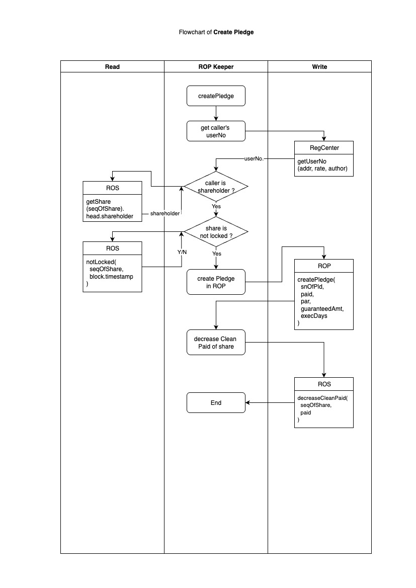<figcaption></figcaption></figure>

<figure><figcaption></figcaption></figure>

<figure>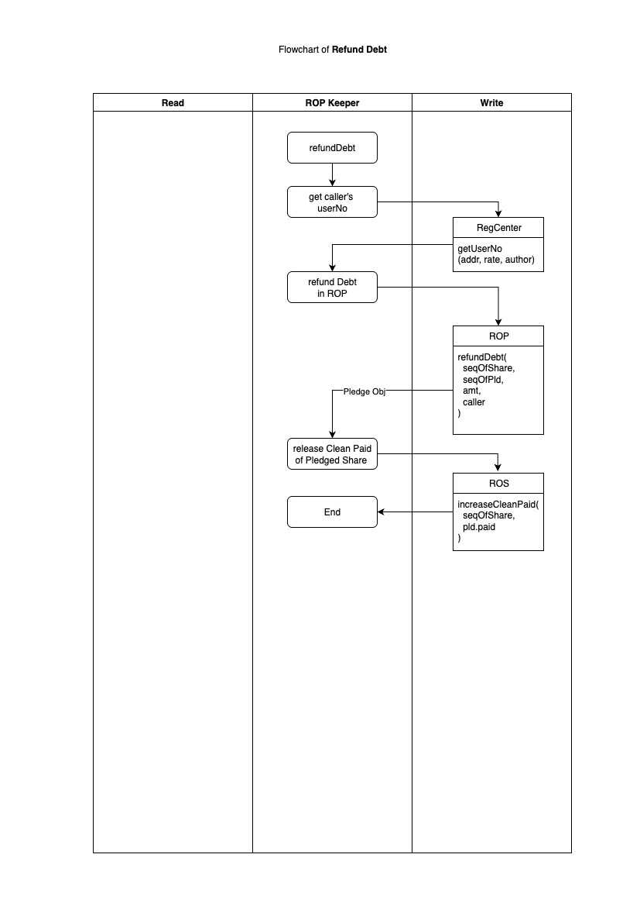<figcaption></figcaption></figure>

<figure><figcaption></figcaption></figure>

<figure>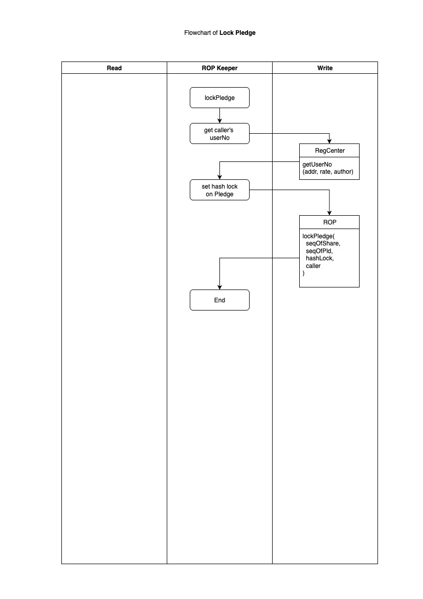<figcaption></figcaption></figure>

<figure>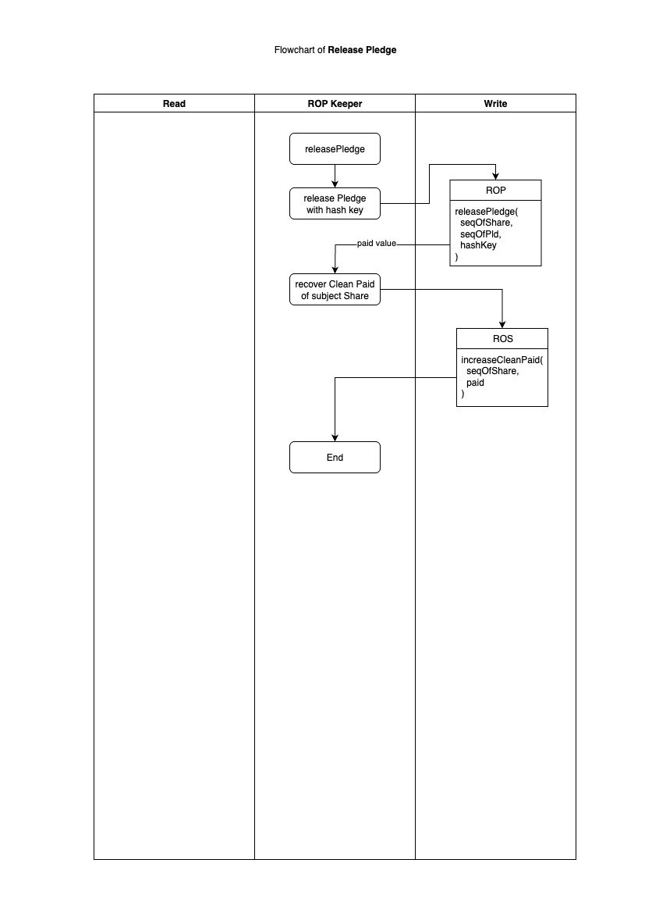<figcaption></figcaption></figure>

<figure>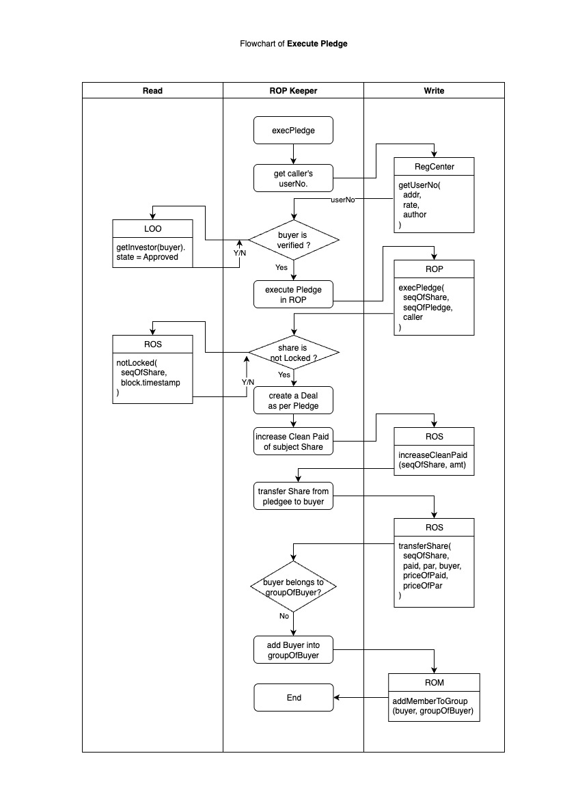<figcaption></figcaption></figure>

<figure>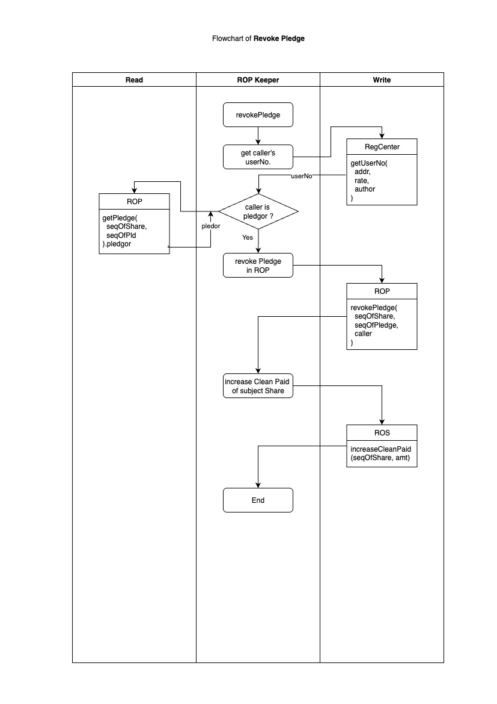<figcaption></figcaption></figure>

<strong>6.9. APIs Routed to SHA Keeper</strong>

<table><thead><tr><th width="76.578125">SN.</th><th width="246.6953125">API</th><th>Description of Functions and Input Parameters</th></tr></thead><tbody><tr><td>60</td><td>
function <strong>execAlongRight</strong>(

    address <em><mark style="color:$primary;">ia</mark></em>,

    bytes32 <em><mark style="color:$primary;">snOfClaim</mark></em>,

    bytes32 <em><mark style="color:$primary;">sigHash</mark></em>

) external
</td><td>(The right holder) Execute the Tag-Along right, for the tag along or drag along Claim encoded as <em><mark style="color:$primary;">snOfClaim</mark></em> in the Investment Agreement deployed at the address of <em><mark style="color:$primary;">ia</mark></em>, with the signature’s hash value as <em><mark style="color:$primary;">sigHash</mark></em>.</td></tr><tr><td>61</td><td>
function <strong>acceptAlongDeal</strong>(

        address <em><mark style="color:blue;">ia</mark></em>,

        uint256 <em><mark style="color:blue;">seqOfDeal</mark></em>,

        bytes32 <em><mark style="color:blue;">sigHash</mark></em>

) external
</td><td>(The buyer) Accepts the Tag/Drag Along requests, for the Deal numbered as <em><mark style="color:blue;">seqOfDeal</mark></em> of the Investment Agreement deployed at the address of <em><mark style="color:blue;">ia</mark></em>, with the signature’s hash value as <em><mark style="color:blue;">sigHash</mark></em>.</td></tr><tr><td>62</td><td>
function <strong>execAntiDilution</strong>(

        address <em><mark style="color:blue;">ia</mark></em>,

        uint256 <em><mark style="color:blue;">seqOfDeal</mark></em>,

        uint256 <em><mark style="color:blue;">seqOfShare</mark></em>,

        bytes32 <em><mark style="color:blue;">sigHash</mark></em>

) external
</td><td>(The right holder) Execute the Anti-Dilution right, towards the Deal numbered as <em><mark style="color:blue;">seqOfDeal</mark></em> in the Investment Agreement deployed at the address of <em><mark style="color:blue;">ia</mark></em>, for its share numbered <em><mark style="color:blue;">seqOfShare</mark></em>, with the signature hash value as <em><mark style="color:blue;">sigHash</mark></em>.</td></tr><tr><td>63</td><td>
function <strong>takeGiftShares</strong>(

  address <em><mark style="color:blue;">ia</mark></em>,

  uint256 <em><mark style="color:blue;">seqOfDeal</mark></em>

) external
</td><td>(The right holder of Anti-Dilution, after the closing) Take the gift shares, generating as per the Anti-Dilution Term of SHA, for the Deal numbered as <em><mark style="color:blue;">seqOfDeal</mark></em> in the Investment Agreement deployed at the address of <em><mark style="color:blue;">ia</mark></em>.</td></tr><tr><td>64</td><td>
function <strong>execFirstRefusal</strong>(

        uint256 <em><mark style="color:blue;">seqOfRule</mark></em>,

        uint256 <em><mark style="color:blue;">seqOfRightholder</mark></em>,

        address <em><mark style="color:blue;">ia</mark></em>,

        uint256 <em><mark style="color:blue;">seqOfDeal</mark></em>,

        bytes32 <em><mark style="color:blue;">sigHash</mark></em>

    ) external
</td><td>(The right holder) Execute its First Refusal right, as per the Rule numbered as <em><mark style="color:blue;">seqOfRule</mark></em>, with the identified sequence number as <em><mark style="color:blue;">seqOfRightholder</mark></em>, to request to buy the subject share of the Deal numbered as <em><mark style="color:blue;">seqOfDeal</mark></em> in the Investment Agreement deployed at the address of <em><mark style="color:blue;">ia</mark></em>, with the signature hash value as <em><mark style="color:blue;">sigHash</mark></em>.</td></tr><tr><td>65</td><td>
function computeFirstRefusal(

        address <em><mark style="color:blue;">ia</mark></em>,

        uint256 <em><mark style="color:blue;">seqOfDeal</mark></em>

    ) external;
</td><td>(Any Member) Compute the First Refusal claims result for the Deal numbered as <em><mark style="color:blue;">seqOfDeal</mark></em> of the Investment Agreement deployed at the address of <em><mark style="color:blue;">ia</mark></em>, so as to obtain the automatically updated Investment Agreement.</td></tr></tbody></table>

<figure><figcaption></figcaption></figure>

<figure>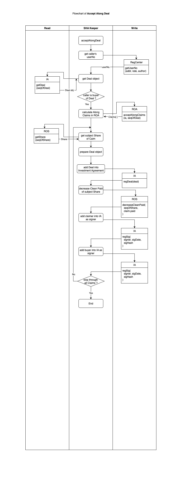<figcaption></figcaption></figure>

<figure>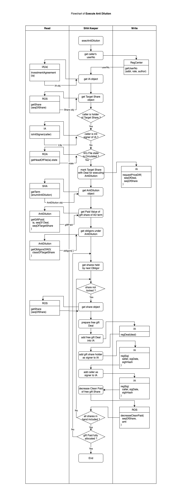<figcaption></figcaption></figure>

<figure>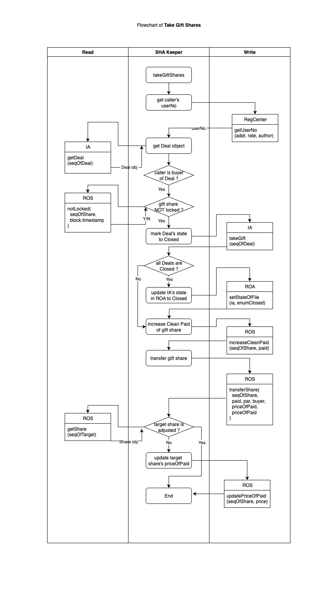<figcaption></figcaption></figure>

<figure>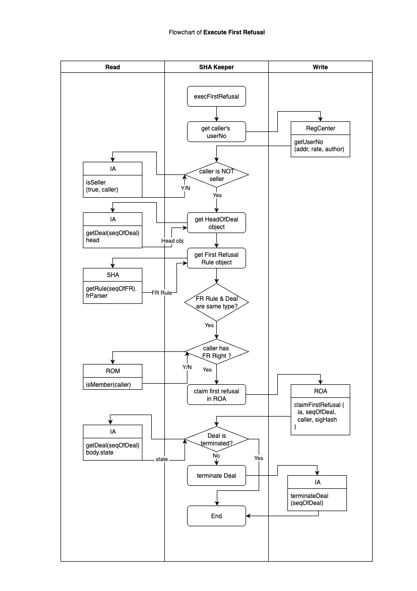<figcaption></figcaption></figure>

<figure>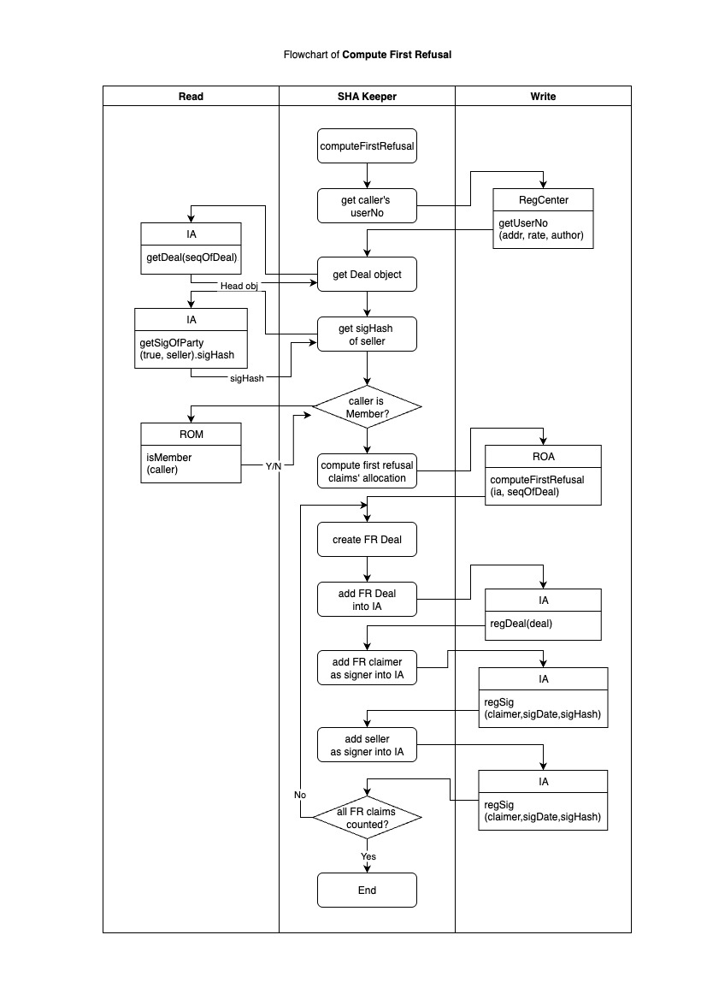<figcaption></figcaption></figure>

<strong>6.10. APIs routed to Accountant</strong>

<table><thead><tr><th width="68.55859375">SN</th><th width="232.37890625">API</th><th>Description of Functions and Input Parameters</th></tr></thead><tbody><tr><td>66</td><td>
function <strong>initClass</strong>(

    uint <em><mark style="color:$primary;">class</mark></em>

) external;
</td><td>(Secretary of the Company) Initiate a specific <em><mark style="color:$primary;">class</mark></em> of shares to calculate ROE or IRR.</td></tr><tr><td>67</td><td>
function <strong>distributeProfits</strong>(

        uint256 <em><mark style="color:blue;">amt</mark></em>,

        uint256 <em><mark style="color:blue;">expireDate</mark></em>,

        uint256 <em><mark style="color:$primary;">seqOfDR</mark></em>,

        uint256 <em><mark style="color:blue;">seqOfMotion</mark></em>

) external
</td><td>(The designated executor) Distribute the profits of the company amount to <em><mark style="color:blue;">amt</mark></em>, as per the distribution rule numbered as <em><mark style="color:$primary;">seqOfDR</mark></em> and the Motion numbered as <em><mark style="color:blue;">seqOfMotion</mark></em>, before the expiration date of <em><mark style="color:blue;">expireDate</mark></em>.</td></tr><tr><td>68</td><td>
function <strong>distributeIncome</strong>(

        uint256 <em><mark style="color:$primary;">amt</mark></em>,

        uint256 <em><mark style="color:$primary;">expireDate</mark></em>,

        uint256 <em><mark style="color:$primary;">seqOfDR</mark></em>,

        uint256 <em><mark style="color:$primary;">fundManager</mark></em>,

        uint256 <em><mark style="color:$primary;">seqOfMotion</mark></em>

) external
</td><td>(The designated executor) Distribute the income of the fund amount to <em><mark style="color:$primary;">amt</mark></em>, as per the Motion numbered as <em><mark style="color:$primary;">seqOfMotion</mark></em>, before the expiration date of <em><mark style="color:$primary;">expireDate</mark>,</em> with the user number of the asset manager as <em><mark style="color:$primary;">fundManager</mark></em>.</td></tr><tr><td>69</td><td>
    function transferFund(

        bool <em><mark style="color:blue;">fromBMM</mark></em>,

        address <em><mark style="color:blue;">to</mark></em>,

        bool <em><mark style="color:blue;">isCBP</mark></em>,

        uint256 <em><mark style="color:blue;">amt</mark></em>,

        uint256 <em><mark style="color:blue;">expireDate</mark></em>,

        uint256 <em><mark style="color:blue;">seqOfMotion</mark></em>

    ) external
</td><td>(The designated executor) Transfer, CBP (<em><mark style="color:blue;">isCBP</mark></em> is true) or ETH (<em><mark style="color:blue;">isCBP</mark></em> is false), to the account address <em><mark style="color:blue;">to</mark></em>, amount to <em><mark style="color:blue;">amt</mark></em>, as per the Motion passed by, the Board (<em><mark style="color:blue;">toBMM</mark></em> is true) or the General Meeting (<em><mark style="color:blue;">toBMM</mark></em> is false), before the timestamp of <em><mark style="color:blue;">expireDate</mark></em>, numbered as <em><mark style="color:blue;">seqOfMotion</mark></em>.</td></tr></tbody></table>

<figure>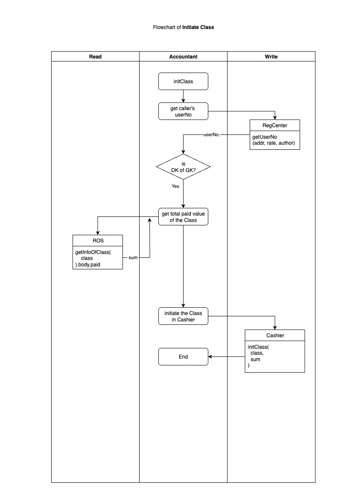<figcaption></figcaption></figure>

<figure>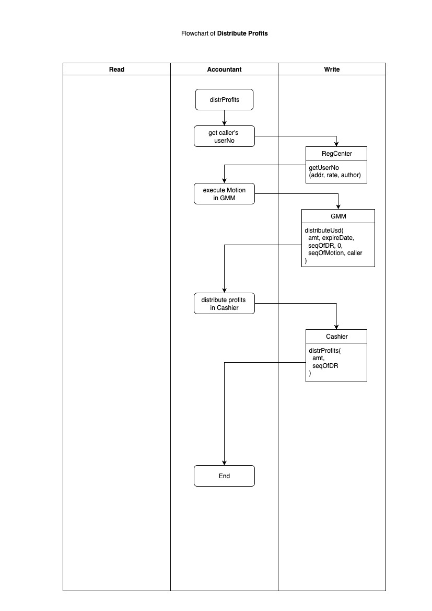<figcaption></figcaption></figure>

<figure>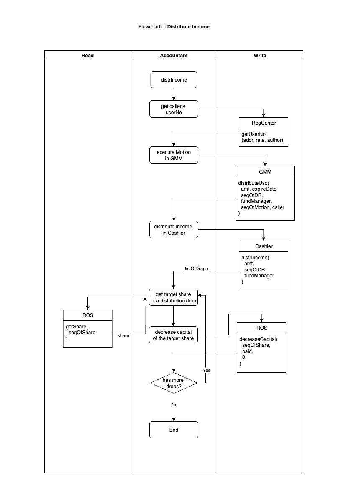<figcaption></figcaption></figure>

<figure>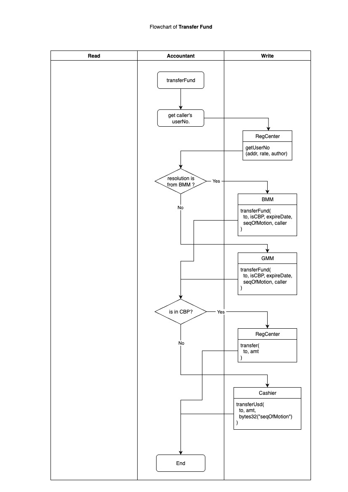<figcaption></figcaption></figure>

<strong>6.11. APIs routed to LOO Keeper</strong>

<table><thead><tr><th width="68.0703125">S.N.</th><th width="222.20703125">API</th><th>Description of Functions and Input Parameters</th><th></th></tr></thead><tbody><tr><td>72</td><td>
function regInvestor(

  address <em><mark style="color:blue;">bKey</mark></em>,

  uint256 <em><mark style="color:blue;">groupRep</mark></em>,

  bytes32 <em><mark style="color:blue;">idHash</mark></em>

) external
</td><td>(Any user) Register itself as an investor, by inputting its backup key as <em><mark style="color:blue;">bKey</mark></em>, the user number of its concert group’s representative as <em><mark style="color:blue;">groupRep</mark></em>, with the hash value of its identity information as <em><mark style="color:blue;">idHash</mark></em>.</td><td></td></tr><tr><td>73</td><td>
function approveInvestor(

uint256 <em><mark style="color:blue;">userNo</mark></em>,

uint256 <em><mark style="color:blue;">seqOfLR</mark></em>

) external
</td><td>(The verifier) Approve the investor’s application, pursuant to the Listing Rule numbered as <em><mark style="color:blue;">seqOfLR</mark></em>, filed by the user numbered as <em><mark style="color:blue;">userNo</mark></em>.</td><td></td></tr><tr><td>74</td><td>
function revokeInvestor(

uint256 <em><mark style="color:blue;">userNo</mark></em>,

uint256 <em><mark style="color:blue;">seqOfLR</mark></em>

) external
</td><td>(The verifier) Revoke the investor’s qualification of the user numbered as <em><mark style="color:blue;">userNo</mark>,</em>  pursuant to the Listing Rule numbered as <em><mark style="color:blue;">seqOfLR</mark></em>.</td><td></td></tr><tr><td>75</td><td>
function placeInitialOffer(

        uint256 <em><mark style="color:blue;">classOfShare</mark></em>,

        uint256 <em><mark style="color:blue;">execHours</mark></em>,

        uint256 <em><mark style="color:blue;">paid</mark></em>,

        uint256 <em><mark style="color:blue;">price</mark></em>,

        uint256 <em><mark style="color:blue;">seqOfLR</mark></em>

    ) external
</td><td>(The issuer) Place an initial offer for the class of <em><mark style="color:blue;">classOfShare</mark></em>, at the price of paid as <em><mark style="color:blue;">price</mark></em>, to the amount of paid as <em><mark style="color:blue;">paid</mark></em>, with the available number of hours as <em><mark style="color:blue;">execHours</mark>,</em> pursuant to the Listing Rule numbered as <em><mark style="color:blue;">seqOfLR</mark></em>.</td><td></td></tr><tr><td>76</td><td>
function withdrawInitialOffer(

        uint256 <em><mark style="color:blue;">classOfShare</mark></em>,

        uint256 <em><mark style="color:blue;">seqOfOrder</mark></em>,

        uint256 <em><mark style="color:blue;">seqOfLR</mark></em>

    ) external;
</td><td>(The issuer) Withdraw the initial offer numbered as <em><mark style="color:blue;">seqOfOrder</mark></em> under the class of <em><mark style="color:blue;">classOfShare</mark></em>, pursuant to the Listing Rule numbered as <em><mark style="color:blue;">seqOfLR.</mark></em></td><td></td></tr><tr><td>77</td><td>
    function placeSellOrder(

        uint256 <em><mark style="color:blue;">seqOfClass</mark></em>,

        uint256 <em><mark style="color:blue;">execHours</mark></em>,

        uint256 <em><mark style="color:blue;">paid</mark></em>,

        uint256 <em><mark style="color:blue;">price</mark></em>,

        uint256 <em><mark style="color:blue;">seqOfLR</mark></em>

    ) external
</td><td>(Any qualified investor) Place a sell order under the class numbered as <em><mark style="color:blue;">seqOfClass</mark></em>, as per the Listing Rule of <em><mark style="color:blue;">seqOfLR</mark></em>, to the paid value amount to <em><mark style="color:blue;">paid</mark></em>, at the selling price of <em><mark style="color:blue;">price</mark></em>, with the available time within the number of hours as <em><mark style="color:blue;">execHours</mark></em>.</td><td></td></tr><tr><td>78</td><td>
function withdrawSellOrder(

        uint256 <em><mark style="color:blue;">classOfShare</mark></em>,

        uint256 <em><mark style="color:blue;">seqOfOrder</mark></em>

    ) external
</td><td>(The seller) Withdraw sell order numbered as <em><mark style="color:blue;">seqOfOrder</mark></em> for the class of <em><mark style="color:blue;">classOfShare</mark></em>.</td><td></td></tr><tr><td>79</td><td>
    function placeBuyOrder(

        uint256 <em><mark style="color:blue;">classOfShare</mark></em>,

        uint256 <em><mark style="color:blue;">paid</mark></em>,

        uint256 <em><mark style="color:blue;">price</mark></em>,

        uint256 <em><mark style="color:blue;">execHours,</mark></em>

    ) external <mark style="color:blue;">payable</mark>
</td><td>(Any qualified investor) Place buy order for the class of <em><mark style="color:blue;">classOfShare</mark>,</em> to the paid value amount to <em><mark style="color:blue;">paid</mark></em>, at the buy price of <em><mark style="color:blue;">price</mark></em>, with the available time within the number of hours as <em><mark style="color:blue;">execHours</mark></em>, paying certain amount of ETH sufficient to cover the total value of the order.</td><td></td></tr><tr><td>80</td><td>
    function withdrawBuyOrder(

        uint256 <em><mark style="color:blue;">classOfShare</mark></em>,

        uint256 <em><mark style="color:blue;">seqOfOrder</mark></em>

    ) external
</td><td>(The buyer) Withdraw the buy order numbered as <em><mark style="color:blue;">seqOfOrder</mark></em> for the class of <em><mark style="color:blue;">classOfShare</mark></em>.</td><td></td></tr></tbody></table>

<figure>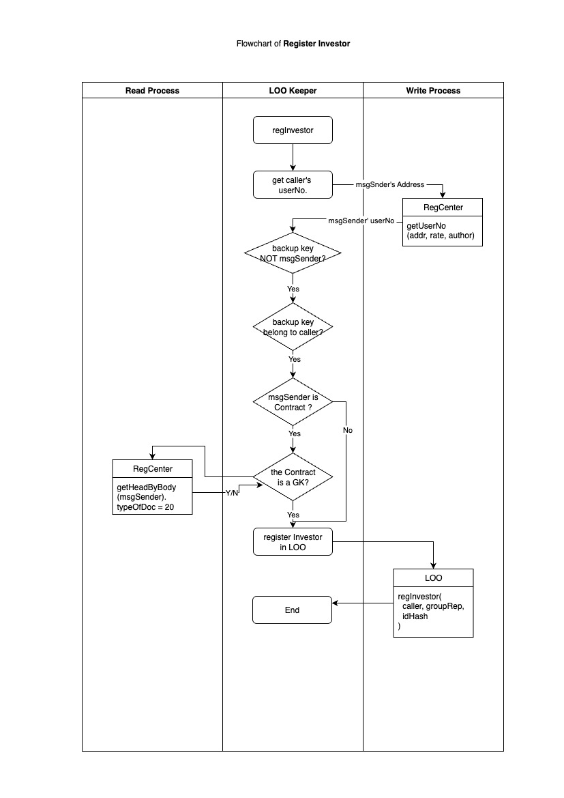<figcaption></figcaption></figure>

<figure>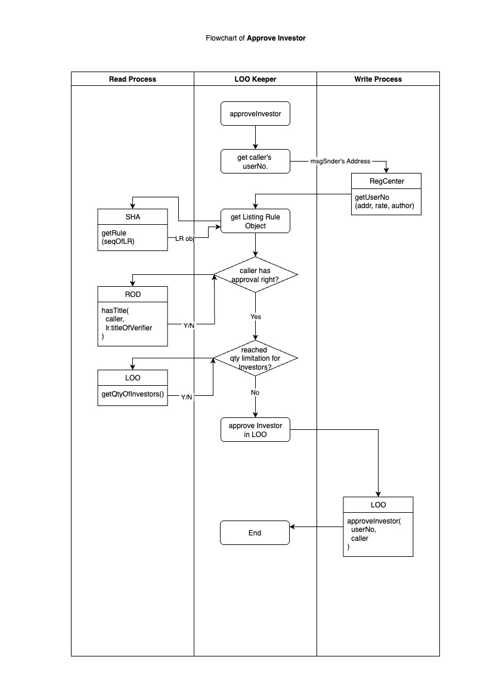<figcaption></figcaption></figure>

<figure>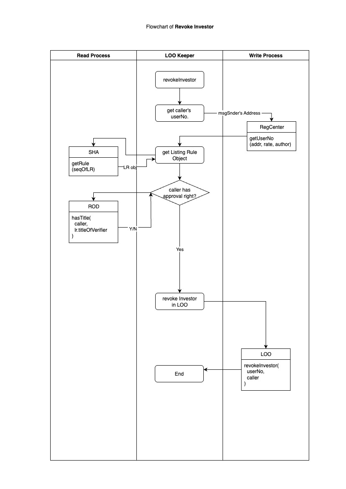<figcaption></figcaption></figure>

<figure>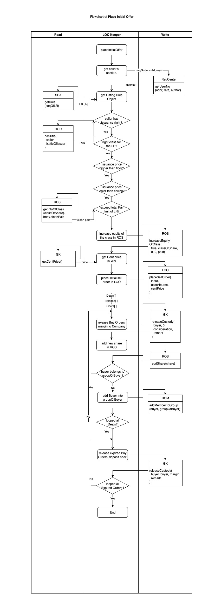<figcaption></figcaption></figure>

<figure>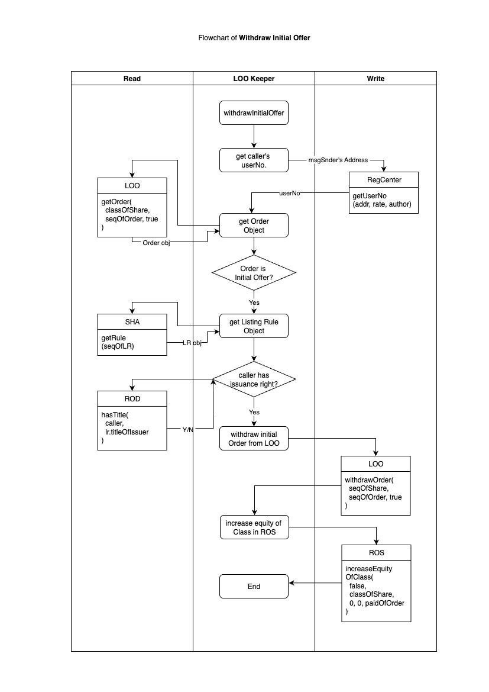<figcaption></figcaption></figure>

<figure>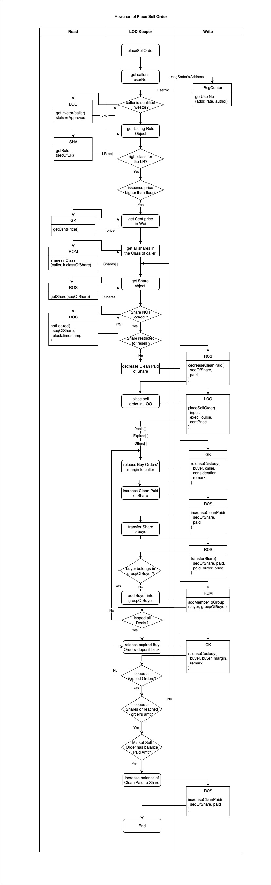<figcaption></figcaption></figure>

<figure><figcaption></figcaption></figure>

<figure>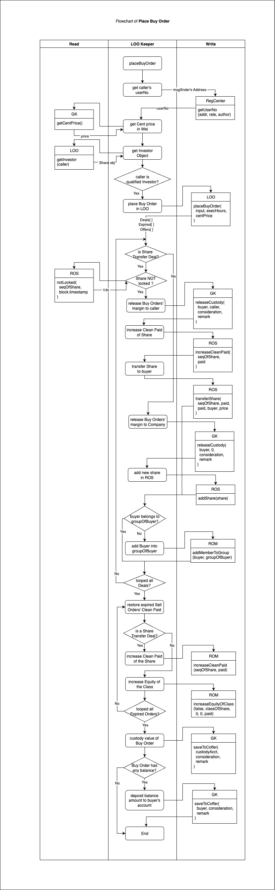<figcaption></figcaption></figure>

<figure><figcaption></figcaption></figure>

<strong>6.12. APIs routed to USD LOO Keeper</strong>

<table><thead><tr><th width="50.0625">S.N.</th><th width="242.7265625">API</th><th>Description of Functions and Input Parameters</th></tr></thead><tbody><tr><td>81</td><td>
    function placeInitialOffer(

        uint256 <em><mark style="color:blue;">classOfShare</mark></em>,

        uint256 <em><mark style="color:blue;">execHours</mark></em>,

        uint256 <em><mark style="color:blue;">paid</mark></em>,

        uint256 <em><mark style="color:blue;">price</mark></em>,

        uint256 <em><mark style="color:blue;">seqOfLR</mark></em>

    ) external
</td><td>(The issuer) Place an initial offer for the class of <em><mark style="color:blue;">classOfShare</mark></em>, as per the authorization of the Listing Rule numbered as <em><mark style="color:blue;">seqOfLR</mark></em>,at the price of paid as <em><mark style="color:blue;">price</mark></em>, to the amount of paid as <em><mark style="color:blue;">paid</mark></em>, with the available number of hours as <em><mark style="color:blue;">execHours</mark></em>.</td></tr><tr><td>82</td><td>
function withdrawInitialOffer(

        uint256 <em><mark style="color:blue;">classOfShare</mark></em>,

        uint256 <em><mark style="color:blue;">seqOfOrder</mark></em>,

        uint256 <em><mark style="color:blue;">seqOfLR</mark></em>

    ) external;
</td><td>(The issuer) Withdraw the initial offer numbered as <em><mark style="color:blue;">seqOfOrder</mark></em> under the class of <em><mark style="color:blue;">classOfShare</mark></em>, as per the authorization of the Listing Rule numbered as <em><mark style="color:blue;">seqOfLR</mark>.</em></td></tr><tr><td>83</td><td>
    function placeSellOrder(

        uint256 <em><mark style="color:blue;">seqOfClass</mark></em>,

        uint256 <em><mark style="color:blue;">execHours</mark></em>,

        uint256 <em><mark style="color:blue;">paid</mark></em>,

        uint256 <em><mark style="color:blue;">price</mark></em>,

        uint256 <em><mark style="color:blue;">seqOfLR</mark></em>

    ) external
</td><td>(Any qualified investor) Place a sell order under the class numbered as <em><mark style="color:blue;">seqOfClass</mark></em>, as per the Listing Rule of <em><mark style="color:blue;">seqOfLR</mark></em>, to the paid value amount to <em><mark style="color:blue;">paid</mark></em>, at the selling price of <em><mark style="color:blue;">price</mark></em>, with the available time within the number of hours as <em><mark style="color:blue;">execHours</mark></em>.</td></tr><tr><td>84</td><td>
function withdrawSellOrder(

        uint256 <em><mark style="color:blue;">classOfShare</mark></em>,

        uint256 <em><mark style="color:blue;">seqOfOrder</mark></em>

    ) external
</td><td>(The seller) Withdraw the sell order placed by itself numbered as <em><mark style="color:blue;">seqOfOrder</mark></em> for the class of <em><mark style="color:blue;">classOfShare</mark></em>.</td></tr><tr><td>85</td><td>
function placeBuyOrder(

    ICashier.TransferAuth        

    memory <em><mark style="color:blue;">auth</mark></em>,

    uint256 <em><mark style="color:blue;">classOfShare</mark></em>,

    uint256 <em><mark style="color:blue;">paid</mark></em>,

    uint256 <em><mark style="color:blue;">price</mark></em>,

    uint256 <em><mark style="color:blue;">execHours</mark></em>

) external
</td><td>(Any qualified investor) Place a buy order for the class of <em><mark style="color:blue;">classOfShare</mark>,</em> to the paid value amount to <em><mark style="color:blue;">paid</mark></em>, at the buy price of <em><mark style="color:blue;">price</mark></em>, within the available time as number of hours of <em><mark style="color:blue;">execHours</mark></em>, paying certain amount of USDC as per the off-chain authorization signed as <em><mark style="color:blue;">auth</mark></em>.</td></tr><tr><td>86</td><td>
function placeMarketBuyOrder(

    ICashier.TransferAuth 

    memory <em><mark style="color:blue;">auth</mark></em>,

    uint256 <em><mark style="color:blue;">classOfShare</mark></em>,

    uint256 <em><mark style="color:blue;">paid</mark></em>,

    uint256 <em><mark style="color:blue;">execHours</mark></em>

) external
</td><td>(Any qualified investor) Place a buy order for the class of <em><mark style="color:blue;">classOfShare</mark>,</em> to the paid value amount to <em><mark style="color:blue;">paid</mark></em>, at the market price, with the available time within the number of hours as <em><mark style="color:blue;">execHours</mark></em>, paying certain amount of USDC as per the off-chain authorization signed as <em><mark style="color:blue;">auth</mark></em>.</td></tr><tr><td>87</td><td>
function withdrawBuyOrder(

        uint256 <em><mark style="color:blue;">classOfShare</mark></em>,

        uint256 <em><mark style="color:blue;">seqOfOrder</mark></em>

    ) external
</td><td>(The buyer) Withdraw the buy order numbered as <em><mark style="color:blue;">seqOfOrder</mark></em> for the class of <em><mark style="color:blue;">classOfShare</mark></em> that it has placed.</td></tr></tbody></table>

<figure>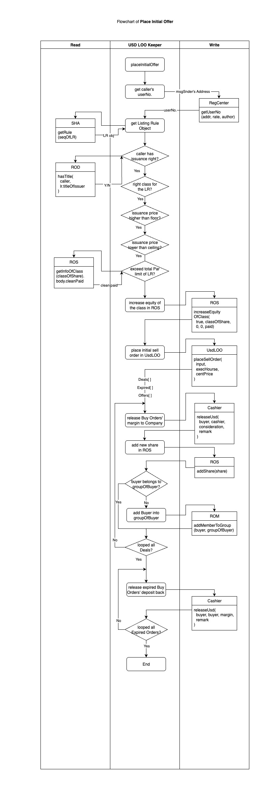<figcaption></figcaption></figure>

<figure><figcaption></figcaption></figure>

<figure>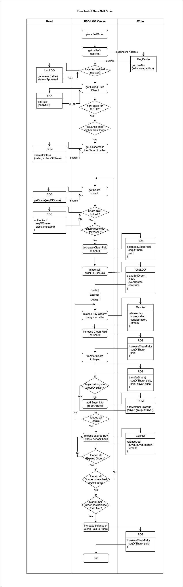<figcaption></figcaption></figure>

<figure>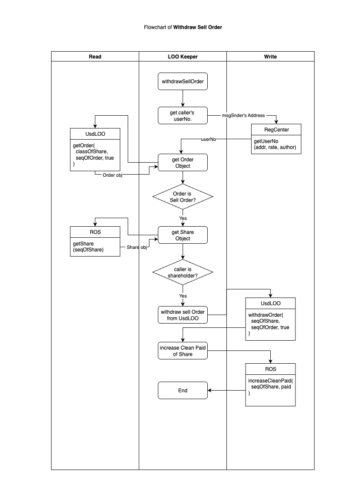<figcaption></figcaption></figure>

<figure>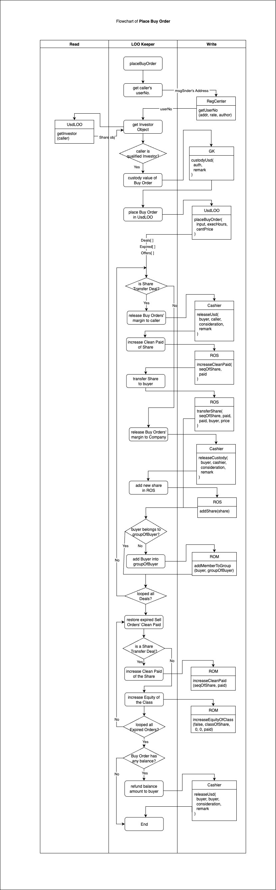<figcaption></figcaption></figure>

<figure>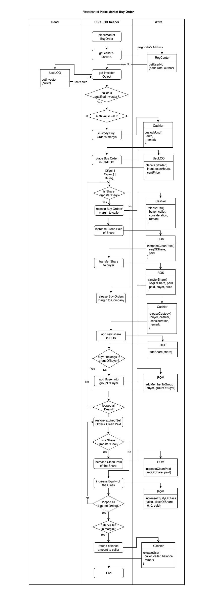<figcaption></figcaption></figure>

<figure>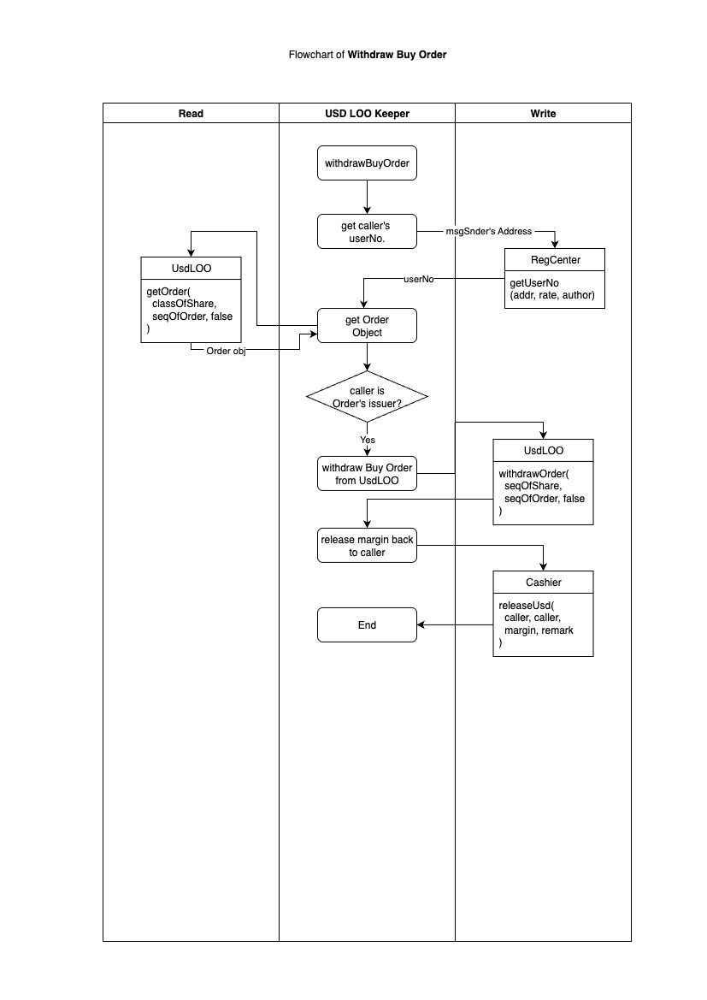<figcaption></figcaption></figure>

<strong>6.13. Other APIs concerning USDC payments</strong>

<table><thead><tr><th width="46.890625"></th><th width="228.50390625">API</th><th>Description of Functions and Input Parameters</th></tr></thead><tbody><tr><td>88</td><td>
function payInCapital(

    ICashier.TransferAuth 

    memory <em><mark style="color:blue;">auth</mark></em>,

    uint256 <em><mark style="color:blue;">seqOfShare</mark></em>,

    uint256 <em><mark style="color:blue;">paid</mark></em>

) external
</td><td>(The shareholder) Pay in capital, for its specific share numbered as <em><mark style="color:blue;">seqOfShare</mark></em>, to the amount of paid as <em><mark style="color:blue;">paid</mark></em>, by paying certain amount of USDC through off-chain authorization signed as <em><mark style="color:blue;">auth</mark>.</em></td></tr><tr><td>89</td><td>
function payOffApprovedDeal(

  ICashier.TransferAuth 

  memory <em><mark style="color:blue;">auth</mark></em>,

  address <em><mark style="color:blue;">ia</mark></em>,

  uint256 <em><mark style="color:blue;">seqOfDeal</mark></em>,

  address <em><mark style="color:blue;">to</mark></em>

) external
</td><td>(The buyer) Pay off the specific Deal numbered as <em><mark style="color:blue;">seqOfDeal</mark></em> in the Investment Agreement deployed as the address of <em><mark style="color:blue;">ia</mark></em>, by paying to the seller/issuer address <em><mark style="color:blue;">to</mark></em> certain amount of USDC as per the off-chain authorization signed as <em><mark style="color:blue;">auth</mark></em>, to close the Deal.</td></tr><tr><td>90</td><td>
function payOffSwap(

  ICashier.TransferAuth 

  memory <em><mark style="color:blue;">auth</mark></em>,

  uint256 <em><mark style="color:blue;">seqOfOpt</mark></em>,

  uint256 <em><mark style="color:blue;">seqOfSwap</mark></em>,

  address <em><mark style="color:blue;">to</mark></em>

) external
</td><td>(The pledger) Pay certain amount of USDC as per the off-chain authorization signed as <em><mark style="color:blue;">auth</mark></em>, to release the pledged share under the Swap numbered <em><mark style="color:blue;">seqOfSwap</mark></em> of the Option numbered as <em><mark style="color:blue;">seqOfOpt</mark></em>, to close the Swap.</td></tr><tr><td>91</td><td>
function payOffRejectedDeal(

  ICashier.TransferAuth 

  memory <em><mark style="color:blue;">auth</mark></em>,

  address <em><mark style="color:blue;">ia</mark></em>,

  uint256 <em><mark style="color:blue;">seqOfDeal</mark></em>,

  uint256 <em><mark style="color:blue;">seqOfSwap</mark></em>,

  address <em><mark style="color:blue;">to</mark></em>

) external;
</td><td>(The veto Member who has voted against the Deal) Pay certain amount of USDC as per the off-chain authorization signed as <em><mark style="color:blue;">auth</mark></em>, to close the Swap numbered as <em><mark style="color:blue;">seqOfSWap</mark></em> created by the seller for the Deal numbered as <em><mark style="color:blue;">seqOfDeal</mark></em> under the Investment Agreement deployed at the address of <em><mark style="color:blue;">ia</mark></em>.</td></tr></tbody></table>

<figure>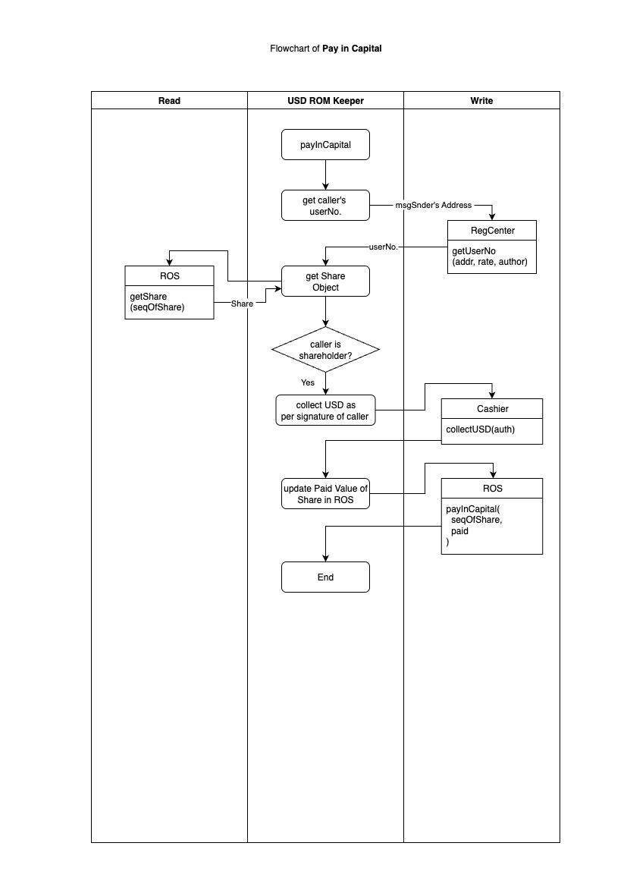<figcaption></figcaption></figure>

<figure>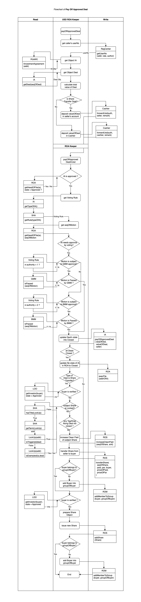<figcaption></figcaption></figure>

<figure>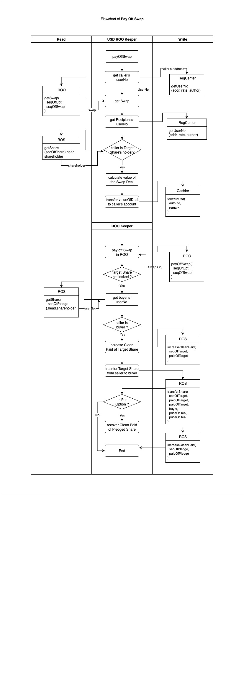<figcaption></figcaption></figure>

<figure>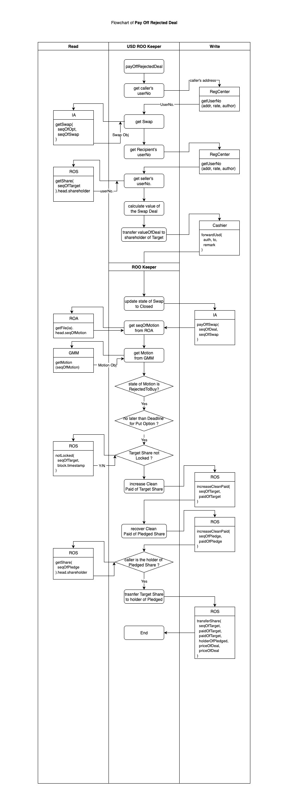<figcaption></figcaption></figure>

