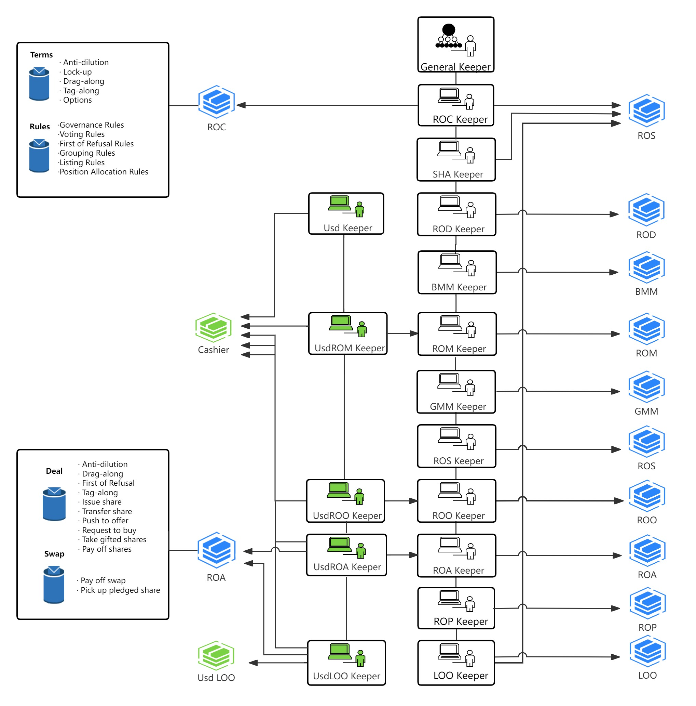

# 🏗️ System Architecture

[**ComBoox**](https://comboox.vercel.app) consists of four major types of smart contracts: **Registers**, **Bookkeepers**, **Shareholders Agreements** and **Investment Agreements**.

<figure><figcaption>
Diagram of System Architecture
</figcaption></figure>

 📖  <strong>Registers</strong>

**Registers** defined registration books to record the various book-entry interests (such as equities, pledges, options) or corporate governance documents (such as general meeting minutes and board meeting minutes). The core functions of which are to define the attributes composition of various bookkeeping objects, and the data structure, parameter and logical verification algorithm thereof, as well as the basic methods and APIs for adding, deleting, modifying and querying these objects.

1. **Functions of Registers**

When users exercise their rights:&#x20;

(1)    in accordance with the calling commands sent or routed from **Bookkeepers**, **Registers** will retrieve and provide specific states of book-entry interests or historical records of legal behaviors;

(2)    Based on the above feedback, **Bookkeepers** will verify or determine whether the conditions for exercising certain rights are fulfilled, or calculates values of the relevant parameters concerned; and

(3)    **Bookkeepers** will call specific **Register** to update the states of specific book-entry interests, or store the contents, consequences or historical records of the legal behaviors concerned.

***

For example, when a director takes his/her seat, he/she needs to call the "Take Seat" API of **General Keeper**, inputting the shareholders meeting resolution's sequence number which approved him/her to be director and the position number of the director, and then:

(1)    **General Keeper** will query and obtain the user number of the message sender account, and call the “Take Seat” API of **Register of Directors Keeper (“ROD Keeper”)** so as to process the subsequent actions thereof;

(2)    **ROD Keeper** will firstly call the **General Meeting Minutes (“GMM”)** to verify: whether the type of motion is to elect director and whether the motion has been approved;

(3)    If the type and approval status of the motion are all verified, **ROD Keeper** will further call the **GMM** to verify whether the user number of the message sender is equal to the candidate’s number as defined in the position’s description of the motion of nomination, if yes, then update the state of the motion into "executed";

(4)    If the message sender's identity is verified, **ROD Keeper** will call **Register of Directors (“ROD”)** to record the user number, timestamp, as well as the block number concerned, so as to complete the entire process of inauguration.

.png>)

In the above process, GMM and **ROD** are the two types of **Registers.** **GMM** provides the motion’s type and its voting results by answering the query request of **ROD Keeper**, so as to determine whether the conditions for exercising the rights has been fulfilled, thereafter, verifies the caller's identity against the user number of the motion's candidate. Then, **ROD Keeper** writes the user number, date and block number of inauguration into **ROD**, so as to write down the action records of "inauguration".

2. **Types of Registers**

Based on the types of information recorded, **Registers** can be divided into two categories: **Registers** of book-entry interests and **Registers** of corporate governance records, which includes:

1. **Register of Constitution ("ROC")**: records all editions of **Shareholders Agreement** with respect to their address, legal force status, procedural schedules for creation, review and voting etc., so as to enable users or smart contracts to retrieve or check the currently valid version of **Shareholders Agreement**, as well as all its historical revoked versions;
2. **Register of Directors ("ROD")**: records all information about the positions of directors or managers with respect to their candidate’s user number, nominator, the voting rules applied for election, the start and end date of tenure etc., so as to enable users or smart contracts to search or verify the identity, authorities or duties of executive officers;
3. **Board Meeting Minutes ("BMM")**: records all the motions submitted to the Board of Directors for approval with respect to their proposer, proposal date, start and end time of voting, voting results, delegate arrangements, executor, execution status, etc, so as to enable users or smart contracts to check or verify the motions of Board;
4. **Register of Members ("ROM")**: records all information about members or shareholders with respect to their equity shares, voting rights, amount of subscribed / paid-in / clean capital (i.e. capital contribution with no pledges, transfer arrangements or other legal encumbrances), so as to enable users or smart contracts to check or verify the shareholding status of a member;
5. **GeneralMeetingMinutes ("GMM")**: records all the motions submitted to the General Meeting of Shareholders for approval with respect to their proposer, proposal time, voting start and end time, voting results, delegate arrangements, executor, execution state, etc., so as to enable users or smart contracts to check or verify the relevant information of the motion submitted to General Meeting of Members;
6. **Register of Agreements ("ROA")**: records all the **Investment Agreements** with respect to their address, status, transaction type and detailed arrangements, parties, procedural schedules for exercising special rights,  so as to enable users or smart contracts to check and retrieve the relevant **Investment Agreements**, and, to enable the parties concerned to execute the deals under these **Investment Agreements**.  Moreover, **ROA** also can mock the transaction results and calculate the ultimate controller of the company after closing of the deals concerned, so as to anticipate whether the conditions of drag-along or tag-along will be triggered (i.e. change of controlling power);
7. **Register of Options ("ROO")**: record all information of (call / put) options with respect to their right holders, obligors, execution period, closing period, trigger conditions, exercise price, class and amount of the subject euqity, etc;
8. **Register of Pledges ("ROP"):** record all pledges attached to the equity shares with respect to their creditor, debtor, pledgor, pledged amount, guaranteed amount, debt expiration date, guarantee period etc;
9. **Register of Shares ("ROS")**: record all equity shares issued by the company with respect to their shareholders, class, voting weight, issue date, paid-in deadline / date, par value, paid-in amount, issue price and so on;
10. **List of ETH Orders ("LOE"** or **"LOO")**: record all information about listing trade of shares in ETH with respect to the subject shares class, sequence number, investors, limited sell orders, limited buy orders, and deals closed etc.
11. **Cashier**: record all USDC payment transactions related to the Company, including details of the payer, payee, purpose of payment, authorization for USDC collection, and other relevant information.
12. **List of USD Orders ("Usd LOO"** or **"LOU")**: record all information about listing trade of shares in USDC with respect to the subject shares class, sequence number, investors, limited sell orders, limited buy orders, and deals closed etc.

👨🏻‍✈️  <strong>Bookkeepers</strong>

**Bookkeepers** defined the APIs for dozens of legal behaviors regarding corporate governance and share transactions, so as to manage and control the identification of actors, conditions, procedures and legal consequences of the relevant legal behaviors.

1. **Functions of Bookkeepers**

When users exercise their rights, **Bookkeeper** will call **Shareholders Agreement** and the relevant **Register** as per legal logic, so as to check what conditions need to be satisfied to conduct the relevant legal behaviors (or what parameters need to be relied on for the subsequent calculations), and, together with the input parameters obtained from the API, **Bookkeepers** will make decisions on whether the conditions are fulfilled or calculate the specific values of the intermediate parameters.  If all conditions are fulfilled, **Bookkeeper** will call the relevant **Register** to update the states of book-entry interests or record the contents of the legal behaviors, such as expression of intention, or action tracks of the behaviors.

For example, when a shareholder votes on a motion, it needs to call the "Cast Vote" API of **General Keeper,** input the subject motion number and express its attitude as support, against or abstain, thereafter, **General Keeper** will call **Reg Center** to retrieve the user number of shareholder and further call the “Cast Vote” API of **General Meeting Minutes Keeper (“GMM Keeper”)** so as to hand over the control rights on the subsequent processing steps, and then, **GMM Keeper** will:

(1) retrieve the motion object from **General Meeting Minutes**;

(2) retrieve the voting rule from **Shareholders Agreement** as per the voting rule number specified in the motion object, and deduce the voting period accordingly;

(3) determine whether it is in the voting period as per the current timestamp;

(4) if within the voting period, call the **Register of Members** to verify whether the voter is a shareholder of the company;

(5) If it is a shareholder, then check the entrust arrangements from the **Delegate Map** of the motion, and then call the **Register of Members** again to retrieve and calculate the total voting rights entrusted from the principals as well as represented by the voter;

(6) Finally, store the voting information (user number, voting attitude, total voting rights, voting time, etc.) in the **General Meeting Minutes**.

From the above example, it is quite clear that **Bookkeeper** is the control center of the exercise conditions and logical flows for each legal behavior.

***

In order to satisfy the size requirements of EIP170, **ComBoox** defines two types of smart contracts, namely, **General Keeper** and several **Sub-Bookkeepers**.

2. **General Keeper**

**General Keeper** sits at the uppermost layer of the company book-entry system and has the following functions:

(1)    Acts as the only entry of the company's book-entry system for write operation commands and is responsible for routing write commands to specific Sub-Bookkeeper;

(2)    Acts as the address registration center for Registers, and responses the address of specific Register as per its sequence number;

(3)    Represents the legal entity of the company and conducts legal behaviors on behalf the company on-chain, e.g. signing or executing smart contracts, making payments in tokens, exercising voting rights, etc;

(4)    Represents the company to hold cryptocurrencies such as ETH and CBP etc., and makes payments in accordance with the resolutions of General Meeting of Members or Board of Directors;

(5)    Temporarily keeps ETH income (or balance) incurred from share transfer transactions or asset distributions, which can be picked up by the seller or shareholder to its public key account thereafter.

***

3. **Sub-Bookkeepers**

**Sub-Bookkeepers** are the core computation layer controlling the identity verification, conditions, procedures and legal consequences of legal behaviors, which includes:

**(1) Register of Constitution** **Keeper ("ROC Keeper")**: has write permissions to **Register of Agreements**, and controls the legal behaviors of creating, circulating, signing, activating, and accepting **Shareholders Agreements**;

**(2) Register of Directors Keeper ("ROD Keeper")**: has write permissions to **Register of Directors**, and controls the legal behaviors of inauguration, dismissal, and resignation of directors or executive officers;

**(3) Board Meeting Minutes Keeper ("BMMKeeper")**: has write permissions to **Board Meeting Minutes**, and controls the legal behaviors of creating and proposing board motions, appointing voting delegate, casting vote, counting of vote results, and executing actions. The motions concerned include the appointing and removing managers, reviewing contracts, paying tokens, and calling on-chain smart contracts;

**(4) Register of Members Keeper ("ROMKeeper")**: has write permissions to **Register of Shares** and **Register of Members**, and controls the legal behaviors of setting the maximum number of shareholders, setting hash locks on paid-in shares, releasing and withdrawing paid-in shares, and decreasing registered capital;

**(5) General Meeting Minutes Keeper ("GMMKeeper")**: has write permissions to **General Meeting Minutes**, and controls the legal behaviors of creating and proposing motions, appointing voting delegate, casting votes, counting vote results, and executing resolutions. The motions include nominating and removing directors, reviewing contracts, paying tokens and calling smart contracts;

**(6) Register of Agreements** **Keeper ("ROA Keeper")**: has write permissions to **Register of Agreements** and **Register of Shares**, and controls the legal behaviors of creation, circulation, and signing of **Investment Agreements**, as well as locking the subject equity, releasing and withdrawing the subject equity, issuing new shares, transferring share, terminating transaction, and paying consideration;

**(7) Register of Options Keeper ("ROO Keeper")**: has write permissions to **Register of Options** and **Register of Shares**, and controls the legal behaviors of inputting trigger events, exercising options, setting option’s pledge, paying off option, executing option’s pledge, requesting the against member to buy, paying consideration for the rejected deal’s equity shares, and executing the against member's pledge;

**(8) Register of Pledges Keeper ("ROP Keeper"):** has write permissions to **Register of Pledges**, **Register of Shares**, and **Register of Agreements**, and controls the legal behaviors of refunding debts, extending secured period, creating, transferring, executing, locking, releasing, withdrawing and revoking pledges;

**(9) Shareholders Agreement Keeper ("SHA Keeper")**: has write permissions to **Register of Shares** and **Register of Agreements**, and controls the legal behaviors of exercising and accepting special shareholders' rights like Drag-Along, Tag-Along, Anti-Dilution and First Refusal;

**(10) List of ETH Orders Keeper ("LOE Keeper")**: has write permissions to **List of Orders**, **Register of Shares**, and **Register of Members**, and controls legal behaviors of registering, approving and revoking accredited investors, listing and withdrawing initial offers, sell orders, and placing buy orders.

***

4. **USDC concerned Sub-Bookkeepers**

To facilitate user payments in USDC for equity consideration, margin deposits, and related expenses, the system introduces a set of specialized Sub-Bookkeepers, including:

**(11) USD Keeper**: has write permissions to Cashier, and generally controls legal acts of collecting, forwarding, transferring, holding and releasing USDC to or from **Cashier**;

**(12) UsdROM Keeper**: has write permissions to Register of Shares, and controls legal behaviors of pay in capital in USDC;

**(13) UsdROA Keeper**: has write permissions to ROAKeeper, and controls legal behaviors of pay off approved deal in USDC;

**(14) LOU Keeper**: has write permissions to LOU, Register of Shares, and Register of Members, and controls legal behaviors of listing and withdrawing initial offers, sell orders, and buy orders to be settled in USDC;

**(15) UsdROO Keeper:** has write permissions to ROO Keeper, and controls legal behaviors of pay off swap and pay off rejected deal.

📒  <strong>ShareholdersAgreement</strong>

**Shareholders Agreement** is to dynamically define rules and conditions relating to share transaction and corporate governance, which can be deemed as a constitutional document of the company.

When users exercise their rights, **Shareholders Agreement** will, as per the query request of **Bookkeepers**, search and obtain specific rules or terms, based on which a specific threshold value, parameter, or testing result will be parsed and reverted, so as for **Bookkeepers** to conduct further calculation or processing.

For example, when a shareholder casts vote for a motion, the relevant **Bookkeeper** will call **Shareholders Agreement** to query the voting period of certain governing voting rule, and then, based on the number of voting days obtained, the motion’s proposal date, as well as the current block timestamp, **Bookkeeper** will determine whether it is in the voting period.

The detailed terms and rules of **Shareholders Agreement** are abstractly defined as different data objects and methods according to the legal logic of corporate governance. During the drafting process, different values can be dynamically set to the different attributes, so as to define the different rules of the legal behavior concerned. A draft **Shareholders Agreement** will become effective upon approval of the general meeting of shareholders.

For example, when setting voting rules for different types of share transaction, a 30-days' review period and a two-thirds voting threshold can be set for capital increase deals, while, a 15-days' review period and a one-half voting threshold can be set for share transfer deals. Thereafter, during the process when a transaction is submitted to the shareholders’ meeting for reviewing and voting, **Bookkeeper** will calculate and determine the time period and voting results as per the transaction type accordingly.

In the **Shareholders Agreement**, the rules of corporate governance and share transaction can be categorized into "**Rules**" and "**Terms**" according to their respective complexity and governing matters.

1. **Rules**

“**Rules**” are defined in form of a byte-32 array, and are relied on the public library of **Rules Parser** to parse their key attributes, length of period or key threshold of conditions, so as to transform into structured objects.

**Function of Voting Rule Parser**

Each rule has its own sequence number, so it’s quite easy to set up a mapping from “sequence number” to the bytes32 “rule”.

Currently the rules include following types: **General Governance Rules, Voting Rules, Position Allocate Rules, First Refusal Rules, Grouping Update Orders,** and **Listing Rules**.

2. **Terms**

"**Terms**" are defined in form of independent smart contracts, and are relied on structured data objects and their methods to define specific pre-conditions of rights and intermediate parameters algorithm.

Each term has its own sequence number, so it’s quite easy to set up a mapping from “title number” to the “address of term”.

Currently the terms include the following types: **Anti Dilution, Lock Up, Drag Along, Tag Along, Put Option and Call Option**.

Therefore, **Shareholders Agreement** can be deemed as a data base comprises of “rules mapping” and “terms mapping”, which is to dynamically define the parameters and attributes of different rules so as to retrieve them in runtime.  As for the functions of **Rules Parser** and **Terms**, they are to set up models for the rules and terms in line with legal logic, and to abstractly define their core attributes and methods, thereafter, expose certain APIs so as for users to dynamically define various attributes or parameters of those rules and terms accordingly.  So that, during runtime, in accordance with user’s commands, specific **Bookkeeper** may search **Shareholders Agreement** as per the predefined logic of specific legal behavior, to get specific attribute or parameter of certain rule, and then, to further determine certain condition or to further control certain process.

📋 <strong>InvestmentAgreement</strong>

**Investment Agreement** dynamically defines all necessary elements of deals for issuing or transferring shares, such as the subject equity shares, price, amounts, buyer's identity, signing deadline, closing deadline, contractual parties and so on.

After an **Investment Agreement** is properly signed on-chain, the parties can call the relevant API of **Bookkeepers** to push forward the rest procedures concerning the deals' execution, like **General Meeting**’s reviewing and approving, paying consideration and closing etc.  The relevant **Bookkeepers** will, strictly in line with the rules and terms set out in **Shareholders Agreement**, automatically verify the caller's identy, check the fulfillment of pre-conditions, and control the transaction's procedure, until realizing the final business purpose ---- updates the **Register of Shares**.

The nature of **Investment Agreement** is actually a special script (or, a batch file) consisting of a series of write operation commands to update the book-entry states of the equity shares (i.e. update the **Register of Shares**), which will be automatically executed in an orderly manner, under the control of the relevant **Bookkeepers** in line with predefined conditions and procedures set out in the **Shareholders Agreement**, and will eventually realize the business objectives of updating book-entry states of equity shares, i.e. to realize the legal consequences of issue new shares or transfer existing shares.

If there are any special arrangements stipulated in **Shareholders Agreement**, such as "First Refusal", "Drag-Along", "Tag-Along", or "Anti-Dilution" etc., the right holders can call the relevant API of **Bookkeeper** to exercise their rights during the specific exercising period, then, **Bookkeeper** will automatically change the counter party (for first refusal), add free transaction for gift shares (for anti-dilution), or add new transactions with the same price and conditions (for drag-along or tag-along), in accordance with the algorithm and methods defined in Shareholders Agreement, so as to realize the business purpose thereof.

Inside **Investment Agreement**, the substantive elements of a share transaction (subject equity, buyer, amount, price, closing deadline, etc.) are defined by a type of structured object, called "**Deal**"; while, the procedural elements (such as contract parties, signing deadline, closing deadline, etc.) are defined by a reusable and inheritable smart contract component, called "**Signature Page**".

1. **Deal**

The object of **Deal** defines all necessary factors to issue new shares or transfer existing shares in **Register of Shares**, which also defines a hash lock in form of bytes32 for parties to arrange off-chain or cross-chain payment for equity consideration.

The share transactions can be categorized into three basic types: “capital increase”, “external transfer”, and “internal transfer” as per the different types of buyer, and, by combinations of these 3 basic types, it can be further deduced into 7 types of deals in total. In **Shareholders Agreement**, different voting rules can be tailored for each of the said 7 types, so as to satisfy the customized requirements of investors.

In **ShareholdersAgreement**, different voting rules can be tailored for each of the said 7 categories, so as to satisfy the customized requirements of investors.

2. **Signature Page**

**Signature page** is an independent, reusable and inheritable component smart contract that defines several key attributes of contract’s execution, including contractual parties, signature fields, signing deadline and closing deadline etc..

**Investment Agreement** defines an initial **Signature Page** and a supplemental **Signature Page**, the former is to be signed by the contracting parties during the contract’s formation, while the latter will be automatically filled up by **Bookkeeper** when the relevant right holders exercise their special rights (such as "First Refusal", "Tag-along, "Drag-along", and "Anti-Dilution" etc.)

When a party calls the API of **Bookkeeper** to sign an **Investment Agreement**, Bookkeeper will record the block number and timestamp of the signing action in the signature field, moreover, the signature field also can store a special hash value generated by hashing handwriting signatures or scanned copy of company seal, which can be used to verify digital documents in future.

