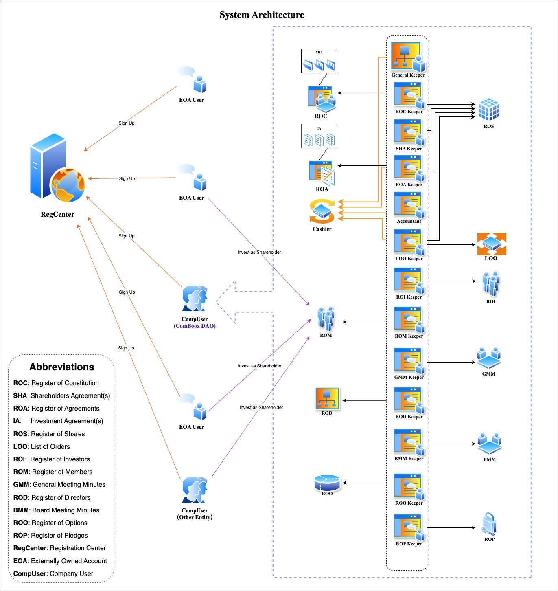
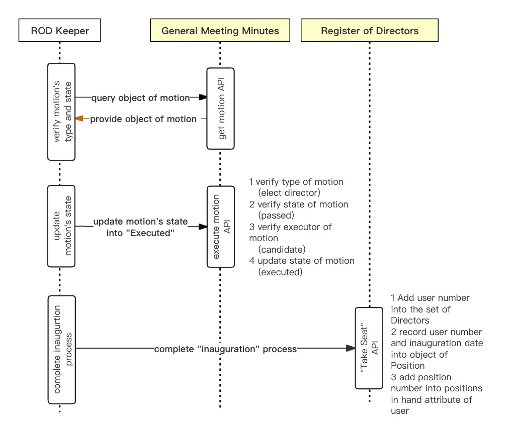

# 🏗️ 3. System Architecture

[**ComBoox**](https://comboox.vercel.app) consists of four major types of smart contracts: **Registers**, **Bookkeepers**, **Shareholders Agreements** and **Investment Agreements**.

<figure><figcaption></figcaption></figure>

<strong>3.1. Registers</strong>

**Registers** defined registration books to record the various book-entry interests (such as equities, pledges, options) or corporate governance documents (such as general meeting minutes and board meeting minutes). The core functions of which are to define the attributes composition of various bookkeeping objects, and the data structure, parameter and logical verification algorithm thereof, as well as the basic methods and APIs for adding, deleting, modifying and querying these objects.

1. **Functions of Registers**

When users exercise their rights:&#x20;

(1)    in accordance with the calling commands sent or routed from **Bookkeepers**, **Registers** will retrieve and provide specific states of book-entry interests or historical records of legal behaviors;

(2)    Based on the above feedback, **Bookkeepers** will verify or determine whether the conditions for exercising certain rights are fulfilled, or calculates values of the relevant parameters concerned; and

(3)    **Bookkeepers** will call specific **Register** to update the states of specific book-entry interests, or store the contents, consequences or historical records of the legal behaviors concerned.

***

For example, when a director takes his/her seat, he/she needs to call the "Take Seat" API of **General Keeper**, inputting the shareholders meeting resolution's sequence number which approved him/her to be director and the position number of the director, and then:

(1)    **General Keeper** will query and obtain the user number of the message sender account, and call the “Take Seat” API of **Register of Directors Keeper (“ROD Keeper”)** so as to process the subsequent actions thereof;

(2)    **ROD Keeper** will firstly call the **General Meeting Minutes (“GMM”)** to verify: whether the type of motion is to elect director and whether the motion has been approved;

(3)    If the type and approval status of the motion are all verified, **ROD Keeper** will further call the **GMM** to verify whether the user number of the message sender is equal to the candidate’s number as defined in the position’s description of the motion of nomination, if yes, then update the state of the motion into "executed";

(4)    If the message sender's identity is verified, **ROD Keeper** will call **Register of Directors (“ROD”)** to record the user number, timestamp, as well as the block number concerned, so as to complete the entire process of inauguration.

<figure><figcaption></figcaption></figure>

In the above process, GMM and **ROD** are the two types of **Registers.** **GMM** provides the motion’s type and its voting results by answering the query request of **ROD Keeper**, so as to determine whether the conditions for exercising the rights has been fulfilled, thereafter, verifies the caller's identity against the user number of the motion's candidate. Then, **ROD Keeper** writes the user number, date and block number of inauguration into **ROD**, so as to write down the action records of "inauguration".

2. **Types of Registers**

Based on the types of information recorded, **Registers** can be divided into two categories: **Registers** of book-entry interests and **Registers** of corporate governance records, which includes:

1. **Register of Constitution ("ROC")**: records all editions of **Shareholders Agreement** with respect to their address, legal force status, procedural schedules for creation, review and voting etc., so as to enable users or smart contracts to retrieve or check the currently valid version of **Shareholders Agreement**, as well as all its historical revoked versions;
2. **Register of Directors ("ROD")**: records all information about the positions of directors or managers with respect to their candidate’s user number, nominator, the voting rules applied for election, the start and end date of tenure etc., so as to enable users or smart contracts to search or verify the identity, authorities or duties of executive officers;
3. **Board Meeting Minutes ("BMM")**: records all the motions submitted to the Board of Directors for approval with respect to their proposer, proposal date, start and end time of voting, voting results, delegate arrangements, executor, execution status, etc, so as to enable users or smart contracts to check or verify the motions of Board;
4. **Register of Members ("ROM")**: records all information about members or shareholders with respect to their equity shares, voting rights, amount of subscribed / paid-in / clean capital (i.e. capital contribution with no pledges, transfer arrangements or other legal encumbrances), so as to enable users or smart contracts to check or verify the shareholding status of a member;
5. **GeneralMeetingMinutes ("GMM")**: records all the motions submitted to the General Meeting of Shareholders for approval with respect to their proposer, proposal time, voting start and end time, voting results, delegate arrangements, executor, execution state, etc., so as to enable users or smart contracts to check or verify the relevant information of the motion submitted to General Meeting of Members;
6. **Register of Agreements ("ROA")**: records all the **Investment Agreements** with respect to their address, status, transaction type and detailed arrangements, parties, procedural schedules for exercising special rights,  so as to enable users or smart contracts to check and retrieve the relevant **Investment Agreements**, and, to enable the parties concerned to execute the deals under these **Investment Agreements**.  Moreover, **ROA** also can mock the transaction results and calculate the ultimate controller of the company after closing of the deals concerned, so as to anticipate whether the conditions of drag-along or tag-along will be triggered (i.e. change of controlling power);
7. **Register of Options ("ROO")**: record all information of (call / put) options with respect to their right holders, obligors, execution period, closing period, trigger conditions, exercise price, class and amount of the subject euqity, etc;
8. **Register of Pledges ("ROP"):** record all pledges attached to the equity shares with respect to their creditor, debtor, pledgor, pledged amount, guaranteed amount, debt expiration date, guarantee period etc;
9. **Register of Shares ("ROS")**: record all equity shares issued by the company with respect to their shareholders, class, voting weight, issue date, paid-in deadline / date, par value, paid-in amount, issue price and so on;
10. **List of Orders ("LOO")**: record all information about listing trade of shares in USDC with respect to the subject shares class, sequence number, investors, limited sell orders, limited buy orders, and deals closed etc.
11. **Register of Investors** ("**ROI**"): record all information about investors who intend to invest in the Company with respect to their user number, group representative’s user number, registration date, verifier’s user number, approved date, registration state, and hash value of ID documents.
12. **Bank**: the official address of the smart contract deployed by Circle Internet Financial that automatically records users’ USDC balances and transaction records.
13. **Cashier**: record all USDC payment transactions related to the Company, including details of the payer, payee, purpose of payment, authorization for USDC collection, and other relevant information.
14. **Register of Redemptions** ("**ROR**"): records all information relating to redemption requests for redeemable fund shares and the execution thereof, including, without limitation, the class number, share sequence number, net asset value (NAV) price, shareholder user number, amount of paid, redemption value in USDC, and the sequence of the relevant request package.

<strong>3.2. Bookkeepers</strong>

**Bookkeepers** defined the APIs for dozens of legal behaviors regarding corporate governance and share transactions, so as to manage and control the identification of actors, conditions, procedures and legal consequences of the relevant legal behaviors.

1. **Functions of Bookkeepers**

When users exercise their rights, **Bookkeeper** will call **Shareholders Agreement** and the relevant **Register** as per legal logic, so as to check what conditions need to be satisfied to conduct the relevant legal behaviors (or what parameters need to be relied on for the subsequent calculations), and, together with the input parameters obtained from the API, **Bookkeepers** will make decisions on whether the conditions are fulfilled or calculate the specific values of the intermediate parameters.  If all conditions are fulfilled, **Bookkeeper** will call the relevant **Register** to update the states of book-entry interests or record the contents of the legal behaviors, such as expression of intention, or action tracks of the behaviors.

For example, when a shareholder votes on a motion, it needs to call the "Cast Vote" API of **General Keeper,** input the subject motion number and express its attitude as support, against or abstain, thereafter, **General Keeper** will call **Reg Center** to retrieve the user number of shareholder and further call the “Cast Vote” API of **General Meeting Minutes Keeper (“GMM Keeper”)** so as to hand over the control rights on the subsequent processing steps, and then, **GMM Keeper** will:

(1) retrieve the motion object from **General Meeting Minutes**;

(2) retrieve the voting rule from **Shareholders Agreement** as per the voting rule number specified in the motion object, and deduce the voting period accordingly;

(3) determine whether it is in the voting period as per the current timestamp;

(4) if within the voting period, call the **Register of Members** to verify whether the voter is a shareholder of the company;

(5) If it is a shareholder, then check the entrust arrangements from the **Delegate Map** of the motion, and then call the **Register of Members** again to retrieve and calculate the total voting rights entrusted from the principals as well as represented by the voter;

(6) Finally, store the voting information (user number, voting attitude, total voting rights, voting time, etc.) in the **General Meeting Minutes**.

From the above example, it is quite clear that **Bookkeeper** is the control center of the exercise conditions and logical flows for each legal behavior.

***

In order to satisfy the size requirements of EIP170, **ComBoox** defines two types of smart contracts, namely, **General Keeper** and several **Sub-Bookkeepers**.

2. **General Keeper**

**General Keeper** sits at the uppermost layer of the company book-entry system and has the following functions:

(1)    Acts as the only entry of the company's book-entry system for write operation commands and is responsible for routing write commands to specific Sub-Bookkeeper;

(2)    Acts as the address registration center for Registers, and responses the address of specific Register as per its sequence number;

(3)    Represents the legal entity of the company and conducts legal behaviors on behalf the company on-chain, e.g. signing or executing smart contracts, making payments in tokens, exercising voting rights, etc;

(4)    Represents the company to hold cryptocurrencies such as ETH and CBP etc., and makes payments in accordance with the resolutions of General Meeting of Members or Board of Directors.

***

3. **Sub-Bookkeepers**

**Sub-Bookkeepers** are the core computation layer controlling the identity verification, conditions, procedures and legal consequences of legal behaviors. They do not store any state variables and operate in a manner analogous to libraries. The General Keeper identifies and retrieves the address of the relevant Sub-Bookkeeper to be invoked by reference to the function selector (i.e., the first four bytes of the keccak256 hash of the function signature), and subsequently invokes the corresponding function of such Sub-Bookkeeper by means of a delegatecall. Accordingly, the specific algorithms defined in the functions of each Sub-Bookkeeper are executed within the context of the General Keeper, such that all computations are performed against the General Keeper’s state. The Sub Keepers include the followings:

**(1) Register of Constitution** **Keeper ("ROC Keeper")**: routes write commands to **Register of Agreements**, and controls the legal behaviors of creating, circulating, signing, activating, and accepting **Shareholders Agreements**;

**(2) Register of Directors Keeper ("ROD Keeper")**: routes write commands to **Register of Directors**, and controls the legal behaviors of inauguration, dismissal, and resignation of directors or executive officers;

**(3) Board Meeting Minutes Keeper ("BMMKeeper")**: routes write commands to **Board Meeting Minutes**, and controls the legal behaviors of creating and proposing board motions, appointing voting delegate, casting vote, counting of vote results, and executing actions. The motions concerned include the appointing and removing managers, reviewing contracts, paying tokens, and calling on-chain smart contracts;

**(4) Register of Members Keeper ("ROMKeeper")**: routes write commands to **Register of Shares** and **Register of Members**, and controls the legal behaviors of setting the maximum number of shareholders, setting hash locks on paid-in shares, releasing and withdrawing paid-in shares, and decreasing registered capital;

**(5) General Meeting Minutes Keeper ("GMMKeeper")**: routes write commands to **General Meeting Minutes**, and controls the legal behaviors of creating and proposing motions, appointing voting delegate, casting votes, counting vote results, and executing resolutions. The motions include nominating and removing directors, reviewing contracts, paying tokens and calling smart contracts;

**(6) Register of Agreements** **Keeper ("ROA Keeper")**: routes write commands to **Register of Agreements** and **Register of Shares**, and controls the legal behaviors of creation, circulation, and signing of **Investment Agreements**, as well as locking the subject equity, releasing and withdrawing the subject equity, issuing new shares, transferring share, terminating transaction, and paying consideration;

**(7) Register of Options Keeper ("ROO Keeper")**: routes write commands to **Register of Options** and **Register of Shares**, and controls the legal behaviors of inputting trigger events, exercising options, setting option’s pledge, paying off option, executing option’s pledge, requesting the against member to buy, paying consideration for the rejected deal’s equity shares, and executing the against member's pledge;

**(8) Register of Pledges Keeper ("ROP Keeper"):** routes write commands to **Register of Pledges**, **Register of Shares**, and **Register of Agreements**, and controls the legal behaviors of refunding debts, extending secured period, creating, transferring, executing, locking, releasing, withdrawing and revoking pledges;

**(9) Shareholders Agreement Keeper ("SHA Keeper")**: routes write commands to **Register of Shares** and **Register of Agreements**, and controls the legal behaviors of exercising and accepting special shareholders' rights like Drag-Along, Tag-Along, Anti-Dilution and First Refusal;

**(10) List of Orders Keeper ("LOO Keeper")**: routes write commands to **List of Orders**, **Register of Shares**, and **Register of Members**, and controls legal behaviors of listing and withdrawing initial offers, sell orders, and placing buy orders to be settled in USDC.

**(11) Accountant**: routes write commands to Cashier, General Meeting Minutes and/or Borad Meeting Minutes, and controls the legal behaviors of distribution of profits or income, and the transfer of funds;

**(12) Register of Redemptions Keeper** ("**ROR Keeper**"): routes write commands to Register of Redemptions, Register of Shares, and Cashier, and controls the legal behaviors of addition or removal of redeemable classes, submission of redemption request and the redemption of the requested shares.

To facilitate user payments in USDC for equity consideration, margin deposits, and related expenses, the ROA Keeper, ROM Keeper, LOO Keeper, and ROO Keeper are designed to route write commands to Cashier to execute USDC payment transactions in connection with equity trades or capital contributions.

<strong>3.3. ShareholdersAgreement</strong>

**Shareholders Agreement** is to dynamically define rules and conditions relating to share transaction and corporate governance, which can be deemed as a constitutional document of the company.

When users exercise their rights, **Shareholders Agreement** will, as per the query request of **Bookkeepers**, search and obtain specific rules or terms, based on which a specific threshold value, parameter, or testing result will be parsed and reverted, so as for **Bookkeepers** to conduct further calculation or processing.

For example, when a shareholder casts vote for a motion, the relevant **Bookkeeper** will call **Shareholders Agreement** to query the voting period of certain governing voting rule, and then, based on the number of voting days obtained, the motion’s proposal date, as well as the current block timestamp, **Bookkeeper** will determine whether it is in the voting period.

The detailed terms and rules of **Shareholders Agreement** are abstractly defined as different data objects and methods according to the legal logic of corporate governance. During the drafting process, different values can be dynamically set to the different attributes, so as to define the different rules of the legal behavior concerned. A draft **Shareholders Agreement** will become effective upon approval of the general meeting of shareholders.

For example, when setting voting rules for different types of share transaction, a 30-days' review period and a two-thirds voting threshold can be set for capital increase deals, while, a 15-days' review period and a one-half voting threshold can be set for share transfer deals. Thereafter, during the process when a transaction is submitted to the shareholders’ meeting for reviewing and voting, **Bookkeeper** will calculate and determine the time period and voting results as per the transaction type accordingly.

In the **Shareholders Agreement**, the rules of corporate governance and share transaction can be categorized into "**Rules**" and "**Terms**" according to their respective complexity and governing matters. 

1. **Rules**

“**Rules**” are defined in form of a byte-32 array, and are relied on the public library of **Rules Parser** to parse their key attributes, length of period or key threshold of conditions, so as to transform into structured objects.

**Function of Voting Rule Parser**

Each rule has its own sequence number, so it’s quite easy to set up a mapping from “sequence number” to the bytes32 “rule”.

Currently the rules include following types: **General Governance Rules, Voting Rules, Position Allocate Rules, First Refusal Rules, Grouping Update Orders,** and **Listing Rules**.

* **(1) Governance Rule (No. 0)**
  \
  \
  The **Governance Rule** specifies key corporate governance matters, including the company’s legal form, operating term, the basis for calculating voting rights (whether based on paid-in capital or subscribed capital), quorum requirements for the General Meeting and the Board, proposal thresholds, the maximum number of shareholders or directors, the term of office of the Board, and the minimum shareholding percentage required for shareholder disclosure.

* **(2) Voting Rule (No. 1 \~ 255)**
  \
  \
  The **Voting Rules** set out the exercise periods for special shareholder rights in various decision-making procedures, and the methods for calculating voting outcomes. Specifically, Rules No.1 through No.7 prescribe the voting rules applicable to capital increase, transfers of equity to third parties, transfers of equity among existing shareholders, and the four hybrid transaction types formed by combinations of these three basic equity transactions. Rule No.8 establishes a special voting regime for amendments to **Shareholders Agreement**. Rules No.9 and No.10 govern the voting procedures for ordinary and special resolutions of the General Meeting, respectively, while Rules No.11 and No.12 govern the voting procedures for ordinary and special resolutions of the Board of Directors, respectively.\
  \
  Where special requirements arise, additional customized **Voting Rules** may be freely introduced after Rule No.12, up to a maximum of Rule No.255. Once such rules are incorporated into the **Shareholders Agreement**, they may be mandatorily applied during the proposal and voting processes by reference to their corresponding rule sequence number. Any adoption or modification of voting rules constitutes an amendment to the **Shareholders Agreement** and, accordingly, must be approved by the **General Meeting** in accordance with Rule No.8 for the revised **Shareholders Agreement** to become effective.

* **(3) Position Allocate Rule (No. 256 \~ 511)**\
  \
  The **Position Allocation Rules** specify the allocation of nomination rights for directors and officers, the **Voting Rule** applicable, and the terms thereof. By defining directors’ nomination rights under this rule, the allocation of **Board** seats among shareholders may be achieved. Nomination rights may be vested in a specific user or in a designated title of positions (e.g. CEO may nominate CFO). If, under the **Voting Rule** applicable, both the voting points ratio and the headcount ratio are set to zero, this indicates that the nominator may directly appoint the candidate to the position without approval.

*   **(4) First Refusal Rule (No. 512 \~ 767)** 

    The **First Refusal Rules** govern shareholders’ pre-emptive rights to subscribe for newly issued equity or rights of first refusal to purchase equity proposed to be transferred. Such rights may be granted equally to all shareholders or conferred upon specific ones. The allocation of the subject equity may be made pro rata based on voting rights or in accordance with the chronological order in which such rights are exercised. Up to 256 distinct first-refusal rules may be established to apply to different transaction types and different combinations of entitled parties.

 

*   **(5) Group Update Order (No. 768 \~ 1023)** 

    **Group Update Orders** are used to define and update groups of affiliated shareholders (or persons acting in concert). Each group is identified by a representative shareholder’s user number. During the activation process of a **Shareholders Agreement**, the system automatically executes the **Group Update Orders** contained therein to add specified users into, or remove them from, a particular affiliation group. A proposal for updating **Shareholders Agreement** with **Group Update Orders** effectively constitutes a declaration and disclosure by the relevant shareholders of their affiliated relationships. Accordingly, the review and approval of such motion signifies the General Meeting’s acknowledgment and approval of such relationships.

 

*   **(6) Listing Rule (No. 1024 \~ 1280)**

    \
    The **Listing Rules** set out the rules governing the issuance or trading of shares by listing, including maximum and minimum offering price, minimum trading price, resale lockup days, caps on the number of qualified Investors, the title of Verifiers and issuers, the class of shares to which the rules apply, and the maximum aggregate Par Value of shares that may be issued. Up to 256 Listing Rules may be established to regulate the issuance and trading of different classes of equity.

2. **Terms**

"**Terms**" are defined in form of independent smart contracts, and are relied on structured data objects and their methods to define specific pre-conditions of rights and intermediate parameters algorithm.

Each term has its own sequence number, so it’s quite easy to set up a mapping from “title number” to the “address of term”.

Currently the terms include the following types: **Anti Dilution, Lock Up, Drag Along, Tag Along, Put Option and Call Option**. 

*   **(1) Anti Dilution (No. 1 Term)** 

    **Anti-Dilution** is a special smart contract designed to protect existing shareholders from dilution caused by the issuance of new shares at a lower price, which would otherwise dilute the effective per-unit acquisition price of their shares (calculated as acquisition cost divided by aggregate par value). The mechanism establishes benchmark prices for different classes of shares and specifies the shareholders’ user number of the parties responsible for providing anti-dilution compensation (typically the company’s controlling shareholder). If new shares are issued at a price below the applicable benchmark price, the obligated party must compensate the entitled shareholders through a gratuitous transfer of equity, until the weighted-average acquisition price of the entitled shareholders is adjusted to align with the new issuance price. 

    To facilitate the drafting and amendment of the **Anti Dilution** by users, the following lists the editorial API interfaces that may be invoked by external accounts.

*   **(2) Lock Up (No.2 Term)** 

    **Lock Up** is a specialized smart contract designed to define and monitor shares subject to transfer restrictions. For each locked shares, the contract assigns a dedicated “locker” that records the lock-up expiration date and the user numbers of the designated “key holders” whose consent is required for any early release. The subject share may be transferred prior to the expiration of the lock-up period only with the unanimous consent of all key holders; otherwise, the system will automatically reject the proposed transfer. If the lock-up expiration date is set to zero, the share shall remain permanently locked and non-transferable unless all key holders unanimously approve its release. 

    To facilitate the drafting and amendment of the Lock Up by users, the following lists the editorial API interfaces that may be invoked by external accounts.

*   **(3) Drag/Tag Along (No.3 \~ No.4 Term)** 

    **Drag/Tag Along** is a specialized smart contract designed to define and execute coordinated share transfer arrangements. Under a **Drag Along**, when a selling shareholder intends to transfer shares, it may require specified obligors to sell their shares alongside, enabling the buyer to acquire a larger proportion of the company’s equity. Under a **Tag Along**, designated right holders may require the seller to allow them to sell their shares on the same price and terms, thereby facilitating a joint exit. 

    The contract uses a **Link Rule**, encoded in bytes32, to define the exercise start date, exercise period, minimum **Drag Along** price, or minimum annualized ROE, along with other exercise conditions and timelines. It uses the selling shareholder’s user number to identify the data object Link which is further consists of the Link Rule and the followers (i.e. the **Drag Along** obligors or **Tag Along** right-holders participating in the transfer). Exercise conditions may include a change of company control or may be unconditional, depending on the terms. 

    To facilitate the drafting and amendment of the **Drag/Tag Along** by users, the following lists the editorial API interfaces that may be invoked by external accounts.

* **(4) Put/Call Option**\
  \
  **Put/Call Option** is a specialized smart contract designed to define and enforce the compulsory purchase or sale of a specified quantity and class of shares at a predetermined price. By flexibly configuring the exercise conditions, it can be used to implement complex equity investment arrangements, such as valuation adjustments and mandatory buybacks.\
  \
  To facilitate the drafting and amendment of the Put/Call Option by users, the following lists the editorial API interfaces that may be invoked by external accounts.

3. **Editorial APIs of Shareholders Agreement**

Therefore, **Shareholders Agreement** can be deemed as a data base comprises of “rules mapping” and “terms mapping”, which is to dynamically define the parameters and attributes of different rules so as to retrieve them in runtime.  As for the functions of **Rules Parser** and **Terms**, they are to set up models for the rules and terms in line with legal logic, and to abstractly define their core attributes and methods, thereafter, expose certain APIs so as for users to dynamically define various attributes or parameters of those rules and terms accordingly.  So that, during runtime, in accordance with user’s commands, specific **Bookkeeper** may search **Shareholders Agreement** as per the predefined logic of specific legal behavior, to get specific attribute or parameter of certain rule, and then, to further determine certain condition or to further control certain process.

The external APIs of the **Shareholders Agreement** are primarily used to add, remove, or query **Terms** and **Rules**. To facilitate the drafting and amendment of the Shareholders Agreement by users, the following lists the editorial API interfaces related to contract drafting and inquiry that may be invoked by external accounts.

<table><thead><tr><th width="220.86328125">API</th><th>Description of Functions and Parameters</th></tr></thead><tbody><tr><td>
function <strong>createTerm</strong>(

    uint <em>title</em>, uint <em>version</em>

) external;
</td><td>Create a clone smart contract using the term’s sequence number <em>title</em> and version number <em>version</em>, and add the address of the cloned instance into the terms mapping.</td></tr><tr><td>
function <strong>removeTerm</strong>(

    uint <em>title</em>

) external;
</td><td>Remove the clone smart contract identified by the term’s sequence number <em>title</em>.</td></tr><tr><td>
function <strong>addRule</strong>(

    uint seqOfRule, 

    bytes32 <em>rule</em>

) external;
</td><td>Add the Rule encoded in bytes32 as <em>rule</em> and identified by the Rule’s sequence number <em>seqOfRule</em> into the rules’ mapping.</td></tr><tr><td>
function <strong>removeRule</strong>(

    uint256 <em>seqOfRule</em>

) external;
</td><td>Remove the rule identified by sequence number <em>seqOfRule</em>.</td></tr><tr><td>
function <strong>finalizeSHA</strong>(

) external;
</td><td>Transfer the special Roles with write authority over the Terms and this Shareholders Agreement to “Zero” to permanently lock their contents.</td></tr></tbody></table>

4. **Signature Page**

**Signature Page** is an independent, reusable and inheritable component smart contract that defines several key attributes of contract’s execution, including contractual parties, signature fields, signing deadline and closing deadline etc..

**Shareholders Agreement** and **Investment Agreement** both inherit **Signature Page** as a special component to define and record information related to the contract execution.

To facilitate the drafting and amendment of the **Signature Page** by users, the following lists the editorial API interfaces that may be invoked by external accounts.

<table><thead><tr><th width="210.74609375">API</th><th>Description of Functions and Parameters</th></tr></thead><tbody><tr><td>
function <strong>setTiming</strong>(

    bool <em>initPage</em>,

    uint <em>signingDays</em>,

    uint <em>closingDays</em>

) external;
</td><td>Set the timing parameters for <em>signingDays</em> and <em>closingDays</em> on the initial page when <em>initPage</em> is true, or on the second page when <em>initPage</em> is false. This function shall be invoked by the attorney responsible for drafting the relevant contract.</td></tr><tr><td>
function <strong>addBlank</strong>(

    bool <em>initPage</em>, 

    bool <em>beBuyer</em>,

    uint256 <em>seqOfDeal</em>,

    uint256 <em>acct</em>

) external;
</td><td>Add a new blank on the initial page when <em>initPage</em> is true, or on the second page when <em>initPage</em> is false, for the seller when <em>beBuyer</em> is false or for the buyer when <em>beBuyer</em> is true, in connection with the deal identified by sequence number <em>seqOfDeal</em>, for the intended signer with user number <em>acct</em>. This function may be invoked by the attorney responsible for drafting the relevant contract, or by the relevant Sub Keeper when exercising special shareholders’ rights.</td></tr><tr><td>
function <strong>removeBlank</strong>(

    bool <em>initPage</em>,

    uint256 <em>seqOfDeal</em>,

    uint256 <em>acct</em>

) external;
</td><td>Remove the blank from the initial page when <em>initPage</em> is true, or from the second page when <em>initPage</em> is false, in relation to the deal identified by sequence number <em>seqOfDeal</em>, for the intended signer identified by user number <em>acct</em>. This function may be invoked by the attorney responsible for drafting the relevant contract, or by the relevant Sub Keeper when exercising special shareholders’ rights.</td></tr></tbody></table>

<strong>3.4. InvestmentAgreement</strong>

**Investment Agreement** dynamically defines all necessary elements of deals for issuing or transferring shares, such as the subject equity shares, price, amounts, buyer's identity, signing deadline, closing deadline, contractual parties and so on.

After an **Investment Agreement** is properly signed on-chain, the parties can call the relevant API of **Bookkeepers** to push forward the rest procedures concerning the deals' execution, like **General Meeting**’s reviewing and approving, paying consideration and closing etc.  The relevant **Bookkeepers** will, strictly in line with the rules and terms set out in **Shareholders Agreement**, automatically verify the caller's identy, check the fulfillment of pre-conditions, and control the transaction's procedure, until realizing the final business purpose ---- updates the **Register of Shares**.

The nature of **Investment Agreement** is actually a special script (or, a batch file) consisting of a series of write operation commands to update the book-entry states of the equity shares (i.e. update the **Register of Shares**), which will be automatically executed in an orderly manner, under the control of the relevant **Bookkeepers** in line with predefined conditions and procedures set out in the **Shareholders Agreement**, and will eventually realize the business objectives of updating book-entry states of equity shares, i.e. to realize the legal consequences of issue new shares or transfer existing shares.

If there are any special arrangements stipulated in **Shareholders Agreement**, such as "First Refusal", "Drag-Along", "Tag-Along", or "Anti-Dilution" etc., the right holders can call the relevant API of **Bookkeeper** to exercise their rights during the specific exercising period, then, **Bookkeeper** will automatically change the counter party (for first refusal), add free transaction for gift shares (for anti-dilution), or add new transactions with the same price and conditions (for drag-along or tag-along), in accordance with the algorithm and methods defined in Shareholders Agreement, so as to realize the business purpose thereof.

Inside **Investment Agreement**, the substantive elements of a share transaction (subject equity, buyer, amount, price, closing deadline, etc.) are defined by a type of structured object, called "**Deal**"; while, the procedural elements (such as contract parties, signing deadline, closing deadline, etc.) are defined by a reusable and inheritable smart contract component, called "**Signature Page**".

1. **Deal**

The object of **Deal** defines all necessary factors to issue new shares or transfer existing shares in **Register of Shares**, which also defines a hash lock in form of bytes32 for parties to arrange off-chain or cross-chain payment for equity consideration.

The share transactions can be categorized into three basic types: “capital increase”, “external transfer”, and “internal transfer” as per the different types of buyer, and, by combinations of these 3 basic types, it can be further deduced into 7 types of deals in total. In **Shareholders Agreement**, different voting rules can be tailored for each of the said 7 types, so as to satisfy the customized requirements of investors.

In **ShareholdersAgreement**, different voting rules can be tailored for each of the said 7 categories, so as to satisfy the customized requirements of investors.

2. **Editorial APIs of Investment Agreement**

The external APIs of the **Investment Agreement** are primarily used to add, remove, or query **Deal**. In addition, to accommodate transaction requirements such as lock-up and closing of the subject shares, as well as the exercise of special shareholder rights, **Investment Agreement** reserves some other interfaces that may be automatically invoked by the relevant **Sub Keeper** in the course of executing the foregoing processes, so as to automatically update the status of the relevant variables.

To facilitate the drafting and amendment of the **Investment Agreement** by users, the following lists the editorial API interfaces related to contract drafting that may be invoked by external accounts.

<table><thead><tr><th width="222.60546875">API</th><th>Description of Functions and Parameters</th></tr></thead><tbody><tr><td>
function <strong>addDeal</strong>(

    bytes32 <em>sn</em>,

    uint <em>buyer</em>,

    uint <em>groupOfBuyer</em>,

    uint <em>paid</em>,

    uint <em>par</em>,

    uint <em>distrWeight</em>

) external;
</td><td>Create and add a Deal object to the Investment Agreement with the transaction parameters encoded in bytes32 form as <em>snOfDeal</em>, the intended buyer identified by user number <em>buyer</em>, the representative of the buyer’s affiliated group identified by user number <em>groupOfBuyer</em>, the paid value of the transaction as <em>paid</em>, the corresponding par value as <em>par</em>, and the distribution weight for the new class in a capital increase transaction as <em>distrWeight</em>.</td></tr><tr><td>
function delDeal(

    uint256 <em>seq</em>

) external;
</td><td>Remove the Deal identified by sequence number <em>seq</em>.</td></tr><tr><td>
function finalizeIA(

) external;
</td><td>Finalize the Investment Agreement and lock its contents.</td></tr></tbody></table>

3. **Signature Page**

**Signature page** is an independent, reusable and inheritable component smart contract that defines several key attributes of contract’s execution, including contractual parties, signature fields, signing deadline and closing deadline etc..

**Investment Agreement** defines an initial **Signature Page** and a supplemental **Signature Page**, the former is to be signed by the contracting parties during the contract’s formation, while the latter will be automatically filled up by **Bookkeeper** when the relevant right holders exercise their special rights (such as "First Refusal", "Tag-along, "Drag-along", and "Anti-Dilution" etc.)

When a party calls the API of **Bookkeeper** to sign an **Investment Agreement**, Bookkeeper will record the block number and timestamp of the signing action in the signature field, moreover, the signature field also can store a special hash value generated by hashing handwriting signatures or scanned copy of company seal, which can be used to verify digital documents in future.

