# 🤝 Share Transaction

The action flow by various stakeholders to promote share transactions through legal behaviors is shown in the table below:

<figure>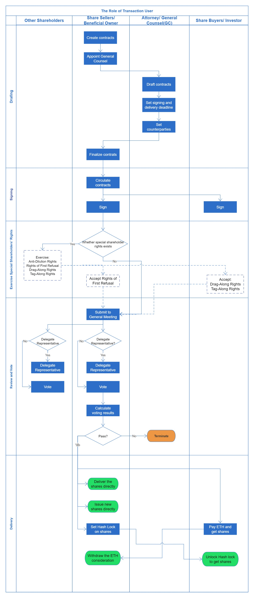<figcaption></figcaption></figure>

The detailed flow of algorithmic instruction interactions between system smart contracts at each step of the action is as follows:

(0) Query the caller's user number

* As the pre-defined process for identity verification, almost each **legal behavior** in the system starts with querying caller's user number.
* **Logical flow**: as follow.

### A. Draft Investment Agreement

(1)  <strong>Create Investment Agreement</strong>

* **Actor**: it is generally triggered by the share transferor (in share transaction) or the actual controller (in a capital increase transaction)
* **Calling API**: (to be added)
* **Action Consequences**:

1. Create and deploy a new clone contract based on the **investment agreement** contract template;
2. Initialize access control settings for the new **investment agreement** contract;
3. Registering the address of the new **investment agreement** contract in the **investment agreement** registry.

* **Logical flow**: as follows.

(2) Appoint General Counsel

* **Actor**: the creator of **investment agreement**s
* **Calling API**: (to be added)
* **Action Consequences**: Set the **general counsel** role in **investment agreement** to a specific account address;
* **Logical flow**: as follows.

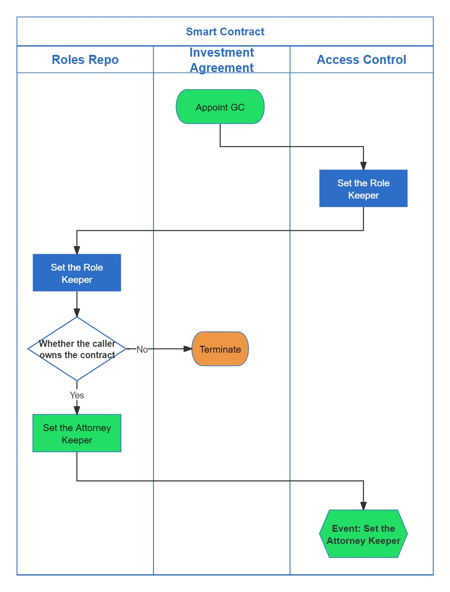

(3) Draft the Contract

* **Actor:** the **general counsel** of **investment agreement**s
* **Calling API:** (to be added)
* **Action Consequences:** Set the order objects in **investment agreement**;
* **Logical flow:** as follows.

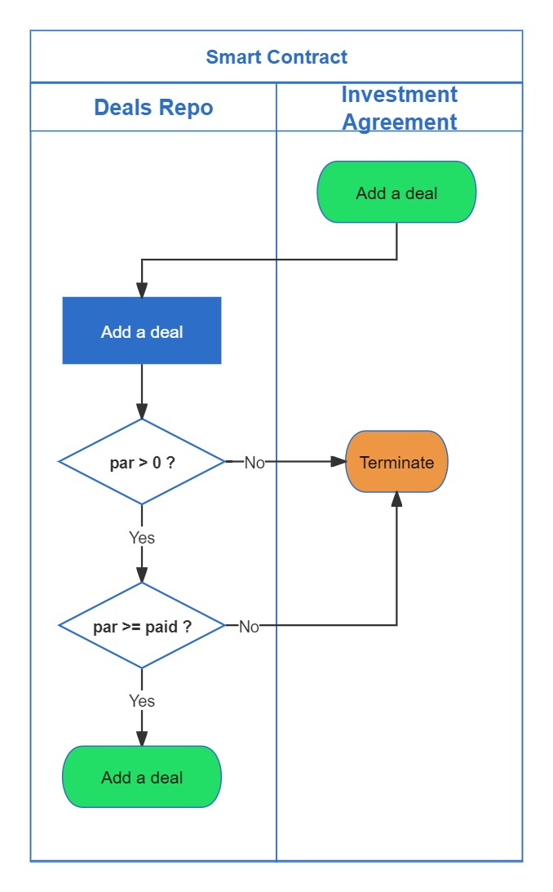

(4) Set the Signature and Closing Deadline

* **Actor**: the **general counsel** of **investment agreements**
* **Calling API**: (to be added)
* **Action Consequences**: Set the signature and delivery deadline in **investment agreement**;
* **Logical flow**: as follows.

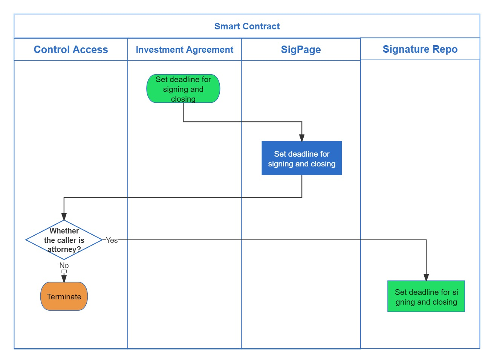

(5) Set the Parties

* **Actor:** the **general counsel** of **investment agreement**s
* **Calling API**: (to be added)
* **Action Consequences**: Add or delete a signature for the parties to the contract on the **SigPage** of the **investment agreement**;
* **Logical flow**: as follows.

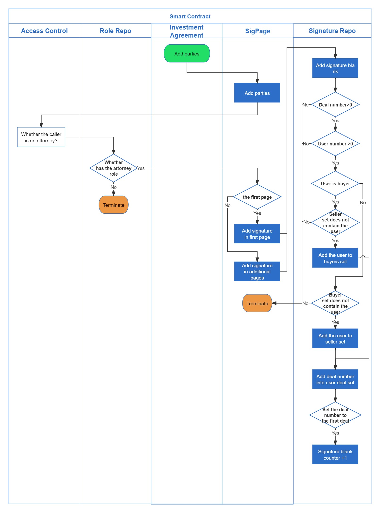

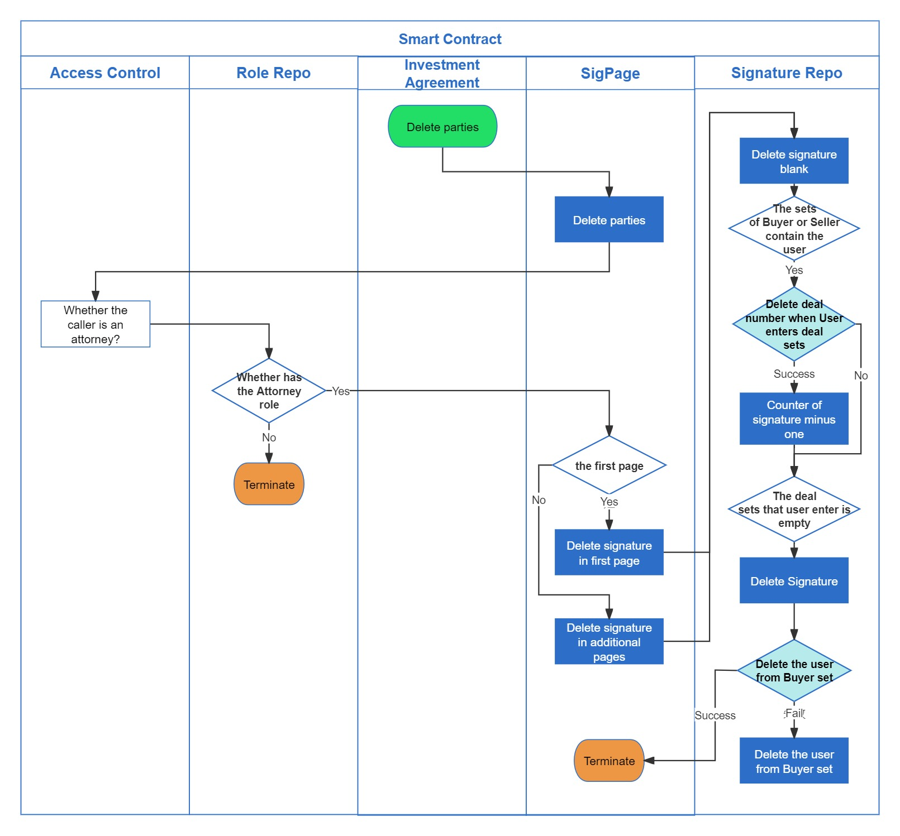

(6) Finalize the Contract

* **Actor:** need to be triggered by the shareholder who creates the contract after reviewing the content;
* **Calling API**: (to be added)
* **Action Consequences:** Revoke the "**Attorney**" in contracts and transfer of the "**Owner**" to a zero address, revoking the right to modify the contract;
* **Logical flow:** as follows.

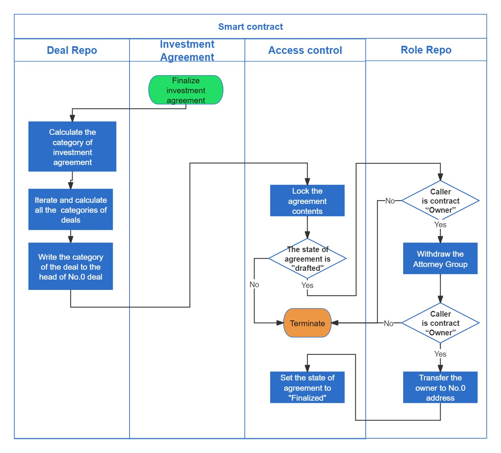

### B. Sign Investment Agreement

(7) Circulate the Contract

* **Actor:** triggered by the **contractual parties**
* **Calling API**: (to be added)
* **Action Consequences:** Write the period of enforcement into the data objects of **investment agreement**s, in accordance with the voting rules in the **investment agreement**;
* **Logical flow**: as follows.

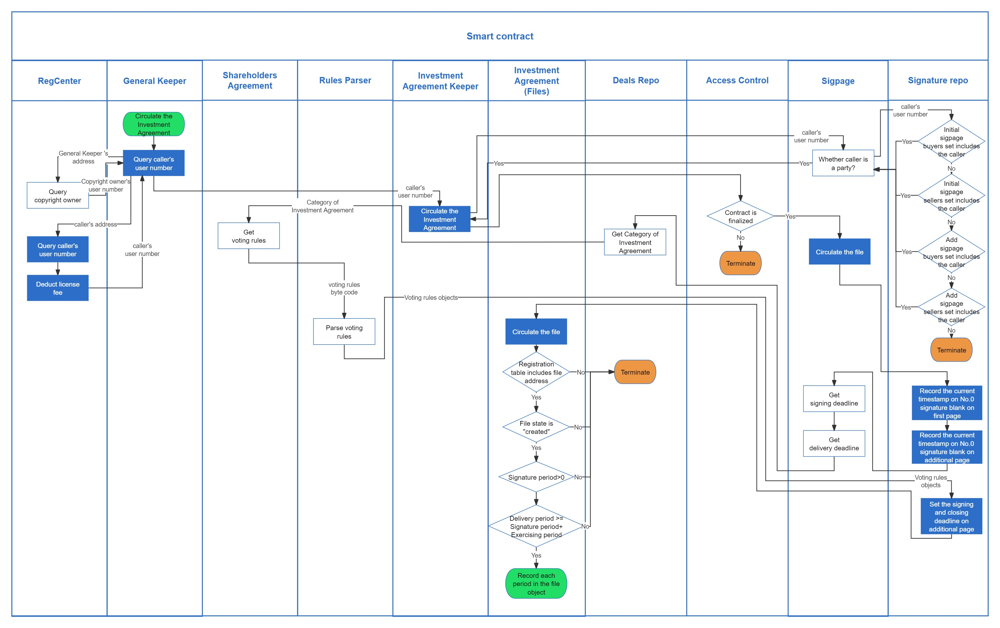

(8) <strong>Sign the Investment Agreement</strong>

* **Actor:** triggered by the **contractual parties**
* **Calling API**: (to be added)
* **Action Consequences:** Lock the transactions related to the **investment agreement** and record the caller's signature on the first signature page;
* **Logical flow**: as follows.

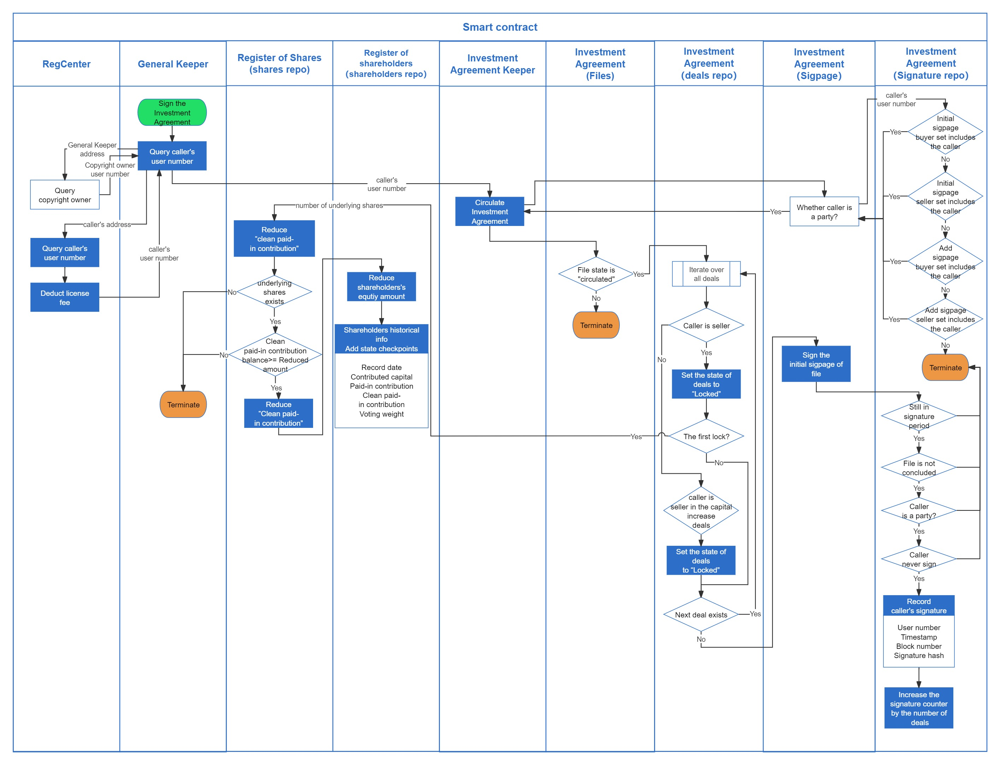

### C. **Review and Vote for Investment Agreement**

(9) Submit to General Meeting

* **Actor:** triggered by an account that process both **signature** and **shareholder** identity;
* **Calling API**: (to be added)
* **Action Consequences:** Lock the transactions related to the **investment agreement** and record the caller's signature on the first signature page;
* **Logical flow**: as follows.

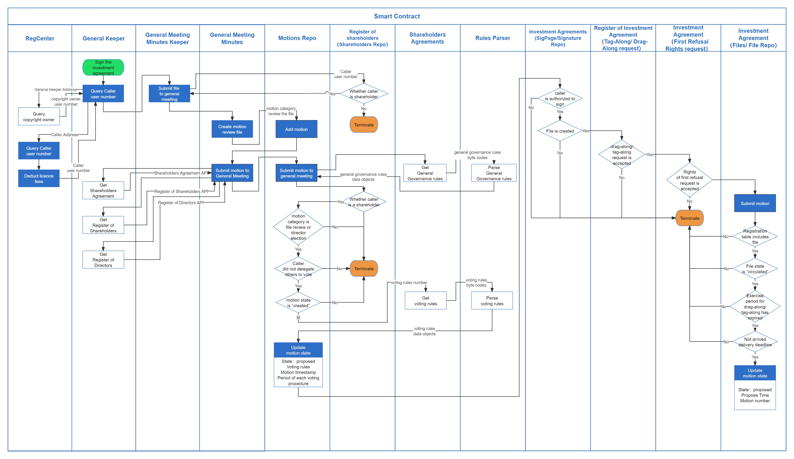

(10) Delegate 

* **Actor**: triggered by the **shareholders** who have never given delegate;
* **Input parameters:** motion number, the user number of the designated user;
* **Action Consequences**: Vest the number of shareholders giving delegate and the weight of their votes to the designated user;
* **Logical flow**: as follows.

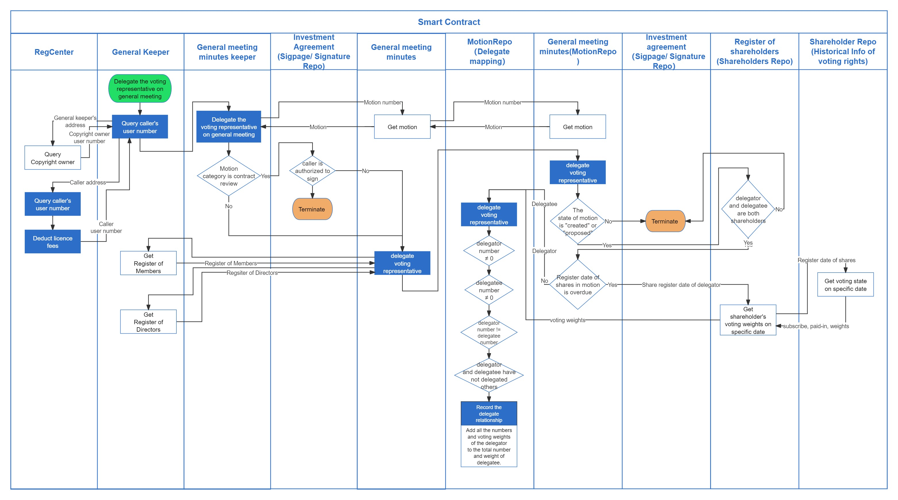

(11) Vote

* **Actor**: triggered by the **shareholders** who have never voted or delegated to vote;
* **Input parameters**: motion number, voting attitude, Signature File Hash(selectable);
* **Action Consequences:** Add the votes to ballots case;
* **Logical flow**: as follows.

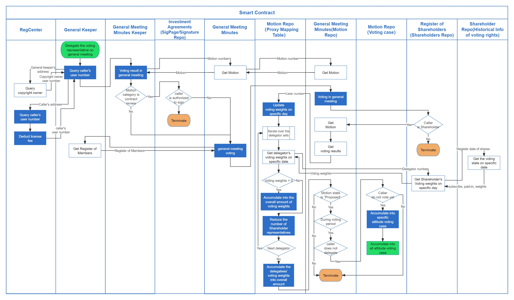

(12) Ballots

* **Actor**: triggered any accounts (to avoid the delayed voting calculation by the losing party);
* **Input parameters**: motion number;
* **Action Consequences:** Vest the number of shareholders giving delegate and the weight of their votes to the designated user;
* **Logical flow**: as follows.

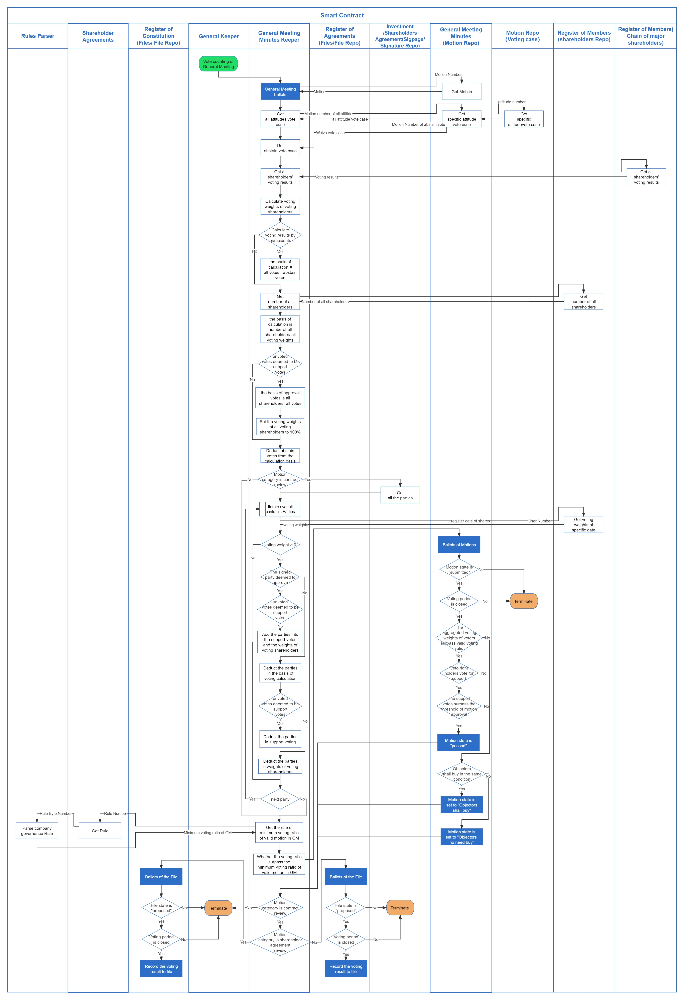

### D. Execution of Investment Agreement

(13) Deliver the Shares directly

* **Actor**: The **seller** in the share transfer transaction;
* **Input parameters**: the contract address of **investment agreement** and the deal number;
* **Action Consequences:** **Cancel** the underlying shares of deals and issue new shares with the same class, amount and weight to the **buye**r;
* **Logical flow**: as follows.

