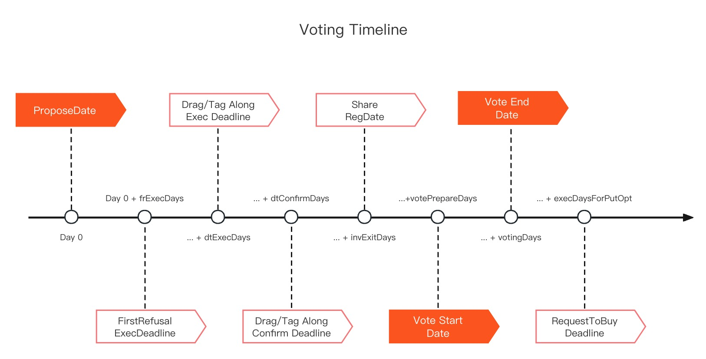

# 📏 Rule and RulesParser

### **Function and Usage**&#x20;

The **Rules Parser** library defined several **Rules** that are extensively covering almost all kinds of activities that a company may encounter during its daily operation, which can be categorized into the following types as per their governing matters: **General Governance Rule, Voting Rules, Position Allocation Rules, First Refusal Rules, Grouping Orders** and **Listing Rules**.  All these rules are stored in the "World States" in form of bytes32 and can be retrieved from a "key-value" mapping with the structure of "sequence number (uint) -> rule object (bytes32) " in the smart contract of **Shareholders Agreement**.  During the runtime, **the** **Book Keepers** can call **the** **Rules Parser** to parse the said **Rules** from the original form of bytes32 into their specific structured objects,  from the attributes of which the intended value will be obtained ultimately.\
Except the **General Governance Rule**, the beginning 16-bit of the other **Rules** are defined as their sequence number.  However, these sequence numbers are not consecutive, instead, they are segmented with 256 as a group for a specific type of **Rules**, so as to reserve enough numbers for adding new **Rules** in future.

<table><thead><tr><th width="177">SeqOfRule</th><th>Type Of Rule</th></tr></thead><tbody><tr><td>0</td><td>General Governance Rule</td></tr><tr><td>1</td><td>Voting Rules (Capital Increase)</td></tr><tr><td>2</td><td>Voting Rules (External Transfer)</td></tr><tr><td>3</td><td>Voting Rules (Internal Transfer)</td></tr><tr><td>4</td><td>Voting Rules (Capital Increase + Internal Transfer)</td></tr><tr><td>5</td><td>Voting Rules (External Transfer + Internal Transfer)</td></tr><tr><td>6</td><td>Voting Rules (Capital Increase + Internal Transfer + External Transfer)</td></tr><tr><td>7</td><td>Voting Rules (Capital Increase + External Transfer)</td></tr><tr><td>8</td><td>Voting Rules (Update of Shareholders Agreement)</td></tr><tr><td>9</td><td>Voting Rules (Simple Majority of General Meeting of Shareholders)</td></tr><tr><td>10</td><td>Voting Rules (Special Majority of General Meeting of Shareholders)</td></tr><tr><td>11</td><td>Voting Rules (Simple Majority of Board Meeting)</td></tr><tr><td>12</td><td>Voting Rules (Special Majority of Board of Meeting)</td></tr><tr><td>13 ~ 255</td><td>Voting Rules (Other Matters)</td></tr><tr><td>256 ~ 511</td><td>Position Allocation Rules</td></tr><tr><td>512</td><td>First Refusal Rule (Capital Increase)</td></tr><tr><td>513</td><td>First Refusal Rule (External Transfers)</td></tr><tr><td>514 ~ 767</td><td>Other First Refusal Rules</td></tr><tr><td>768 ~ 1023</td><td>Grouping Orders</td></tr><tr><td>1024 ~ 1279</td><td>Listing Rules</td></tr></tbody></table>

### **Members and Attributes**&#x20;

The **Rules Parser** library comprehensively defined the data structure, coding method and parsing method for the **General Governance Rule, Voting Rules, Position Allocation Rules, First Refusal Rules, Grouping Orders**, as well as **Listing Rules**.

### **General Governance Rule**

| Attribute                          | Commercial and Legal Meaning                                                                                   |
| ---------------------------------- | -------------------------------------------------------------------------------------------------------------- |
| fundApprovalThreshold              | The minimum amount to be paid by the company to be submitted to the general meeting for review.                |
| basedOnPar                         | Whether shareholders exercise voting rights in accordance with the subscribed contribution.                    |
| proposeWeightRatioOfGM             | Minimum voting weights ratio for shareholders to submit motions to the shareholders meeting (in basis points). |
| proposeHeadRatioOfMembers          | Minimum number ratio of shareholders to submit motions to the shareholders meeting (in basis points).          |
| proposeHeadRatioOfDirectorsInGM    | Minimum number ratio of directors to submit motions to the shareholders meeting (in basis points).             |
| proposeHeadRatioOfDirectorsInBoard | Minimum number ratio of directors to submit motions to the board meeting (in basis points).                    |
| maxQtyOfMembers                    | Maximum number of shareholders.                                                                                |
| quorumOfGM                         | Minimum percentage of voting weights for valid shareholders meeting resolution (in basis points).              |
| maxNumOfDirectors                  | Maximum number of directors.                                                                                   |
| tenureMonOfBoard                   | Number of months of directors' tenure.                                                                         |
| quorumOfBoardMeeting               | Minimum ratio of the number of votes for valid resolutions of the Board of Directors (in basis points).        |
| establishedDate                    | Established date of the company.                                                                               |
| businessTermInYears                | Number of years of the company's operation period.                                                             |
| typeOfComp                         | Category of the company.                                                                                       |
| minVoteRatioOnChain                | Minimum ratio of voting weights of shareholders (in basis points).                                             |

### **Voting Rule**

| Attributes        | Commercial and Legal Meaning                                                                                                                                  |
| ----------------- | ------------------------------------------------------------------------------------------------------------------------------------------------------------- |
| seqOfRule         | The sequence number of rules.                                                                                                                                 |
| qtyOfSubRule      | The total number of rules in the secondary category.                                                                                                          |
| seqOfSubRule      | Rule number in the secondary category.                                                                                                                        |
| authority         | Decision-making authority to apply the rules. 1 - Shareholders Meeting, 2 - Board of Directors Meeting.                                                       |
| headRatio         | Minimum ratio of number of voting approval (unit: basis points).                                                                                              |
| amountRatio       | Minimum ratio of voting weights for voting approval (unit: basis points).                                                                                     |
| onlyAttendance    | Whether only the attitude of voters can be counted in the voting result.                                                                                      |
| impliedConsent    | Whether the non-voters imply approval to the motion.                                                                                                          |
| partyAsConsent    | Whether the parties who review the document imply approval to the motion.                                                                                     |
| againstShallBuy   | Whether the shareholders who voted against the motion are obliged to purchase the underlying shares on equal terms.                                           |
| frExecDays        | The number of days for the exercise period of the right of first refusal.                                                                                     |
| dtExecDays        | The number of days for the exercise period of the drag-along and tag-along rights.                                                                            |
| dtConfirmDays     | Number of days for the buyer's acceptance period for the drag-along and tag-along rights.                                                                     |
| invExitDays       | Number of days for the shareholder withdrawal from investment after proposal.                                                                                 |
| votePrepareDays   | Number of days of voting preparation period.                                                                                                                  |
| votingDays        | Number of days in the voting period.                                                                                                                          |
| execDaysForPutOpt | Number of days in the exercise period for the share transferor to request the shareholders who vote against to purchase the underlying shares on equal terms. |
| vetoers\[0]       | First user number of whom vote against.                                                                                                                       |
| vetoers\[1]       | Second user number of whom vote against                                                                                                                       |

<figure><figcaption>
表决程序时间表
</figcaption></figure>

### **Position Allocation Rule**

| Attribute        | Commercial and Legal Meaning                         |
| ---------------- | ---------------------------------------------------- |
| seqOfRule        | Rule number.                                         |
| qtyOfSubRule     | The total number of rules in the secondary category. |
| seqOfSubRule     | Rule number in the secondary category.               |
| removePos        | Whether to remove the position information.          |
| seqOfPos         | The number of the position.                          |
| titleOfPos       | The title of the position.                           |
| nominator        | The nominee user number.                             |
| titleOfNominator | The nominee's title number.                          |
| seqOfVR          | Voting rule number.                                  |
| endDate          | Tenure deadline for the position.                    |

### **First Refusal Rule**

| Attribute        | Commercial and Legal Meaning                                                                    |
| ---------------- | ----------------------------------------------------------------------------------------------- |
| seqOfRule        | Rule number.                                                                                    |
| qtyOfSubRule     | The total number of rules in the secondary category.                                            |
| seqOfSubRule     | Rule number in the secondary category.                                                          |
| typeOfDeal       | Transaction category number.                                                                    |
| membersEqual     | Whether all shareholders have equal right of first refusal.                                     |
| proRata          | Whether right of first refusal is given in proportion to voting weights.                        |
| basedOnPar       | Whether right of first refusal is given in proportion to the amount of subscribed contribution. |
| rightholders\[0] | 1st right holder.                                                                               |
| rightholders\[1] | 2nd right holder.                                                                               |
| rightholders\[2] | 3rd right holder.                                                                               |
| rightholders\[3] | 4th right holder.                                                                               |

### **Grouping Update Order**

| Attribute    | Commercial and Legal Meaning                                                 |
| ------------ | ---------------------------------------------------------------------------- |
| seqOfRule    | Number of rule.                                                              |
| qtyOfSubRule | The total number of rules in the secondary category.                         |
| seqOfSubRule | Rule number in the secondary category.                                       |
| addMember    | Whether or not to add the member to the concert party.                       |
| groupRep     | User number of the representative shareholder of the group of concert party. |
| members\[0]  | 1st member.                                                                  |
| members\[1]  | 2nd member.                                                                  |
| members\[2]  | 3rd member.                                                                  |
| members\[3]  | 4th member.                                                                  |

### **Listing Rule**

| Attribute         | Commercial and Legal Meaning                        |
| ----------------- | --------------------------------------------------- |
| seqOfRule         | Rule number.                                        |
| titleOfIssuer     | (Additional Issue) Issuer Title.                    |
| classOfShare      | Class of shares.                                    |
| maxTotalPar       | (Additional Issue) Maximum Total Contribution.      |
| titleOfVerifier   | (Investor Identification) Verifier's User Number.   |
| maxQtyOfInvestors | Maximum number of investors. (0 for no upper limit) |
| ceilingPrice      | (Additional Issue) Maximum Issue Price.             |
| floorPrice        | (Additional Issue) Lower limit of issue price.      |
| lockupDays        | Number of days of lock-up period.                   |
| offPrice          | Minimum price of listing transaction                |
| votingWeight      | (Additional Issue) Voting weights of equity shares. |

### **Linking Rule**

| Attribute           | Commercial and Legal Meaning                                                                                                                                                         |
| ------------------- | ------------------------------------------------------------------------------------------------------------------------------------------------------------------------------------ |
| triggerDate         | Trigger date.                                                                                                                                                                        |
| effectiveDays       | Number of effective days.                                                                                                                                                            |
| triggerType         | Trigger condition categories. 0-unconditional trigger,  1-transfer of control,  2-transfer of control and the price above threshold,  3-transfer of control and ROE above threshold. |
| shareRatioThreshold | Shareholding ratio threshold for company control (unit: basis points).                                                                                                               |
| rate                | Rate. 2-refers to the transfer price;  3-refers to the annualized ROE.                                                                                                               |
| proRata             | Whether or not to exercise the right at the voting ratio if the right holder claims a conflict.                                                                                      |

## Source Code

#### [RulesParser](https://github.com/paul-lee-attorney/comboox/blob/master/contracts/lib/RulesParser.sol)

