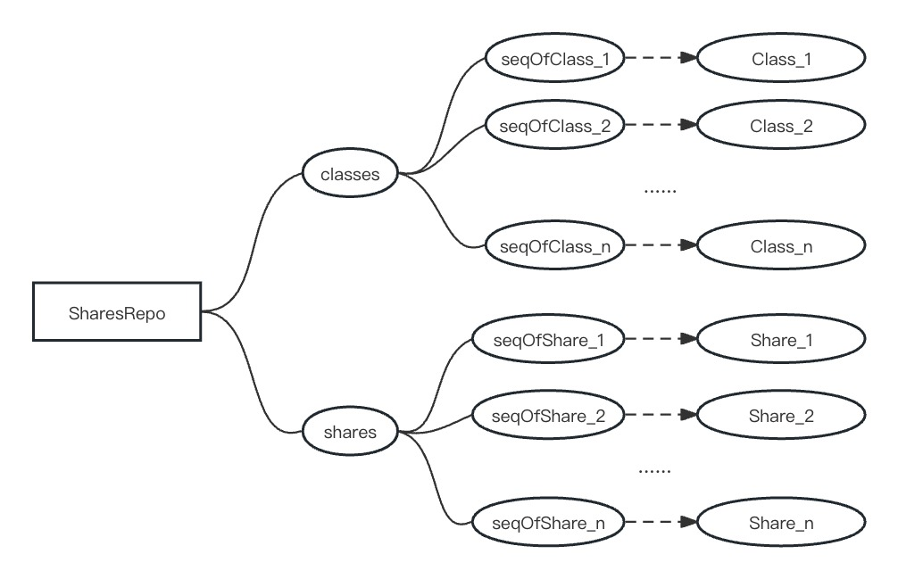

# 🗞️ Share and SharesRepo

## **Function and Usage**

[**SharesRepo**](https://github.com/paul-lee-attorney/comboox/blob/master/contracts/lib/SharesRepo.sol) is the most crucial public library in the system, which is utilized to track the creation, update, transfer and cancellation of shares.

## **Members and Attributes**

The share library consists of two objects: **shares** and **share class**, as well as a "number->object" mapping table composed of these two key objects.

## **Share**

The share consists of two main attributes, **Head** and **Body**. Head mainly records the unchangeable attributes since created, e.g., share number, share class, etc.; Body mainly records the attributes that may change dynamically during the share transaction, e.g., the par value of a share, the paid-in contribution, and clean paid-in contribution.

<figure><figcaption>
Share Object Structure
</figcaption></figure>

#### Attribute List of Shares

| Attribute     | Commercial and Legal Meaning                                                                                                                                                                                                                                                 |
| ------------- | ---------------------------------------------------------------------------------------------------------------------------------------------------------------------------------------------------------------------------------------------------------------------------- |
| class         | The share class, which can be used to distinguish different financing rounds, different shareholders’ equity, and possibly different voting weights.                                                                                                                         |
| seqOfShare    | Share Sequence Number.                                                                                                                                                                                                                                                       |
| preSeq        | Sequence number of underlying shares. Practically, underlying shares will be canceled and the identical shares will be issued to the buyer during a share transaction, and the sequence number of the transferred shares will be recorded in preSeq of newly-created shares. |
| issueDate     | The date of new share issuance or the delivery date of share transactions.                                                                                                                                                                                                   |
| shareholder   | The user number of shareholder.                                                                                                                                                                                                                                              |
| priceOfPaid   | The unit price of the paid-in contribution, which reflects the paid-in share amount in a share transaction, and reflects the premium of the paid-in share amount of the company in a capital increase transaction.                                                           |
| priceOfPar    | The unit price of the subscribed contribution, which reflects the unpaid subscribed contribution in a share transaction, and reflects the premium of subscribed and unpaid shares of the company.                                                                            |
| votingWeight  | Voting weight is a percentage. Each subscribed share represents 100 times the total of voting rights. For example, "100" means per dollar of subscribed shares represent one vote; "1800" means per dollar of subscribed shares represent 18 vote.                           |
| payInDeadline | The deadline of paid-in subscribed contribution. It is a 48-bit timestamp with millisecond precision.                                                                                                                                                                        |
| par           | The subscribed share amount, which may remain some subscribed but unpaid contribution.                                                                                                                                                                                       |
| paid          | paid-in share amount is the total amount actually paid.                                                                                                                                                                                                                      |
| cleanPaid     | Clean paid-in contribution, which is the amount without any encumbrances such as pledge and assignments.                                                                                                                                                                     |
| state         | The state of share.                                                                                                                                                                                                                                                          |
| para          | Pre-set attributes.                                                                                                                                                                                                                                                          |

### **Share Class**

**Share Class** is a list of **share numbers** summarized in the **share mapping** by **share class** and the aggregated information for the **contribution amount** in that share class.

<figure><figcaption>
Share Class Object Structure
</figcaption></figure>

### **Shares repo**

**Shares repo** consists of two mappings, one is a **share mapping** for "share number -> share object" and a **class mapping** for "share class number -> share class object"**.**

<figure><figcaption>
Shares repo structure
</figcaption></figure>

## **Query API**

The query API well reflects the function and usage of the **shares repo** in the overall system, as shown in the table below.

| API                   | Function and Usage                                          |
| --------------------- | ----------------------------------------------------------- |
| counterOfShares       | Get the current value of the share number counter.          |
| counterOfClasses      | Get the current value of the share class number counter.    |
| isShare               | Verify the existence of a specific share number.            |
| getShare              | Get the share object for the specific number.               |
| getQtyOfShares        | Get the total number of current share objects.              |
| getSeqListOfShares    | Get the list of shares sequence numbers.                    |
| getSharesList         | Get a list of all shares objects.                           |
| getQtyOfSharesInClass | Get the total number of shares in a specific share class.   |
| getSeqListOfClass     | Get a list of share numbers for a specific share class.     |
| getInfoOfClass        | Get aggregated information for a specific share class.      |
| getSharesOfClass      | Get a list of all share objects for a specific share class. |

## Source Code

#### [SharesRepo](https://github.com/paul-lee-attorney/comboox/blob/master/contracts/lib/Checkpoints.sol)

