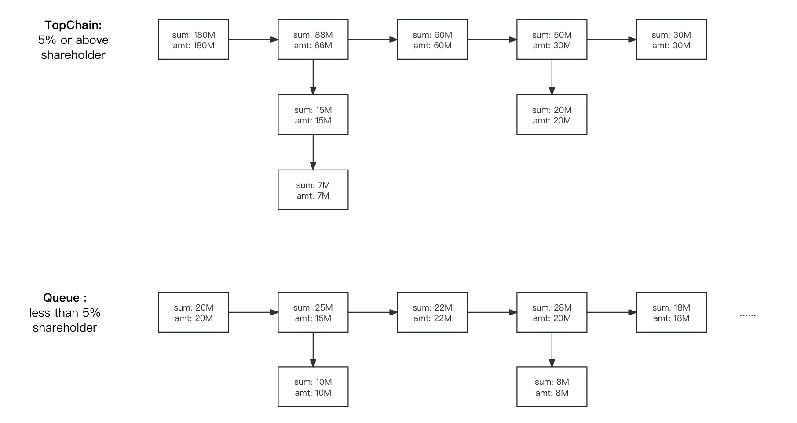
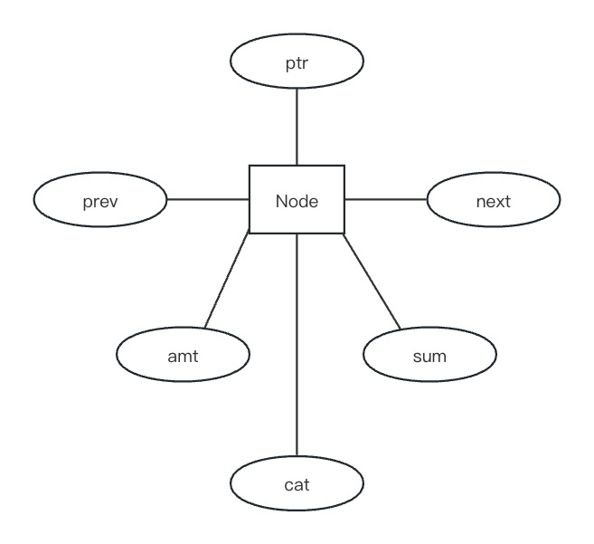

# 🏁 TopChain

## **Function and Usage**

The **Top Chain** defines two top chains consisting of a series of shareholder nodes objects representing shareholders and their voting rights: one is unordered, representing the queue of **minority shareholders** and their concert actors, and the other queue is sorted in reverse order of voting weights from largest to smallest, representing the ranking of majority shareholders and their concert actors whose voting weight exceeds the threshold specified in the **shareholders agreement**.

The nodes of the main **top chain** represent **independent shareholders** or **representative shareholders** of the concert actors, while the extending chain branch represents **member shareholders** of the concert actors.

The core function of the **top chain** is to dynamically filter out the majority shareholders with the updating of the **Register of Shares** and sort them out as per their controlling voting weights, so that the identity of the actual controller and the composition of the majority shareholders of the company can be quickly acquired, satisfying the requirements of the securities laws of certain countries.

The default setting for the voting weights of the majority shareholders in the system is 5%, which is also the threshold for shareholders whose voting weights that needs to be reported when purchase shares from the listing company in the secondary market under the securities laws of the U.S. and China. Certainly, the weights can be freely adjusted during the drafting process of the **shareholders agreement** when setting up the general rules of company governance.

<figure><figcaption></figcaption></figure>

## **Members and Attributes**

The **top chain repo** mainly consists of **shareholder node objects** representing shareholders and their voting weights, **parameter objects** used to record the head and tail of the minority shareholders' queue and aggregated information, and a **shareholder node mapping** of "user number -> node object". Among them, No.0 node is used to record the special parameters such as the head and tail of the top chain of majority shareholders and the total number of voting rights of the company.

### **Shareholder Nodes**

The **shareholder nodes** consist of four location attributes of chains, previous(prev), next(next), point(ptr), category(cat), and several attributes, such as the voting amount and the total number of voting rights. In order to save storage, the total length of all node attributes is set to 256 bits.

<figure><figcaption>
Structure of Shareholder Node Objects
</figcaption></figure>

#### **The Attribute List of Shareholder Nodes**

| Attribute | Commercial and Legal Meaning                                                                                                                                                                                                                                                  |
| --------- | ----------------------------------------------------------------------------------------------------------------------------------------------------------------------------------------------------------------------------------------------------------------------------- |
| prev      | The user number of previous node.                                                                                                                                                                                                                                             |
| next      | The user number of next node                                                                                                                                                                                                                                                  |
| ptr       | Special pointers. When there are concerted actors, the pointer of the representative shareholder node (tee node) will point to the next user number of concerted actor, and the pointers of other concerted actors will point to the nodes of the representative shareholder. |
| cat       | Node category: 0 - no concert parties, 1 - a representative shareholder node (tee node) for concert actors, 2 - a member node for concert actors.                                                                                                                             |
| amt       | The amount of voting weights held by shareholders.                                                                                                                                                                                                                            |
| sum       | Total amount of voting weights. When the node is a representative shareholder node, the total amount is the sum of voting rights held by all concert actors. In other cases, sum is the amount of voting rights held by each shareholder.                                     |

#### **The Special Meaning of No.0 Node**

| Attribute | Commercial and Legal Meaning                                                                |
| --------- | ------------------------------------------------------------------------------------------- |
| prev      | The user number of the tail node in the major shareholder **top chain**.                    |
| next      | The user number of the head node in the major shareholder **top chain**.                    |
| cat       | Whether exercising the voting rights according to the subscribed contribution. 0-No, 1-Yes. |
| sum       | Total number of voting rights in the company.                                               |

### **Parameter Objects**

The **parameter objects** are mainly used to track the head and tail of the user numbers in the **minority shareholder** queue, as well as some aggregated data.

| **Attribute**       | **Commercial and Legal Meaning**                                                                         |
| ------------------- | -------------------------------------------------------------------------------------------------------- |
| tail                | The user number of the tail node in the minority shareholder queue.                                      |
| head                | The user number of the head node in the minority shareholder queue.                                      |
| maxQtyOfMembers     | Maximum number of shareholders in the company. 0 - unlimited number.                                     |
| minVoteRatioOnChain | The threshold of majority shareholder voting weights. A basepoint, i.e. 500 represents 5% voting weight. |
| qtyOfSticks         | Total number of independent minority shareholders and minority shareholders acting in concert.           |
| qtyOfBranches       | Total number of independent major shareholders and majority shareholders acting in concert.              |
| qtyOfMembers        | Total number of shareholders.                                                                            |

### **Chain**

The **chain** consists of the **parameter objects** and the "user number -> shareholder node" mapping consisting of the **shareholder node** objects.

<figure><figcaption>
Structure of Chain Objects
</figcaption></figure>

### **Query API**

The query API can well describe the function and usage of the **top chain repo** in the whole system, as shown in the following table.

| API                 | Commercial and Legal Meaning                                                                                                                      |
| ------------------- | ------------------------------------------------------------------------------------------------------------------------------------------------- |
| isMember            | Whether the concert actors exist.                                                                                                                 |
| tail                | The user number of the tail node in the majority shareholder chain.                                                                               |
| head                | The user number of the head node in the majority shareholder chain.                                                                               |
| totalVotes          | The total number of voting weights of the company.                                                                                                |
| basedOnPar          | Whether the exercising voting rights is based on the amount of subscribed contribution.                                                           |
| headOfQueue         | The user number of the head node in the minority shareholder queue.                                                                               |
| tailOfQueue         | The user number of the tail node in the minority shareholder queue.                                                                               |
| maxQtyOfMembers     | Maximum number of shareholders in the company. 0 -- no upper limit.                                                                               |
| minVoteRatioOnChain | Minimum threshold for voting rights of majority shareholders. Basis point, i.e., 500 represents 5% voting weight.                                 |
| qtyOfBranches       | Total number of independent major shareholders and majority shareholders acting in concert.                                                       |
| qtyOfGroups         | Total number of independent shareholders and shareholders acting in concert.                                                                      |
| qtyOfTopMembers     | Total number of independent shareholders and shareholders acting in concert.                                                                      |
| qtyOfMembers        | Total number of shareholders.                                                                                                                     |
| getPos              | Calculate and get the user number of the nodes before and after the major shareholder node that increases or decreases by a specific amount.      |
| nextNode            | Get the user number of next shareholder nodes. Query path from the beginning nodes to end nodes and from representatives nodes to members nodes.  |
| getNode             | Get the shareholder node object by user number.                                                                                                   |
| rootOf              | Get the user number of the representative shareholder acting in concert by user number.                                                           |
| deepOfBranch        | Get the total number of all shareholder acting in concert by user number.                                                                         |
| votesOfGroup        | Get the total number of voting weights of all shareholder acting in concert by user number.                                                       |
| membersOfGroup      | Get the list of user numbers of all shareholders acting in concert by user number.                                                                |
| affiliated          | Determine whether two users are concert actors by user number.                                                                                    |
| topMembersList      | Get a list of user numbers of all shareholders in the major shareholders chain.                                                                   |
| sortedMembersList   | Get the list of user numbers of all shareholders in the sorted order of the chain.                                                                |
| getSnapshot         | Get a snapshot of the state of top chain.                                                                                                         |
| restoreChain        | Restore the top chain according to the snapshot.                                                                                                  |
| mockDealOfSell      | Mock the status of the top chain after the seller’s user number and transaction consideration is delivered.                                       |
| mockDealOfBuy       | Mock the status of the top chain after the buyer’s user number, the representative shareholder number and transaction consideration is delivered. |
| mockDealsOfIA       | Mock the status of the top chain after the transaction according to investment agreement objects.                                                 |

## Source Code

#### [TopChain](https://github.com/paul-lee-attorney/comboox/blob/master/contracts/lib/TopChain.sol)
